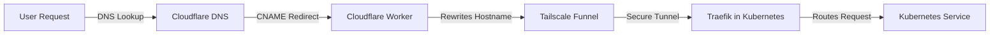

# **Cloudflare, Tailscale, ExternalDNS, and Traefik in Kubernetes**

## **Executive Summary**
This document outlines the architecture and step-by-step setup for exposing a Kubernetes cluster using **Cloudflare, Tailscale Funnel, ExternalDNS, and Traefik**. The external domains `skryter.no` and `bylab.no` will be configured to point to `urbalurba.no` (hosted in Cloudflare), where a Cloudflare Worker will route traffic to **Tailscale Funnel**. Tailscale Funnel will securely forward requests to **Traefik inside the Kubernetes cluster**, ensuring encrypted end-to-end traffic and flexible routing.

### **Why Use Cloudflare?**
Cloudflare provides critical security and performance enhancements, including:
- **Web Application Firewall (WAF)**: Protects against common web vulnerabilities and attacks.
- **DDoS Mitigation**: Shields services from distributed denial-of-service attacks.
- **Global Content Delivery**: Optimizes request handling through Cloudflare's edge network.
- **DNS Management**: Simplifies domain configuration and traffic control.
- **Workers for Custom Routing**: Enables dynamic hostname-based traffic redirection.

By leveraging **Cloudflare in combination with Tailscale and Traefik**, we create a **secure, resilient, and highly available Kubernetes ingress solution**.

### **Traffic Flow Diagram**


## **Architecture Overview**
1. **External DNS (`skryter.no` and `bylab.no`)**
   - Both domains have `CNAME` records pointing to `urbalurba.no`.
2. **Cloudflare Worker on `urbalurba.no`**
   - Redirects requests based on hostname to the appropriate **Tailscale Funnel endpoint**.
3. **Tailscale Funnel (`dog-pence.ts.net`)**
   - Handles HTTPS termination and forwards traffic to **Traefik in Kubernetes**.
4. **Traefik in Kubernetes**
   - Routes incoming requests to the correct **Kubernetes services** based on hostname.

## **Step-by-Step Setup**

### **1. Configure External DNS (`skryter.no` and `bylab.no`)**
Create `CNAME` records in Cloudflare for both domains:
```txt
*.urb.skryter.no CNAME urbalurba.no
*.urb.bylab.no   CNAME urbalurba.no
```
This ensures that requests to `web.urb.skryter.no` and `web.urb.bylab.no` are directed to the Cloudflare Worker.

### **2. Set Up Cloudflare Worker on `urbalurba.no`**
The Cloudflare Worker should redirect requests to **Tailscale Funnel**:
```javascript
addEventListener("fetch", event => {
    event.respondWith(handleRequest(event.request));
});

async function handleRequest(request) {
    let url = new URL(request.url);
    
    if (url.hostname.endsWith("skryter.no")) {
        url.hostname = "web.dog-pence.ts.net";
    } else if (url.hostname.endsWith("bylab.no")) {
        url.hostname = "app.dog-pence.ts.net";
    }
    return fetch(url, request);
}
```
This script dynamically rewrites incoming requests and forwards them to **Tailscale Funnel (`dog-pence.ts.net`)**.

### **3. Set Up Tailscale Funnel**
Tailscale Funnel allows external requests to securely reach Kubernetes:
```sh
tailscale funnel enable web.dog-pence.ts.net --port=443
tailscale funnel enable app.dog-pence.ts.net --port=443
```
This ensures that HTTPS traffic is handled properly.

### **4. Configure Traefik in Kubernetes**
Modify `traefik.yaml` to route requests based on hostname:
```yaml
http:
  routers:
    web:
      rule: "Host(`web.dog-pence.ts.net`)"
      service: web-service
    app:
      rule: "Host(`app.dog-pence.ts.net`)"
      service: app-service
```
This ensures that requests to **web.dog-pence.ts.net** and **app.dog-pence.ts.net** are routed to the correct Kubernetes services.

### **5. Configure ExternalDNS in Kubernetes**
ExternalDNS automatically updates DNS records in Cloudflare. Apply the following Kubernetes `Deployment`:
```yaml
apiVersion: apps/v1
kind: Deployment
metadata:
  name: external-dns
  namespace: kube-system
spec:
  containers:
  - name: external-dns
    image: k8s.gcr.io/external-dns/external-dns:v0.11.0
    args:
    - --source=ingress
    - --provider=cloudflare
    - --cloudflare-zone-id=YOUR_CLOUDFLARE_ZONE_ID
    - --cloudflare-api-token=YOUR_API_TOKEN
```
This will allow Kubernetes to automatically update Cloudflare DNS records when services change.

## **Final Workflow**
1. **User requests `web.urb.skryter.no` → Cloudflare resolves to `urbalurba.no`.**
2. **Cloudflare Worker rewrites hostname to `web.dog-pence.ts.net`.**
3. **Tailscale Funnel forwards request to Traefik inside Kubernetes.**
4. **Traefik routes the request to the correct Kubernetes service.**

This setup provides a **secure, flexible, and automated way to expose Kubernetes services** using **Cloudflare, Tailscale, and Traefik**.

