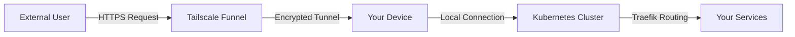

# Tailscale Funnel Setup Guide

**Purpose**: Quick internet access with automatic .ts.net domains  
**Audience**: Users wanting fast, secure internet connectivity  
**Time Required**: 15-30 minutes  
**Prerequisites**: Working cluster on .localhost domains

## 🚀 Quick Summary

Transform your local cluster from `http://service.localhost` to `https://service.your-device.ts.net` in minutes. No domain purchase needed, automatic HTTPS, invite-based access control.

## 🏗️ How Tailscale Funnel Works

### Architecture Overview

Tailscale Funnel creates a secure tunnel from the internet directly to your services without requiring public IP addresses or opening firewall ports. Here's how traffic flows:



**Key Components:**
1. **Tailscale Funnel** - Provides HTTPS endpoints on `.ts.net` domains
2. **Your Device** - Runs Tailscale client and Kubernetes cluster  
3. **Traefik** - Routes traffic to appropriate services based on HostRegexp patterns
4. **Your Services** - whoami, openwebui, authentik, etc.

**Security Benefits:**
- ✅ **End-to-end encryption** through Tailscale network
- ✅ **No public IP exposure** - services remain private
- ✅ **Invite-based access** - only your tailnet members can access
- ✅ **Zero-trust networking** - device authentication required

## ✅ Prerequisites

Before starting, ensure you have:
- [ ] Cluster running successfully on .localhost domains
- [ ] Services accessible at `http://whoami.localhost`, `http://openwebui.localhost`, etc.
- [ ] Rancher Desktop running your Kubernetes cluster
- [ ] Internet connection for Tailscale signup

## 📋 Step-by-Step Setup (15 minutes)

### Step 1: Create Tailscale Account (5 minutes)

1. **Visit** [tailscale.com](https://tailscale.com) and sign up with:
   - Google account
   - Microsoft account
   - GitHub account
   - Or email/password

2. **Create your tailnet** (your private network)
   - Your tailnet name will be something like `provision-host.dog-pence.ts.net`
   - This becomes part of your service URLs

### Step 2: Install Tailscale on Your Machine (5 minutes)

**macOS**:
```bash
brew install tailscale
```

**Windows**:
- Download from [tailscale.com/download](https://tailscale.com/download)
- Run installer as Administrator

**Linux (Ubuntu/Debian)**:
```bash
curl -fsSL https://tailscale.com/install.sh | sh
```

### Step 3: Connect Your Machine (2 minutes)

1. **Login to Tailscale**:
   ```bash
   sudo tailscale up
   ```

2. **Follow the authentication URL** that appears
3. **Confirm your device** appears in [Tailscale Admin Console](https://login.tailscale.com/admin/machines)

### Step 4: Enable Funnel Feature (5 minutes)

Tailscale Funnel requires **two-level authorization** for security:

#### 4a. Tailnet-Level Authorization (First)

1. **Attempt to enable Funnel** on your machine:
   ```bash
   sudo tailscale funnel on
   ```

2. **You'll get an authorization URL**:
   ```
   Funnel is not enabled on your tailnet.
   To enable, visit:
   https://login.tailscale.com/f/funnel?node=XXXXXXXX
   ```

3. **Visit the URL and authorize**:
   - Sign in to your Tailscale account
   - Click **"Enable Funnel"** to authorize this capability for your entire tailnet
   - This modifies your tailnet policy file to include the Funnel feature

#### 4b. Node-Level Authorization (Second)

1. **Run the command again**:
   ```bash
   sudo tailscale funnel on
   ```

2. **You may see a second authorization**:
   ```
   Funnel is enabled, but the list of allowed nodes in the tailnet policy file 
   does not include the one you are using. To give access to this node visit:
   https://login.tailscale.com/f/funnel?node=XXXXXXXX
   ```

3. **Visit the second URL and authorize**:
   - Click the node authorization URL
   - Authorize this specific device to use Funnel
   - This updates your tailnet policy to include this node

**Why Two Levels?**
- **Tailnet-level**: Enables the feature for your organization
- **Node-level**: Controls which specific devices can expose services

### Step 5: Expose Your Services (5 minutes)

1. **Open terminal** where your cluster is running

2. **For each service**, run the funnel command:
   ```bash
   # Expose whoami service (example)
   tailscale funnel 80

   # This creates: https://whoami.your-device.ts.net
   ```

3. **Test your service**:
   ```bash
   curl https://whoami.your-device.ts.net
   ```

## 🔧 Configuration Examples

### Expose Multiple Services

```bash
# Terminal 1 - Expose whoami
tailscale funnel --set-path /whoami 80

# Terminal 2 - Expose openwebui  
tailscale funnel --set-path /openwebui 80

# Terminal 3 - Expose authentik
tailscale funnel --set-path /authentik 80
```

**Result**: All services available at:
- `https://your-device.ts.net/whoami`
- `https://your-device.ts.net/openwebui`
- `https://your-device.ts.net/authentik`

### Individual Service Domains

```bash
# Create subdomain for each service
tailscale funnel --hostname whoami.your-device.ts.net 80
tailscale funnel --hostname openwebui.your-device.ts.net 80
tailscale funnel --hostname authentik.your-device.ts.net 80
```

**Result**: Individual domains:
- `https://whoami.your-device.ts.net`
- `https://openwebui.your-device.ts.net`  
- `https://authentik.your-device.ts.net`

---

## 🚀 Advanced Setup: Kubernetes Operator (Production)

For production deployments or advanced scenarios, use the Tailscale Kubernetes Operator instead of manual funnel commands.

### When to Use the Operator

✅ **Production deployments** requiring high availability  
✅ **Multiple services** that need automatic management  
✅ **Team environments** where manual setup isn't practical  
✅ **Integration with CI/CD** pipelines  

### Prerequisites for Operator Setup

- [ ] Kubernetes cluster running (your current setup)
- [ ] Helm package manager installed
- [ ] Tailscale OAuth credentials (from [Tailscale Admin Console](https://login.tailscale.com/admin/settings/keys))

### Step-by-Step Operator Installation

#### 1. Create OAuth Credentials (5 minutes)

1. **Go to** [Tailscale Admin Console → Settings → Keys](https://login.tailscale.com/admin/settings/keys)
2. **Click** "Generate auth key" → "OAuth client"
3. **Copy** the Client ID and Client Secret
4. **Set scopes**: `device:create`, `device:delete`

#### 2. Install Tailscale Operator (10 minutes)

```bash
# Create Tailscale namespace
kubectl create namespace tailscale

# Add Tailscale Helm repository
helm repo add tailscale https://pkgs.tailscale.com/helmcharts
helm repo update

# Install operator with OAuth credentials
helm install tailscale-operator tailscale/tailscale-operator \
  --namespace tailscale \
  --set-string oauth.clientId=YOUR_OAUTH_CLIENT_ID \
  --set-string oauth.clientSecret=YOUR_OAUTH_CLIENT_SECRET
```

#### 3. Create Tailscale Ingress for Traefik (5 minutes)

```yaml
# Save as tailscale-traefik-ingress.yaml
apiVersion: networking.k8s.io/v1
kind: Ingress
metadata:
  name: traefik-tailscale-ingress
  namespace: kube-system  # Same namespace as Traefik
  annotations:
    tailscale.com/funnel: "true"  # Enable internet access
    tailscale.com/tags: "tag:k8s"  # Optional: tag for ACL policies
spec:
  ingressClassName: tailscale
  defaultBackend:
    service:
      name: traefik
      port:
        number: 80
  tls:
    - hosts:
        - rancher-traefik  # Will become rancher-traefik.your-tailnet.ts.net
```

```bash
# Apply the ingress
kubectl apply -f tailscale-traefik-ingress.yaml
```

#### 4. Verify Operator Setup

```bash
# Check operator status
kubectl get pods -n tailscale

# Check created Tailscale proxy
kubectl get ingress -A | grep tailscale

# Get the Tailscale URL
kubectl describe ingress traefik-tailscale-ingress -n kube-system
```

### Operator Benefits vs Manual Setup

| Feature | Manual Funnel | Kubernetes Operator |
|---------|---------------|-------------------|
| **Setup Complexity** | Simple | Advanced |
| **High Availability** | No | Yes |
| **Automatic Management** | No | Yes |
| **Multiple Services** | Manual each | Automatic |
| **Production Ready** | Basic | Enterprise |
| **Team Deployment** | Individual setup | Centralized |

## ✅ Verification Steps

### Test Your Setup

1. **Check Funnel Status**:
   ```bash
   tailscale funnel status
   ```

2. **Test from External Network**:
   - Use your phone's mobile data (not WiFi)
   - Visit `https://whoami.your-device.ts.net`
   - Should see the whoami response

3. **Test Authentication** (if using Authentik):
   - Visit `https://authentik.your-device.ts.net`
   - Should see Authentik login page

### Verify HostRegexp Routing

Your existing manifests automatically work with Tailscale domains because they use HostRegexp patterns:

```yaml
# This pattern in your manifests:
match: HostRegexp(`whoami\..+`)

# Automatically handles:
# - whoami.localhost (development)
# - whoami.provision-host.dog-pence.ts.net (Tailscale)
# - whoami.yourcompany.com (Cloudflare if added later)
```

## 🔒 Security & Access Control

### Invite Team Members

1. **In Tailscale Admin Console**:
   - Go to **Users** → **Invite users**
   - Send invitation email
   - They get access to your .ts.net services automatically

2. **Set Access Permissions**:
   - Use ACL policies to control who can access what
   - Services are only accessible to your tailnet members

### Fine-Grained Control

```json
// Example ACL for team access
{
  "acls": [
    {
      "action": "accept",
      "src": ["group:developers"],
      "dst": ["your-device.ts.net:80,443"]
    }
  ]
}
```

## ❓ Troubleshooting

### Authorization Issues

#### Two-Level Authorization Problems
**Issue**: "handler does not exist" or "Funnel not working"  
**Cause**: Incomplete authorization process  
**Solution**:
```bash
# 1. Check current authorization status
tailscale funnel status

# 2. If no configuration, restart authorization
sudo tailscale funnel on
# Follow both authorization URLs completely

# 3. Verify node is authorized
tailscale status --peers=false --self=true
```

#### ACL Policy Issues
**Issue**: "node not allowed to use funnel"  
**Cause**: Node not in tailnet policy file  
**Solution**:
1. Go to [Tailscale Admin Console → Access Controls](https://login.tailscale.com/admin/acls)
2. Verify your policy includes:
```json
{
  "nodeAttrs": [
    {
      "target": ["autogroup:members"],
      "attr": ["funnel"]
    }
  ]
}
```
3. Ensure your node is listed under authorized nodes

### Connection and Routing Issues

#### Service Not Accessible Externally
**Check 1 - Tailscale Connection**:
```bash
# Verify Tailscale connectivity
tailscale status
# Should show your device connected

# Check funnel configuration
sudo tailscale funnel status
# Should show active tunnels
```

**Check 2 - Local Service Running**:
```bash
# Test local access first
curl http://whoami.localhost
curl http://openwebui.localhost

# If these fail, your services aren't running locally
kubectl get pods -A
kubectl get svc -A
```

**Check 3 - HostRegexp Routing**:
```bash
# Verify Traefik routing
kubectl get ingressroute -A

# Check Traefik logs
kubectl logs -n kube-system -l app.kubernetes.io/name=traefik
```

#### Certificate and SSL Issues
**Issue**: "Certificate warnings" or "TLS errors"  
**Cause**: Certificate propagation delay  
**Solution**:
```bash
# Wait 10-15 minutes for certificate propagation
# Test with --insecure flag temporarily
curl --insecure https://whoami.your-device.ts.net

# Check certificate status
echo | openssl s_client -connect whoami.your-device.ts.net:443 -servername whoami.your-device.ts.net | openssl x509 -noout -dates
```

### Kubernetes Operator Issues

#### Operator Pod Not Starting
**Debug Commands**:
```bash
# Check operator status
kubectl get pods -n tailscale

# Check operator logs
kubectl logs -n tailscale deployment/operator

# Verify OAuth credentials
kubectl get secrets -n tailscale
kubectl describe secret tailscale-operator-oauth -n tailscale
```

#### Ingress Not Working
**Debug Steps**:
```bash
# 1. Verify ingress resource
kubectl describe ingress traefik-tailscale-ingress -n kube-system

# 2. Check Tailscale proxy pod
PROXY_POD=$(kubectl get pods -n tailscale -l tailscale.com/parent-resource-type=ingress -o name | head -1)
kubectl logs -n tailscale $PROXY_POD

# 3. Check funnel status inside proxy pod  
kubectl exec -n tailscale $PROXY_POD -- tailscale funnel status

# 4. Verify Traefik service
kubectl describe svc traefik -n kube-system
```

### Authentication and Access Issues

#### Authentik Integration Problems
**Issue**: "Authentication loops" or "redirect errors"  
**Cause**: OAuth callback URLs not configured for .ts.net domains  
**Solution**:
```bash
# 1. Update Authentik OAuth application
# Add your .ts.net URLs to redirect URIs:
# https://authentik.your-device.ts.net/*
# https://openwebui.your-device.ts.net/*

# 2. Test with public service first
curl https://whoami-public.your-device.ts.net

# 3. Check Authentik logs
kubectl logs -n authentik -l app.kubernetes.io/name=authentik
```

#### Service-Specific Access Problems
**Debug Individual Services**:
```bash
# Test service accessibility pattern
for service in whoami openwebui authentik; do
    echo "Testing $service..."
    curl -I https://$service.your-device.ts.net
done

# Check service endpoints
kubectl get endpoints -A | grep -E "(whoami|openwebui|authentik)"
```

### Port and Network Issues

#### Port Already in Use
**Issue**: "Port 8000 is already in use"  
**Solution**:
```bash
# Find process using the port
sudo lsof -i :8000

# Kill the process if needed
sudo kill -9 $(sudo lsof -t -i:8000)

# Or use different port
tailscale funnel 8080  # Use port 8080 instead
```

#### Network Connectivity Problems
**Debug Network Path**:
```bash
# 1. Test local cluster connectivity
kubectl exec -it deployment/whoami -- wget -O- http://openwebui.default.svc.cluster.local

# 2. Test Traefik routing from inside cluster
kubectl run debug --image=curlimages/curl --rm -it -- curl http://traefik.kube-system.svc.cluster.local:80

# 3. Test external connectivity
curl -v https://your-device.your-tailnet.ts.net
```

### Advanced Debugging

#### Comprehensive Status Check
**Run this complete diagnostic**:
```bash
#!/bin/bash
echo "=== Tailscale Status ==="
tailscale status

echo -e "\n=== Funnel Configuration ==="
sudo tailscale funnel status

echo -e "\n=== Kubernetes Services ==="
kubectl get svc -A | grep -E "(traefik|whoami|openwebui|authentik)"

echo -e "\n=== Kubernetes Pods ==="
kubectl get pods -A | grep -E "(traefik|whoami|openwebui|authentik|tailscale)"

echo -e "\n=== IngressRoutes ==="
kubectl get ingressroute -A

echo -e "\n=== Recent Traefik Logs ==="
kubectl logs -n kube-system -l app.kubernetes.io/name=traefik --tail=10
```

#### Performance and Monitoring
**Monitor Traffic Flow**:
```bash
# Monitor Tailscale traffic
sudo tailscale status --json | jq '.Peer[] | select(.Online) | {HostName, LastSeen, TxBytes, RxBytes}'

# Monitor Kubernetes ingress
kubectl top pods -n kube-system | grep traefik

# Check connection latency
ping your-device.your-tailnet.ts.net
```

### Getting Help

#### Information to Collect
When seeking help, gather this information:
```bash
# System info
tailscale version
kubectl version --short
docker version --format '{{.Server.Version}}'

# Configuration
tailscale status --json > tailscale-status.json
kubectl get ingressroute -A -o yaml > ingressroutes.yaml
kubectl get svc -A -o yaml > services.yaml

# Logs
kubectl logs -n kube-system -l app.kubernetes.io/name=traefik > traefik.log
```

#### Support Resources
- 📚 [Tailscale Documentation](https://tailscale.com/kb/)
- 💬 [Tailscale Community](https://tailscale.com/contact/support/)
- 🐛 [GitHub Issues](https://github.com/tailscale/tailscale/issues)
- 📖 [Kubernetes Operator Docs](https://tailscale.com/kb/1236/kubernetes-operator/)

## 🔗 Next Steps

### Add More Services
- Any service with HostRegexp patterns automatically works
- Use `tailscale funnel --hostname service.your-device.ts.net 80`

### Add Custom Domain Later
- [Cloudflare Setup Guide](networking-cloudflare-setup.md) - Keep Tailscale for team access
- Both tunnels work simultaneously with your HostRegexp routing

### Advanced Configuration
- [Tailscale ACL Documentation](https://tailscale.com/kb/1018/acls/)
- [Funnel Documentation](https://tailscale.com/kb/1223/tailscale-funnel/)

---

## 📊 Benefits Achieved

✅ **Internet Access**: Services available worldwide  
✅ **Automatic HTTPS**: Built-in SSL certificates  
✅ **Zero Configuration**: No DNS or firewall changes  
✅ **Team Sharing**: Invite-based access control  
✅ **Cost Effective**: No domain purchase required  

Your cluster is now connected to the internet via Tailscale Funnel! Services are accessible securely to anyone you invite to your tailnet.