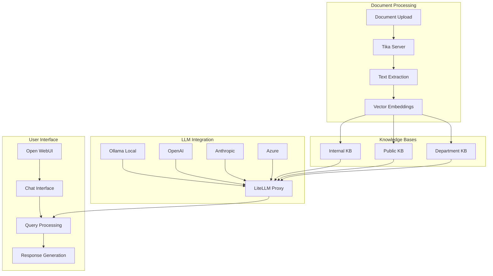
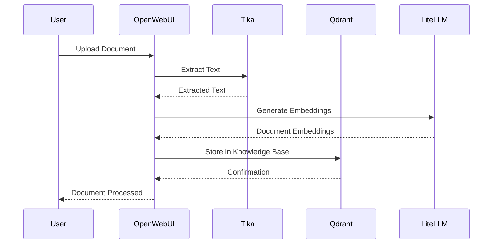
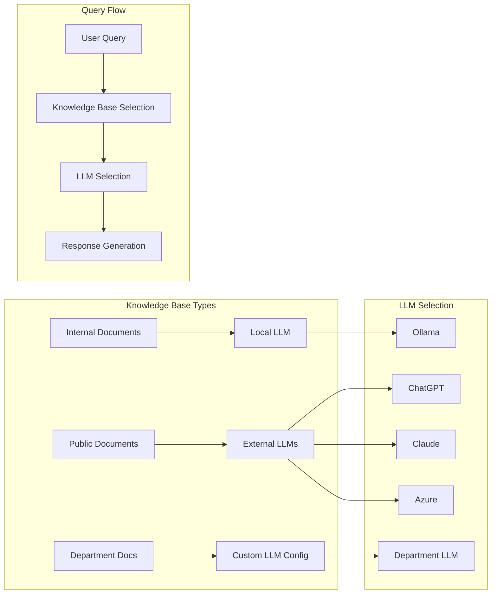
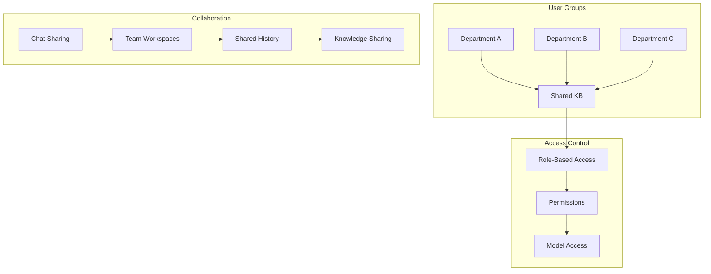

# AI Package

The AI package is a comprehensive self-hosted AI platform that enables organizations to build and deploy AI applications with advanced document processing and knowledge management capabilities. Key features include:

- **Knowledge Base Management**: 
  - Document ingestion and processing through a RAG (Retrieval-Augmented Generation) pipeline
  - Support for various document formats (PDF, Word, Excel, PowerPoint)
  - Integration with Apache Tika for advanced document extraction
  - Vector database storage using Qdrant for efficient similarity search

- **Chat Interface**:
  - ChatGPT-like interface for querying knowledge bases
  - Support for multiple LLM providers through LiteLLM proxy
  - Local model support via Ollama
  - Markdown and LaTeX support for rich text interactions
  - Code execution capabilities via Pyodide
  - Mermaid diagram rendering for visualizations

- **Collaboration Features**:
  - Multi-user support with role-based access control
  - Team-based knowledge sharing
  - User groups and granular permissions
  - Shared workspaces and chat histories
  - Webhook integrations for notifications (Discord, Slack, Teams)

- **Mobile & Accessibility**:
  - Progressive Web App (PWA) support for mobile devices
  - Responsive design for desktop and mobile
  - Speech-to-text integration
  - Offline capabilities when hosted locally

- **Security & Administration**:
  - Granular user permissions and access control
  - LDAP authentication support
  - API key management
  - Model whitelisting
  - Rate limiting and usage monitoring
  - Toxic content filtering

- **Integration Capabilities**:
  - Support for multiple OpenAI-compatible APIs
  - Custom database integration (SQLite, Postgres)
  - External speech-to-text services
  - Web search integration for RAG
  - Custom pipeline support for extended functionality

- **Organizational Features**:
  - **Centralized API Key Management**:
    - Secure sharing of API keys across departments
    - Support for multiple LLM providers (OpenAI, Anthropic, Azure, etc.)
    - Virtual key management for different teams/projects
    - Rate limiting and usage quotas per department
  - **Cost Management**:
    - Detailed cost tracking per department/user
    - Usage monitoring and analytics
    - Budget management and alerts
    - Integration with logging tools (Lunary, MLflow, Langfuse, Helicone)
  - **LLM Gateway Features**:
    - Unified interface for accessing 100+ LLM models
    - Automatic retry and fallback logic
    - Consistent output format across providers
    - Load balancing across multiple deployments

The platform is designed to operate entirely offline while maintaining enterprise-grade security and scalability features. It provides organizations with a secure, cost-effective way to leverage multiple LLM providers while maintaining control over usage and costs.

## System Architecture



## Use Cases

### 1. Document Processing and Knowledge Base Creation


### 2. Querying Knowledge Bases with Different LLMs


### 3. Multi-User Collaboration


The platform supports flexible LLM configuration per knowledge base:
- Internal documents can be configured to use local Ollama models for enhanced privacy
- Public documents can leverage external LLMs (OpenAI, Anthropic, Azure) through LiteLLM
- Department-specific knowledge bases can have custom LLM configurations
- All configurations are managed through the LiteLLM proxy, providing unified access and cost tracking

## Open WebUI Stack Setup

The AI stack is set up using an Ansible playbook (`200-setup-open-webui.yml`) that deploys a complete AI infrastructure on Kubernetes. The stack consists of several key components:

### Core Components

1. **Persistent Storage**
   - Provides persistent storage for all AI components
   - Ensures data persistence across pod restarts
   - [Kubernetes Persistent Volumes Documentation](https://kubernetes.io/docs/concepts/storage/persistent-volumes/)

2. **Apache Tika**
   - Document processing and extraction server
   - Used for handling various document formats
   - Helm chart: `tika/tika`
   - [Apache Tika Official Website](https://tika.apache.org/)
   - [Tika Helm Chart](https://artifacthub.io/packages/helm/tika/tika)

3. **Qdrant Vector Database**
   - Vector database for storing and querying embeddings
   - Replaces the default ChromaDB in Open WebUI
   - Provides efficient similarity search capabilities
   - Helm chart: `qdrant/qdrant`
   - [Qdrant Official Website](https://qdrant.tech/)
   - [Qdrant Documentation](https://qdrant.tech/documentation/)
   - [Qdrant Helm Chart](https://github.com/qdrant/qdrant-helm)

4. **Ollama**
   - Local LLM deployment
   - Installs a minimal model (qwen2:0.5b) for testing
   - Can be extended with additional models
   - Helm chart: `ollama-helm/ollama`
   - [Ollama Official Website](https://ollama.ai/)
   - [Ollama Documentation](https://github.com/ollama/ollama)
   - [Ollama Helm Chart](https://github.com/otwld/ollama-helm)

5. **LiteLLM**
   - LLM proxy service and gateway
   - Acts as a central dispatcher for all LLM requests
   - Enables integration with various LLM providers
   - Supports OpenAI, Anthropic, Azure, and other providers
   - Provides detailed cost tracking and usage analytics
   - Manages API keys and access control
   - Implements rate limiting and fallback strategies
   - Helm chart: `oci://ghcr.io/berriai/litellm-helm`
   - [LiteLLM Official Website](https://litellm.ai/)
   - [LiteLLM Documentation](https://docs.litellm.ai/)
   - [LiteLLM Helm Chart](https://github.com/BerriAI/litellm-helm)

6. **Open WebUI**
   - An extensible, feature-rich, and user-friendly self-hosted AI platform
   - Designed to operate entirely offline
   - Supports various LLM runners like Ollama and OpenAI-compatible APIs
   - Features a built-in inference engine for RAG (Retrieval-Augmented Generation)
   - Provides a powerful AI deployment solution with enterprise capabilities
   - Helm chart: `open-webui/open-webui`
   - [Open WebUI Official Website](https://openwebui.com/)
   - [Open WebUI Documentation](https://docs.openwebui.com/)
   - [Open WebUI GitHub](https://github.com/open-webui/open-webui)
   - [Open WebUI Helm Chart](https://github.com/open-webui/helm-charts)

### Open WebUI Custom Configuration

The default Open WebUI Helm chart has been customized to better integrate with our AI stack:

#### Disabled Components
- Embedded Ollama (using LiteLLM proxy instead)
- Built-in Tika server (using standalone Tika deployment)
- WebSocket support (not required for our setup)
- Redis cluster (not required for our setup)

#### Enabled Features
- Document processing pipelines
- Persistent storage using existing PVC
- Integration with LiteLLM proxy for LLM access
- Qdrant vector database for document storage
- Standalone Tika server for document extraction

#### Resource Configuration
- Memory: 768Mi request, 1.5Gi limit
- CPU: 300m request, 600m limit

#### Key Integrations
1. **LiteLLM Proxy**
   - Connected via `OPENAI_API_BASE: http://litellm:4000`
   - Uses master key from Kubernetes secrets
   - Enables access to multiple LLM providers

2. **Document Processing**
   - Uses standalone Tika server at `http://tika:9998`
   - Configured for document extraction and processing

3. **Vector Database**
   - Uses Qdrant at `http://qdrant:6333`
   - Custom collection name: `openwebui_documents`
   - API key from Kubernetes secrets

4. **Embedding Model**
   - Uses `all-MiniLM-L6-v2` for RAG embeddings
   - Configured for efficient document processing

#### Technical Notes
- **Minimal Model Configuration**: 
  - The system is configured to load a minimal model (qwen2:0.5b) into the cluster for testing purposes
  - This model should be unloaded after initial testing
  - For production use, the system should be configured to use the Ollama instance installed on the host computer
  - This ensures better performance and access to the full range of available models

### Configuration and Requirements

The setup requires:
- A Kubernetes cluster
- Helm package manager
- Required API keys stored in Kubernetes secrets:
  - `OPENWEBUI_QDRANT_API_KEY`
  - `LITELLM_PROXY_MASTER_KEY`
  - `OPENAI_API_KEY`
  - `ANTHROPIC_API_KEY`
  - `AZURE_API_KEY`
  - `AZURE_API_BASE`

### Deployment Process

1. Creates an `ai` namespace in Kubernetes
2. Verifies required secrets exist
3. Sets up persistent storage
4. Adds required Helm repositories
5. Deploys components in sequence:
   - Tika server
   - Qdrant vector database
   - Ollama (with minimal model)
   - LiteLLM proxy
   - Open WebUI frontend

Each component is deployed with appropriate timeouts and readiness checks to ensure proper initialization.

### Usage

If AI is not installed, you can install it with the following command on your host computer:

```bash
docker exec -it provision-host bash -c "cd /provision-host && ./install-ai.sh"
```

Note: The Ollama component may take 10-15 minutes to become fully ready as it downloads the initial model.

