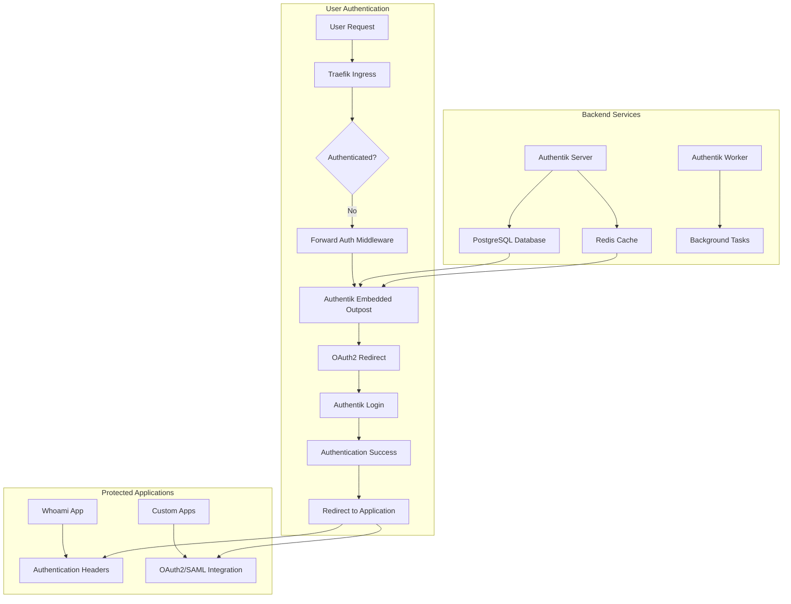
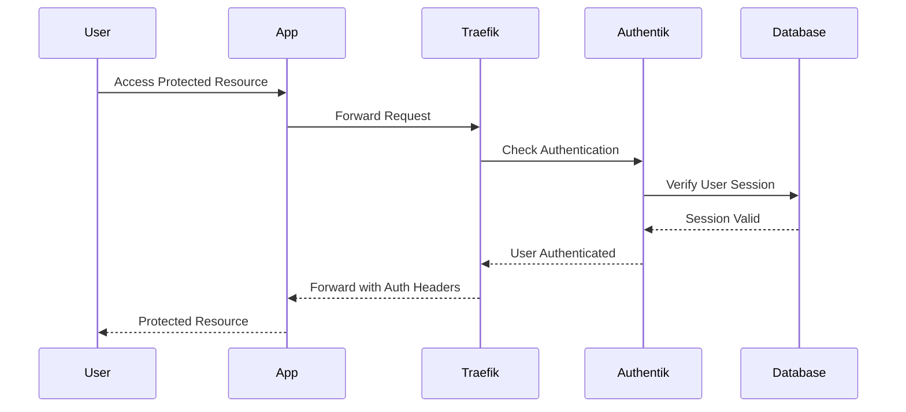
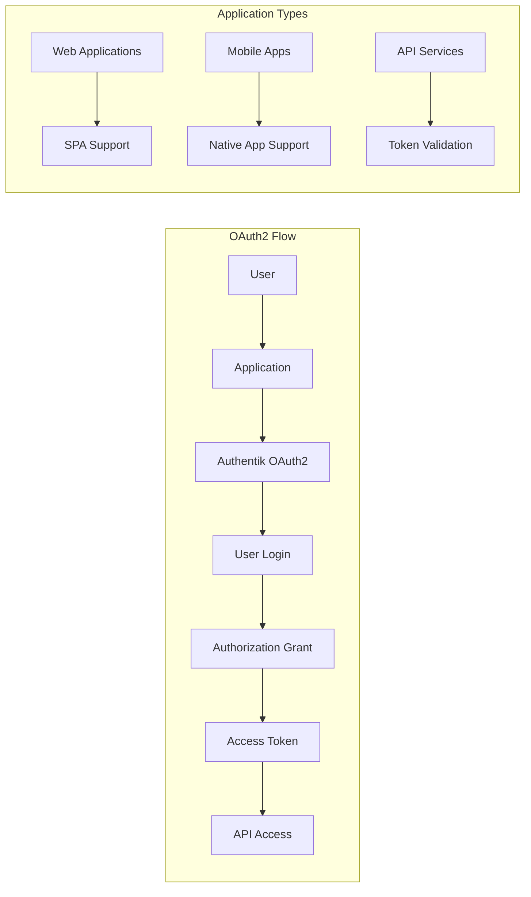
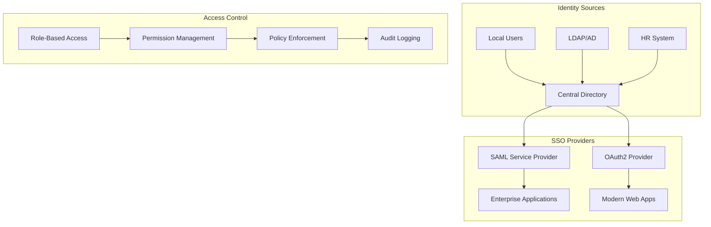
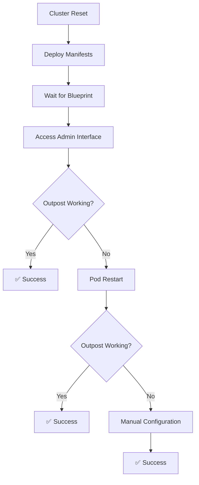

# Authentication Package

The Authentication package is a comprehensive self-hosted identity and access management (IAM) platform that enables organizations to implement enterprise-grade authentication, authorization, and single sign-on (SSO) capabilities. This implementation is based on the [Authentik](https://goauthentik.io/) project, which provides a powerful foundation for building authentication systems. We've enhanced and customized it to better suit enterprise needs and specific use cases.

## Table of Contents

1. [Getting Started](#getting-started)
2. [Technical Implementation](#technical-implementation)
3. [System Architecture](#system-architecture)
4. [Use Cases](#use-cases)
5. [Authentik Stack Setup](#authentik-stack-setup)
6. [Developer Workflow](#developer-workflow)
7. [Security and Compliance](#security-and-compliance)
8. [Monitoring and Management](#monitoring-and-management)
9. [Troubleshooting](#troubleshooting)
10. [Future Enhancements](#future-enhancements)

## Getting Started

On your host computer, run the following command to install the Authentication package:

```bash
./scripts/packages/auth.sh
```

The script will install the Authentication package and start the Authentik frontend. You can then access the Authentik admin interface at [http://authentik.localhost/if/admin/](http://authentik.localhost/if/admin/).

The install takes a while to complete as it sets up the database, creates the initial admin user, and configures all authentication flows. The system is designed to be production-ready from the first deployment.

### Default Credentials

After installation, you can access the system with these default credentials:
- **Admin URL**: [http://authentik.localhost/if/admin/](http://authentik.localhost/if/admin/)
- **Username**: `admin@urbalurba.local`
- **Password**: `SecretPassword1`

**Important**: Change these default credentials immediately after first login for security purposes.

### Checking Installation Progress

You are not supposed to know anything about kubernetes so we have a script that you can run on your host computer to check the progress of the installation.

```bash
./scripts/manage/k9s.sh 
```

This will show you a list of whats going on in the cluster. You just need to wait until you see  `Running` on all items on the list.

## Technical Implementation

### Implementation Differences from Standard Authentik

While our implementation is based on Authentik, we've made several significant modifications to enhance its capabilities and better suit enterprise needs:

#### 1. Database Integration
- **Original**: Includes PostgreSQL as part of the Helm chart deployment
- **Our Implementation**: Uses shared PostgreSQL instance across multiple services
  - Single PostgreSQL instance serving multiple applications
  - Dedicated `authentik` database with proper user permissions
  - Shared backup and recovery procedures
  - Centralized database monitoring and management

#### 2. Session Management
- **Original**: Includes Redis as part of the Helm chart deployment
- **Our Implementation**: Uses shared Redis instance across multiple services
  - Single Redis instance serving multiple applications
  - Shared session management and caching layer
  - Centralized Redis monitoring and management
  - Enhanced security through shared authentication

#### 3. Ingress and Routing
- **Original**: Basic Traefik integration
- **Our Implementation**: Advanced Traefik integration with forward authentication
  - Forward authentication middleware for protecting applications
  - Proper ingress class configuration
  - SSL/TLS termination support
  - Catch-all routing for undefined hostnames

#### 4. Forward Authentication
- **Original**: Basic forward authentication capabilities
- **Our Implementation**: Enhanced forward authentication with embedded outpost
  - Kubernetes-native deployment
  - Automatic service discovery
  - Enhanced security and isolation
  - Better integration with Traefik

#### 5. Storage Architecture
- **Original**: Uses embedded storage solutions
- **Our Implementation**: Kubernetes-native persistent storage
  - Better data persistence
  - Improved backup capabilities
  - Enhanced scalability
  - Better resource management

#### 6. Deployment Architecture
- **Original**: Designed for simpler deployments
- **Our Implementation**: Kubernetes-native deployment
  - Better scalability
  - Enhanced reliability
  - Improved resource management
  - Better integration with enterprise infrastructure

#### 7. Security Enhancements
- **Original**: Basic security features
- **Our Implementation**: Enhanced security features
  - Centralized secret management
  - Advanced access control
  - Better audit capabilities
  - Enhanced monitoring and alerting

#### 8. Monitoring and Management
- **Original**: Basic monitoring capabilities
- **Our Implementation**: Enhanced monitoring and management
  - Comprehensive health checks
  - Detailed logging and audit trails
  - Better resource monitoring
  - Enhanced troubleshooting capabilities

Key features include:

- **Identity Management**: 
  - User and group management with hierarchical organization
  - Role-based access control (RBAC)
  - Multi-factor authentication (MFA) support
  - User provisioning and deprovisioning workflows
  - Password policies and complexity requirements

- **Authentication Flows**:
  - OAuth2 provider for modern web applications
  - SAML provider for enterprise SSO integration
  - OpenID Connect support
  - Custom authentication flows and policies
  - Social login integration capabilities

- **Forward Authentication**:
  - Protect any application with authentication
  - Seamless integration with Traefik ingress
  - Automatic redirect to login for unauthenticated users
  - Session management and persistence
  - Support for multiple protected applications

- **Application Integration**:
  - OAuth2 client applications
  - SAML service providers
  - API authentication and authorization
  - Custom application integration
  - Webhook and notification support

- **Security & Compliance**:
  - Audit logging and compliance reporting
  - Data encryption at rest and in transit
  - GDPR and privacy compliance features
  - Security event monitoring
  - Backup and disaster recovery

- **Enterprise Features**:
  - **Multi-tenant Support**:
    - Organization-based user management
    - Department and team structures
    - Granular permission management
    - Custom branding per organization
  - **Advanced Policies**:
    - Conditional access policies
    - Risk-based authentication
    - Geographic access restrictions
    - Time-based access controls
  - **Integration Capabilities**:
    - LDAP/Active Directory integration
    - HR system synchronization
    - Custom API integrations
    - Webhook notifications

The platform is designed to operate entirely offline while maintaining enterprise-grade security and scalability features. It provides organizations with a secure, cost-effective way to implement comprehensive identity and access management while maintaining control over user access and security policies.

## System Architecture



## Use Cases

### 1. Forward Authentication for Applications


### 2. OAuth2 Provider for Applications


### 3. Enterprise SSO Integration


The platform supports flexible authentication configuration per application:
- Internal applications can use forward authentication for seamless protection
- Modern web applications can integrate via OAuth2 for enhanced user experience
- Enterprise applications can use SAML for traditional SSO integration
- All configurations are managed through a centralized admin interface

## Authentik Stack Setup

The Authentication stack is set up using an Ansible playbook (`070-setup-authentik.yml`) that deploys a complete authentication infrastructure on Kubernetes. The stack consists of several key components:

### Core Components

1. **Shared PostgreSQL Database**
   - Shared database instance serving multiple applications
   - Dedicated `authentik` database within the shared PostgreSQL instance
   - Stores user accounts, groups, policies, and audit logs
   - Ensures data persistence across pod restarts
   - [PostgreSQL Official Website](https://www.postgresql.org/)
   - [PostgreSQL Helm Chart](https://artifacthub.io/packages/helm/bitnami/postgresql)

2. **Shared Redis Cache**
   - Shared Redis instance serving multiple applications
   - Session management and caching layer for Authentik
   - Stores user sessions and temporary data
   - Provides distributed session management
   - [Redis Official Website](https://redis.io/)
   - [Redis Helm Chart](https://artifacthub.io/packages/helm/bitnami/redis)

3. **Traefik Ingress Controller**
   - Kubernetes ingress controller for routing external traffic
   - Handles SSL/TLS termination and routing
   - Integrates with forward authentication middleware
   - [Traefik Official Website](https://traefik.io/)
   - [Traefik Helm Chart](https://artifacthub.io/packages/helm/traefik/traefik)

4. **Forward Authentication Middleware**
   - Traefik middleware for protecting applications
   - Redirects unauthenticated users to Authentik login
   - Manages authentication headers and session validation
   - [Traefik Middleware Documentation](https://doc.traefik.io/traefik/middlewares/overview/)

5. **Authentik Server**
   - Core authentication server
   - Handles user authentication and authorization
   - Manages OAuth2 and SAML flows
   - Provides admin interface and API
   - [Authentik Official Website](https://goauthentik.io/)
   - [Authentik Documentation](https://goauthentik.io/docs/)
   - [Authentik Helm Chart](https://artifacthub.io/packages/helm/authentik/authentik)

6. **Authentik Worker**
   - Background task processor
   - Handles user provisioning and deprovisioning
   - Manages scheduled tasks and workflows
   - Processes webhook notifications
   - [Authentik Worker Documentation](https://goauthentik.io/docs/installation/architecture)

7. **Embedded Outpost**
   - Lightweight authentication proxy
   - Integrates with Traefik for forward authentication
   - Manages session validation and user context
   - Provides seamless authentication experience
   - [Authentik Outpost Documentation](https://goauthentik.io/docs/installation/outposts)

### Authentik Custom Configuration

The default Authentik Helm chart has been customized to better integrate with our authentication stack:

#### Enabled Components
- PostgreSQL database integration with proper permissions
- Redis session management with authentication
- Traefik ingress integration
- Forward authentication middleware
- Embedded outpost for seamless integration

#### Disabled Components
- Built-in PostgreSQL database (using shared PostgreSQL instance)
- Built-in Redis cache (using shared Redis instance)
- Basic ingress (using Traefik integration)

#### Resource Configuration
- **Authentik Server**: 512Mi request, 1Gi limit
- **Authentik Worker**: 256Mi request, 512Mi limit
- **Shared PostgreSQL**: Resources managed separately
- **Shared Redis**: Resources managed separately

#### Key Integrations
1. **PostgreSQL Database**
   - Connected via `AUTHENTIK_POSTGRESQL__HOST: postgresql.default.svc.cluster.local`
   - Database name: `authentik`
   - User credentials from Kubernetes secrets
   - SSL mode: `require`

2. **Redis Cache**
   - Connected via `AUTHENTIK_REDIS__HOST: redis-master.default.svc.cluster.local`
   - Port: `6379`
   - Password authentication from Kubernetes secrets
   - Database: `0`

3. **Traefik Integration**
   - Ingress class: `traefik`
   - Forward authentication middleware
   - SSL redirect configuration
   - Host-based routing

4. **Forward Authentication**
   - Middleware: `default-authentik-forward-auth@kubernetescrd`
   - Embedded outpost integration
   - Session management and validation
   - Automatic redirect to login

#### Technical Notes
- **Session Management**: 
  - Sessions are stored in Redis for distributed access
  - Session timeout configurable per application
  - Automatic session cleanup and expiration
  - Support for multiple concurrent sessions per user
- **Database Migrations**: 
  - Automatic database schema updates
  - Version compatibility checking
  - Rollback capabilities for failed migrations
  - Backup before major schema changes
- **Security Configuration**: 
  - TLS encryption for all connections
  - Password hashing with modern algorithms
  - Rate limiting for authentication attempts
  - Audit logging for security events

### Configuration and Requirements

The setup requires:
- A Kubernetes cluster with Traefik ingress controller
- Shared PostgreSQL instance with `authentik` database created
- Shared Redis instance for session management
- Helm package manager
- Required secrets stored in Kubernetes:
  - `AUTHENTIK_SECRET_KEY`: Authentik encryption key
  - `AUTHENTIK_POSTGRESQL__PASSWORD`: Database user password
  - `AUTHENTIK_REDIS__PASSWORD`: Redis authentication password

### Deployment Process

1. Creates an `authentik` namespace in Kubernetes
2. Verifies required secrets exist
3. Connects to shared PostgreSQL instance and creates `authentik` database with proper permissions
4. Connects to shared Redis instance for session management
5. Deploys Authentik components in sequence:
   - Database migrations and setup
   - Authentik server and worker pods
   - Forward authentication middleware
   - Ingress configuration
6. Configures whoami test application for verification

Each component is deployed with appropriate timeouts and readiness checks to ensure proper initialization.

### Use Cases and Applications

#### 1. Protecting Internal Applications

The forward authentication system allows you to protect any internal application without modifying the application code:

```yaml
# Example: Protecting a custom application
apiVersion: networking.k8s.io/v1
kind: Ingress
metadata:
  name: my-app
  annotations:
    traefik.ingress.kubernetes.io/router.middlewares: "default-authentik-forward-auth@kubernetescrd"
spec:
  rules:
  - host: myapp.localhost
    http:
      paths:
      - path: /
        pathType: Prefix
        backend:
          service:
            name: my-app-service
            port:
              number: 80
```

#### 2. OAuth2 Integration for Modern Apps

Modern web applications can integrate directly with Authentik as an OAuth2 provider:

```javascript
// Example: OAuth2 client configuration
const oauthConfig = {
  clientId: 'your-app-client-id',
  redirectUri: 'http://localhost:3000/callback',
  authorizationEndpoint: 'http://authentik.localhost/application/o/authorize/',
  tokenEndpoint: 'http://authentik.localhost/application/o/token/',
  scope: 'openid profile email'
};
```

#### 3. SAML Integration for Enterprise Apps

Traditional enterprise applications can use SAML for SSO integration:

```xml
<!-- Example: SAML Service Provider configuration -->
<md:EntityDescriptor entityID="http://myapp.localhost">
  <md:SPSSODescriptor protocolSupportEnumeration="urn:oasis:names:tc:SAML:2.0:protocol">
    <md:AssertionConsumerService 
      Binding="urn:oasis:names:tc:SAML:2.0:bindings:HTTP-POST"
      Location="http://myapp.localhost/saml/acs"/>
  </md:SPSSODescriptor>
</md:EntityDescriptor>
```

## Authentik Working Mechanism

### How Authentik Works After Cluster Reset

#### **Post-Reset Initialization Process**

After a cluster reset, Authentik goes through a specific initialization sequence:

1. **Helm Deployment**
   - Authentik server and worker pods start
   - Database connections established
   - Basic configuration loaded

2. **Blueprint Processing**
   - Blueprint discovery task enqueued
   - Applications and providers created automatically
   - Outpost configuration stored in database

3. **Outpost Initialization**
   - **Configuration**: Outpost settings are correct by default
   - **Runtime State**: But outpost process is not fully activated
   - **Status**: Configuration exists but not being applied

4. **Activation Trigger**
   - **Admin Interface Access**: Logging into `http://authentik.localhost`
   - **Application Viewing**: Viewing any application in the admin interface
   - **Result**: Outpost process "wakes up" and applies configuration

#### **Why Admin Interface Access Triggers Activation**

The Authentik admin interface access serves as a **configuration activation trigger**:

- **Database Connection**: Establishes full database connectivity
- **Configuration Loading**: Forces outpost to read its configuration
- **Process Initialization**: Completes outpost process initialization
- **Runtime Activation**: Applies configuration to running process

#### **Outpost Configuration States**

```yaml
# State 1: After Cluster Reset (Inactive)
Configuration: ✅ Correct (authentik_host_browser: "")
Runtime: ❌ Not applied (generates 0.0.0.0:9000 URLs)

# State 2: After Admin Interface Access (Active)
Configuration: ✅ Correct (authentik_host_browser: "")
Runtime: ✅ Applied (generates correct URLs)

# State 3: After Manual Configuration (Active)
Configuration: ✅ Custom settings
Runtime: ✅ Applied (generates custom URLs)
```

#### **Dynamic Host Detection Mechanism**

When `authentik_host_browser` is empty (the default):

1. **Outpost detects incoming domain** from the request
2. **Generates redirect URLs** using the same domain
3. **Automatically adapts** to both `.localhost` and `.urbalurba.no`
4. **No manual configuration** needed for multi-domain support

#### **Configuration Persistence**

- **Outpost settings** are stored in the database
- **Survive pod restarts** and cluster resets
- **Blueprint recreates** applications and providers
- **But outpost configuration** needs activation trigger

#### **Best Practices for Cluster Resets**

1. **Deploy all manifests first**
2. **Wait for blueprint processing** (check logs for completion)
3. **Access admin interface** to trigger outpost activation
4. **Test authentication flow** to verify everything works
5. **No manual configuration changes** needed

#### **Troubleshooting Flow**



## Developer Workflow

### Per-App Authentication Strategy

For developers building applications that need authentication, we provide a streamlined workflow using **per-app authentication islands**. This approach allows developers to set up isolated authentication environments for testing without affecting other applications or requiring deep knowledge of Authentik.

Each application gets:
1. **Isolated user/group namespace** (e.g., `myapp-admin`, `myapp-users`)
2. **Dedicated testing environment** (`whoami-myapp.localhost`)
3. **Production-ready configuration** (`myapp.localhost`)
4. **Independent OAuth2/SAML providers**

### File Structure for Developer Tools

```
scripts/auth/
├── create-app-auth.sh                 # Main script (takes app name as parameter)
├── remove-app-auth.sh                 # Cleanup script
├── templates/
│   ├── app-blueprint-template.yaml    # Authentik blueprint template
│   ├── whoami-ingress-template.yaml   # Whoami routing template
│   └── middleware-template.yaml       # Forward auth middleware template
├── examples/
│   ├── default-users.yaml            # Default user configuration
│   ├── bifrost-example.yaml          # Example for custom app
│   └── README.md                      # Usage examples
└── generated/                         # Output directory (auto-created)
    ├── myapp/
    │   ├── myapp-auth-blueprint.yaml
    │   ├── whoami-myapp-ingress.yaml
    │   ├── myapp-middleware.yaml
    │   └── developer-guide.md
    └── bifrost/
        ├── bifrost-auth-blueprint.yaml
        ├── whoami-bifrost-ingress.yaml
        ├── bifrost-middleware.yaml
        └── developer-guide.md
```

### Quick Developer Start

```bash
# 1. Create authentication setup for your app
./scripts/auth/create-app-auth.sh myapp

# 2. Test authentication flow
open http://whoami-myapp.localhost

# 3. Integrate with your actual app
# Add middleware annotation to your app's ingress:
# traefik.ingress.kubernetes.io/router.middlewares: "default-myapp-forward-auth@kubernetescrd"

# 4. Deploy your app
open http://myapp.localhost
```

### Blueprint-Based Configuration

The developer workflow uses **Authentik blueprints** instead of API calls for simplicity:

**Advantages of Blueprints:**
- **Declarative**: YAML files that are easy to read and modify
- **Automatic Processing**: Authentik detects and applies them automatically
- **Version Control**: Can be committed to git for team collaboration
- **No Authentication**: No need to manage API tokens or credentials
- **Easy Debugging**: Inspect and troubleshoot generated configurations
- **Simple Rollback**: Remove blueprint file to clean up Authentik objects

### Multi-Environment Testing

The system provides two parallel environments for each app:

1. **Authentication Testing**: `whoami-{app}.localhost`
   - Points to existing whoami service
   - Uses app-specific authentication
   - Perfect for testing user/group behaviors
   - Independent of actual app development

2. **Application Development**: `{app}.localhost`
   - Points to developer's actual application
   - Uses same authentication configuration
   - Real-world integration testing
   - Production-ready patterns

### Expected Authentication Headers

Applications receive these headers for authenticated users:
```
X-Forwarded-User: myapp-admin
X-Forwarded-Email: admin@myapp.local
X-Forwarded-Groups: myapp-admins,myapp-users
X-Forwarded-Name: myapp Administrator
X-Forwarded-Preferred-Username: myapp-admin
```

### Integration Examples

#### Next.js Application

```javascript
// middleware.js
export function middleware(request) {
  const user = request.headers.get('x-forwarded-user')
  const groups = request.headers.get('x-forwarded-groups')?.split(',') || []
  
  // Check if user has required permissions
  if (request.nextUrl.pathname.startsWith('/admin')) {
    if (!groups.includes('myapp-admins')) {
      return new Response('Forbidden', { status: 403 })
    }
  }
  
  if (request.nextUrl.pathname.startsWith('/dashboard')) {
    if (!groups.includes('myapp-users')) {
      return new Response('Forbidden', { status: 403 })
    }
  }
}
```

#### Node.js/Express Application

```javascript
// auth-middleware.js
function requireGroup(requiredGroup) {
  return (req, res, next) => {
    const userGroups = req.headers['x-forwarded-groups']?.split(',') || []
    
    if (!userGroups.includes(requiredGroup)) {
      return res.status(403).json({ error: 'Insufficient permissions' })
    }
    
    next()
  }
}

// Usage
app.get('/admin/*', requireGroup('myapp-admins'), adminRoutes)
app.get('/dashboard/*', requireGroup('myapp-users'), userRoutes)
```

## Security and Compliance

### Authentication Security

- **Multi-Factor Authentication (MFA)**: Support for TOTP, SMS, and hardware tokens
- **Password Policies**: Configurable complexity requirements and expiration
- **Brute Force Protection**: Rate limiting and account lockout policies
- **Session Security**: Secure session management with configurable timeouts

### Data Protection

- **Encryption**: All sensitive data encrypted at rest and in transit
- **Audit Logging**: Comprehensive logging of all authentication events
- **Data Retention**: Configurable data retention policies
- **Backup and Recovery**: Automated backup procedures with encryption

### Compliance Features

- **GDPR Compliance**: Data portability and deletion capabilities
- **SOC 2 Support**: Security controls and monitoring
- **HIPAA Ready**: Healthcare compliance features
- **Custom Compliance**: Configurable policies for industry-specific requirements

## Monitoring and Management

### Health Monitoring

- **Pod Health Checks**: Kubernetes-native health monitoring
- **Database Connectivity**: Continuous database connection monitoring
- **Redis Health**: Cache service health monitoring
- **Traefik Integration**: Ingress controller health status

### Logging and Analytics

- **Structured Logging**: JSON-formatted logs for easy parsing
- **Audit Trails**: Complete authentication event logging
- **Performance Metrics**: Response time and throughput monitoring
- **Error Tracking**: Comprehensive error logging and alerting

### Backup and Recovery

- **Automated Backups**: Scheduled database and configuration backups
- **Point-in-Time Recovery**: Database restore capabilities
- **Configuration Backup**: Helm values and custom configurations
- **Disaster Recovery**: Multi-region backup and restore procedures

## Troubleshooting

### Common Issues

1. **Authentication Failures**
   - Check database connectivity
   - Verify Redis connection
   - Check user credentials and permissions
   - Review authentication logs

2. **Forward Authentication Issues**
   - Verify Traefik middleware configuration
   - Check outpost connectivity
   - Review ingress annotations
   - Test middleware functionality

3. **Database Connection Problems**
   - Check PostgreSQL pod status
   - Verify network connectivity
   - Review database logs
   - Check secret configuration

### Debug Commands

```bash
# Check pod status
kubectl get pods -n authentik

# View logs
kubectl logs -n authentik deployment/authentik-server
kubectl logs -n authentik deployment/authentik-worker

# Check services
kubectl get svc -n authentik

# Verify ingress configuration
kubectl get ingress -n authentik
kubectl get middleware -n default

# Test connectivity
kubectl run test-curl --image=curlimages/curl --rm -i --restart=Never --command -- curl -I http://authentik.localhost/if/admin/
```

### System Verification Commands

```bash
# Check deployment status
kubectl get pods -n authentik                    # Should show 2+ running pods
kubectl get svc -n authentik                     # Services
kubectl get ingress -n authentik                 # Ingress configuration
kubectl get middleware -n default                # Forward auth middleware

# Check system health
kubectl logs -n authentik deployment/authentik-server --tail=10
kubectl logs -n authentik deployment/authentik-worker --tail=10
```

### Authentication Flow Testing

```bash
# Test external access to admin interface
curl -I http://authentik.localhost/if/admin/     # Should return 200 OK

# Test authentication flow (should redirect to login)
curl -L http://whoami.localhost

# Test from within cluster
kubectl run curl-test --image=curlimages/curl --rm -i --restart=Never --command -- \
  curl -s -H "Host: authentik.localhost" \
  http://traefik.kube-system.svc.cluster.local
```

### Reset and Recovery

```bash
# Remove specific app authentication (if using developer workflow)
./scripts/auth/remove-app-auth.sh myapp

# Complete Authentik reset (careful!)
kubectl delete namespace authentik
rm -rf ~/authentik-blueprints/*
# Then redeploy using setup script

# Database reset (if needed)
kubectl exec -it deployment/postgresql -n default -- psql -U authentik -c "DROP DATABASE authentik;"
kubectl exec -it deployment/postgresql -n default -- psql -U authentik -c "CREATE DATABASE authentik;"
```

## Future Enhancements

### Planned Features

- **Advanced Policy Engine**: Conditional access policies and risk-based authentication
- **API Gateway Integration**: Enhanced API protection and rate limiting
- **Multi-Region Support**: Geographic distribution and failover
- **Enhanced Monitoring**: Prometheus metrics and Grafana dashboards
- **Mobile App Support**: Native mobile authentication SDKs

### Integration Roadmap

- **LDAP/Active Directory**: Enhanced directory integration
- **HR System Sync**: Automated user provisioning
- **SIEM Integration**: Security information and event management
- **Compliance Reporting**: Automated compliance documentation
- **Custom Workflows**: User-defined authentication flows

### Developer Workflow Enhancements

- **Visual Blueprint Editor**: GUI for creating authentication configurations
- **Testing Automation**: Automated testing of authentication flows
- **Performance Monitoring**: Application-specific authentication metrics
- **Advanced User Scenarios**: Complex testing scenarios and role simulation
- **Integration Templates**: Pre-built configurations for popular frameworks

## Summary

The Authentication package provides a comprehensive solution for both system administrators and developers:

**For System Administrators:**
- Complete deployment automation via scripts and Ansible
- Production-ready configuration with external dependencies
- Comprehensive monitoring and troubleshooting procedures
- Scalable architecture ready for high-availability deployment

**For Developers:**
- Simple per-app authentication setup via scripts
- Isolated testing environments for authentication flows
- Blueprint-based configuration management
- Easy integration with existing applications
- Production parity in development environments

**For End Users:**
- Single sign-on across all applications
- Secure authentication with MFA support
- Self-service password management
- Consistent user experience across platforms

The Authentication package provides a solid foundation for enterprise identity and access management, with continuous improvements and enhancements planned to meet evolving security and compliance requirements. It enables rapid development of authenticated applications while maintaining security best practices and providing a clear path to production deployment.