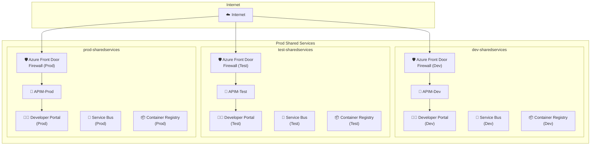
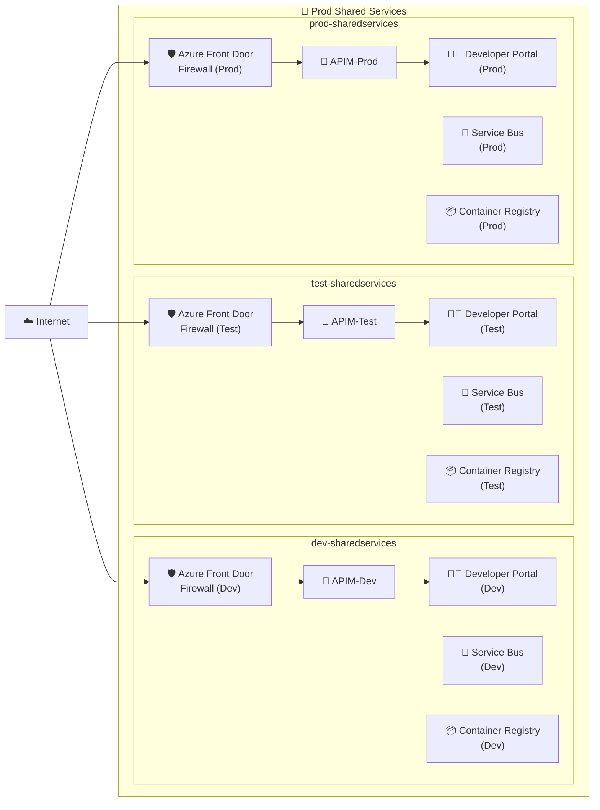

# Integration Platform

```mermaid
graph TB
    subgraph "Internet"
        CLOUD["☁️ Internet"]
    end
    
    subgraph "Prod Shared Services"
        subgraph "dev-sharedservices"
            FIREWALLDEV["🛡️ Azure Front Door<br/>Firewall (Dev)"]
            APIMDEV["🔧 APIM-Dev"]
            PORTALDEV["👨‍💻 Developer Portal<br/>(Dev)"]
            SERVICEBUSDEV["🚌 Service Bus<br/>(Dev)"]
            REGISTRYDEV["📦 Container Registry<br/>(Dev)"]
        end
        
        subgraph "test-sharedservices"
            FIREWALLTEST["🛡️ Azure Front Door<br/>Firewall (Test)"]
            APIMTEST["🔧 APIM-Test"]
            PORTALTEST["👨‍💻 Developer Portal<br/>(Test)"]
            SERVICEBUSTEST["🚌 Service Bus<br/>(Test)"]
            REGISTRYTEST["📦 Container Registry<br/>(Test)"]
        end
        
        subgraph "prod-sharedservices"
            FIREWALLPROD["🛡️ Azure Front Door<br/>Firewall (Prod)"]
            APIMPROD["🔧 APIM-Prod"]
            PORTALPROD["👨‍💻 Developer Portal<br/>(Prod)"]
            SERVICEBUSPROD["🚌 Service Bus<br/>(Prod)"]
            REGISTRYPROD["📦 Container Registry<br/>(Prod)"]
        end
    end
    
    %% Connections
    CLOUD --> FIREWALLDEV
    CLOUD --> FIREWALLTEST
    CLOUD --> FIREWALLPROD
    
    FIREWALLDEV --> APIMDEV
    FIREWALLTEST --> APIMTEST
    FIREWALLPROD --> APIMPROD
    
    APIMDEV --> PORTALDEV
    APIMTEST --> PORTALTEST
    APIMPROD --> PORTALPROD
```

## Alternative Flow Diagram Version

```mermaid
flowchart LR
    CLOUD["☁️ Internet"]
    
    subgraph PSS["🏢 Prod Shared Services"]
        direction TB
        subgraph DEV["dev-sharedservices"]
            direction TB
            FIREWALLDEV["🛡️ Azure Front Door<br/>Firewall (Dev)"]
            APIMDEV["🔧 APIM-Dev"]
            PORTALDEV["👨‍💻 Developer Portal<br/>(Dev)"]
            SERVICEBUSDEV["🚌 Service Bus<br/>(Dev)"]
            REGISTRYDEV["📦 Container Registry<br/>(Dev)"]
        end
        
        subgraph TEST["test-sharedservices"]
            direction TB
            FIREWALLTEST["🛡️ Azure Front Door<br/>Firewall (Test)"]
            APIMTEST["🔧 APIM-Test"]
            PORTALTEST["👨‍💻 Developer Portal<br/>(Test)"]
            SERVICEBUSTEST["🚌 Service Bus<br/>(Test)"]
            REGISTRYTEST["📦 Container Registry<br/>(Test)"]
        end
        
        subgraph PROD["prod-sharedservices"]
            direction TB
            FIREWALLPROD["🛡️ Azure Front Door<br/>Firewall (Prod)"]
            APIMPROD["🔧 APIM-Prod"]
            PORTALPROD["👨‍💻 Developer Portal<br/>(Prod)"]
            SERVICEBUSPROD["🚌 Service Bus<br/>(Prod)"]
            REGISTRYPROD["📦 Container Registry<br/>(Prod)"]
        end
    end
    
    CLOUD --> FIREWALLDEV
    CLOUD --> FIREWALLTEST
    CLOUD --> FIREWALLPROD
    
    FIREWALLDEV --> APIMDEV
    FIREWALLTEST --> APIMTEST
    FIREWALLPROD --> APIMPROD
    
    APIMDEV --> PORTALDEV
    APIMTEST --> PORTALTEST
    APIMPROD --> PORTALPROD
```