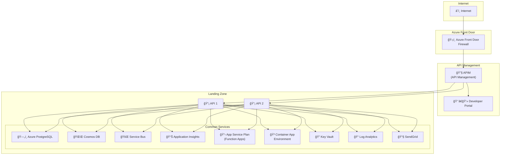
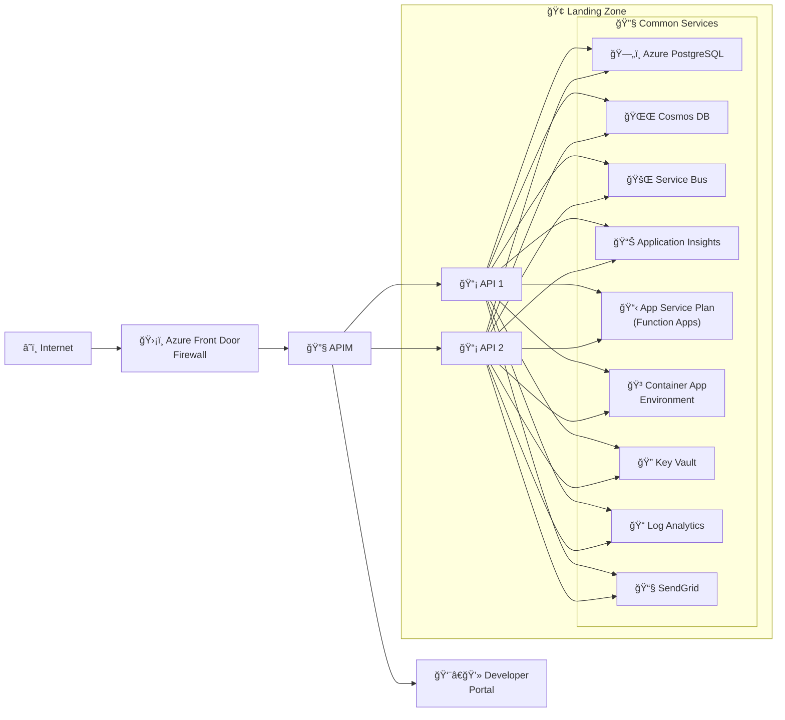

# Landing Zone Architecture

```mermaid
graph TB
    subgraph "Internet"
        CLOUD["â˜ï¸ Internet"]
    end
    
    subgraph "Azure Front Door"
        FIREWALL["ğŸ›¡ï¸ Azure Front Door<br/>Firewall"]
    end
    
    subgraph "API Management"
        APIM["🔧 APIM<br/>(API Management)"]
        PORTAL["👨â€ğŸ’» Developer Portal"]
    end
    
    subgraph "Landing Zone"
        API1["📡 API 1"]
        API2["📡 API 2"]
        
        subgraph "Common Services"
            POSTGRES["ğŸ—„ï¸ Azure PostgreSQL"]
            COSMOS["🌌 Cosmos DB"]
            SERVICEBUS["🚌 Service Bus"]
            INSIGHTS["📊 Application Insights"]
            PLAN["📋 App Service Plan<br/>(Function Apps)"]
            CONTAINER["🳠Container App<br/>Environment"]
            VAULT["🔠Key Vault"]
            LOGS["📠Log Analytics"]
            SENDGRID["📧 SendGrid"]
        end
    end
    
    %% Connections
    CLOUD --> FIREWALL
    FIREWALL --> APIM
    APIM --> PORTAL
    APIM --> API1
    APIM --> API2
    
    API1 --> POSTGRES
    API1 --> COSMOS
    API1 --> SERVICEBUS
    API1 --> INSIGHTS
    API1 --> PLAN
    API1 --> CONTAINER
    API1 --> VAULT
    API1 --> LOGS
    API1 --> SENDGRID
    API2 --> POSTGRES
    API2 --> COSMOS
    API2 --> SERVICEBUS
    API2 --> INSIGHTS
    API2 --> PLAN
    API2 --> CONTAINER
    API2 --> VAULT
    API2 --> LOGS
    API2 --> SENDGRID
```

## Alternative Flow Diagram Version

```mermaid
flowchart LR
    CLOUD["â˜ï¸ Internet"]
    FIREWALL["ğŸ›¡ï¸ Azure Front Door<br/>Firewall"]
    APIM["🔧 APIM"]
    PORTAL["👨â€ğŸ’» Developer<br/>Portal"]
    
    subgraph LZ["🢠Landing Zone"]
        direction TB
        API1["📡 API 1"]
        API2["📡 API 2"]
        
        subgraph SS["🔧 Common Services"]
            direction TB
            POSTGRES["ğŸ—„ï¸ Azure PostgreSQL"]
            COSMOS["🌌 Cosmos DB"]
            SERVICEBUS["🚌 Service Bus"]
            INSIGHTS["📊 Application Insights"]
            PLAN["📋 App Service Plan<br/>(Function Apps)"]
            CONTAINER["🳠Container App<br/>Environment"]
            VAULT["🔠Key Vault"]
            LOGS["📠Log Analytics"]
            SENDGRID["📧 SendGrid"]
        end
    end
    
    CLOUD --> FIREWALL
    FIREWALL --> APIM
    APIM --> PORTAL
    APIM --> API1
    APIM --> API2
    
    API1 --> POSTGRES
    API1 --> COSMOS
    API1 --> SERVICEBUS
    API1 --> INSIGHTS
    API1 --> PLAN
    API1 --> CONTAINER
    API1 --> VAULT
    API1 --> LOGS
    API1 --> SENDGRID
    API2 --> POSTGRES
    API2 --> COSMOS
    API2 --> SERVICEBUS
    API2 --> INSIGHTS
    API2 --> PLAN
    API2 --> CONTAINER
    API2 --> VAULT
    API2 --> LOGS
    API2 --> SENDGRID
```