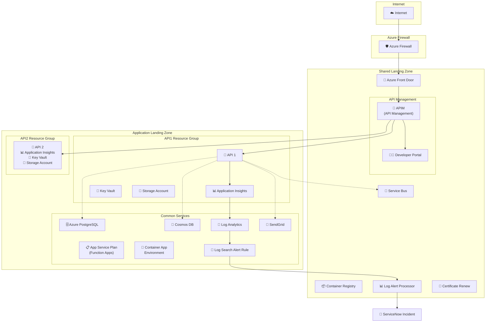
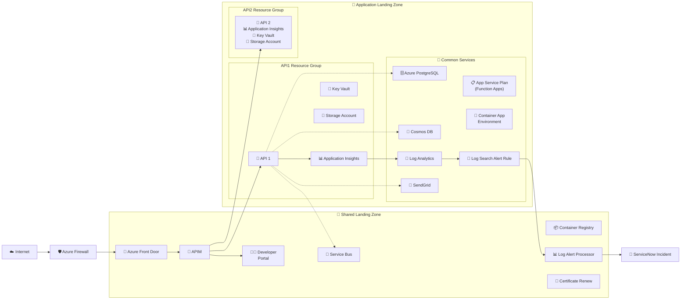

# Landing Zone Architecture

This is the production Landing Zone

```mermaid
graph TB
    subgraph "Internet"
        CLOUD["☁️ Internet"]
    end
    
    subgraph "Azure Firewall"
        FIREWALL["🛡️ Azure Firewall"]
    end
    
    SERVICENOW["🎫 ServiceNow Incident"]
    
    subgraph "Shared Landing Zone"
        FRONTDOOR["🚪 Azure Front Door"]
        SERVICEBUS["🚌 Service Bus"]
        REGISTRY["📦 Container Registry"]
        DANIELLOG["📊 Log Alert Processor"]
        CERTRENEW["🔐 Certificate Renew"]
        
        subgraph "API Management"
            APIM["🔧 APIM<br/>(API Management)"]
            PORTAL["👨‍💻 Developer Portal"]
        end
    end
    
    subgraph "Application Landing Zone"
        subgraph "API1 Resource Group"
            API1["📡 API 1"]
            INSIGHTS1["📊 Application Insights"]
            VAULT1["🔐 Key Vault"]
            STORAGE1["💾 Storage Account"]
        end
        
        subgraph "API2 Resource Group"
            API2["📡 API 2<br/>📊 Application Insights<br/>🔐 Key Vault<br/>💾 Storage Account"]
        end
        
        subgraph "Common Services"
            POSTGRES["🗄️ Azure PostgreSQL"]
            COSMOS["🌌 Cosmos DB"]
            PLAN["📋 App Service Plan<br/>(Function Apps)"]
            CONTAINER["🐳 Container App<br/>Environment"]
            LOGS["📝 Log Analytics"]
            ALERTS["🚨 Log Search Alert Rule"]
            SENDGRID["📧 SendGrid"]
        end
    end
    
    %% Connections
    CLOUD --> FIREWALL
    FIREWALL --> FRONTDOOR
    FRONTDOOR --> APIM
    APIM --> PORTAL
    APIM --> API1
    APIM --> API2
    
    API1 -.-> POSTGRES
    API1 -.-> COSMOS
    API1 -.-> SERVICEBUS
    API1 --> INSIGHTS1
    INSIGHTS1 --> LOGS
    LOGS --> ALERTS
    ALERTS --> DANIELLOG
    DANIELLOG --> SERVICENOW
    API1 -.-> SENDGRID
```

## Alternative Flow Diagram Version

```mermaid
flowchart LR
    CLOUD["☁️ Internet"]
    FIREWALL["🛡️ Azure Firewall"]
    SERVICENOW["🎫 ServiceNow Incident"]
    
    subgraph SLZ["🏢 Shared Landing Zone"]
        direction TB
        FRONTDOOR["🚪 Azure Front Door"]
        SERVICEBUS["🚌 Service Bus"]
        REGISTRY["📦 Container Registry"]
        DANIELLOG["📊 Log Alert Processor"]
        CERTRENEW["🔐 Certificate Renew"]
        APIM["🔧 APIM"]
        PORTAL["👨‍💻 Developer<br/>Portal"]
    end
    
    subgraph ALZ["🏢 Application Landing Zone"]
        direction TB
        subgraph "API1 Resource Group"
            API1["📡 API 1"]
            INSIGHTS1["📊 Application Insights"]
            VAULT1["🔐 Key Vault"]
            STORAGE1["💾 Storage Account"]
        end
        
        subgraph "API2 Resource Group"
            API2["📡 API 2<br/>📊 Application Insights<br/>🔐 Key Vault<br/>💾 Storage Account"]
        end
        
        subgraph SS["🔧 Common Services"]
            direction TB
            POSTGRES["🗄️ Azure PostgreSQL"]
            COSMOS["🌌 Cosmos DB"]
            PLAN["📋 App Service Plan<br/>(Function Apps)"]
            CONTAINER["🐳 Container App<br/>Environment"]
            LOGS["📝 Log Analytics"]
            ALERTS["🚨 Log Search Alert Rule"]
            SENDGRID["📧 SendGrid"]
        end
    end
    
    CLOUD --> FIREWALL
    FIREWALL --> FRONTDOOR
    FRONTDOOR --> APIM
    APIM --> PORTAL
    APIM --> API1
    APIM --> API2
    
    API1 -.-> POSTGRES
    API1 -.-> COSMOS
    API1 -.-> SERVICEBUS
    API1 --> INSIGHTS1
    INSIGHTS1 --> LOGS
    LOGS --> ALERTS
    ALERTS --> DANIELLOG
    DANIELLOG --> SERVICENOW
    API1 -.-> SENDGRID
```