# 1-Azure Integration Platform
**The Red Cross API integration platform**

**Environment-Specific URLs**

## Development
- **API Base**: `https://api-dev.redcross.no`
- **Developer Portal**: `https://developer-dev.redcross.no`

## Test
- **API Base**: `https://api-test.redcross.no`
- **Developer Portal**: `https://developer-test.redcross.no`

## Production
- **API Base**: `https://api.redcross.no`
- **Developer Portal**: `https://developer.redcross.no`

---

# 2-Landing Zone Architecture
**Security-First Design: API Production Landing Zone**

<!-- _class: speaker-note -->
This is the Production Landing Zone architecture. Notice how we have a clear separation between the Shared Landing Zone and the Application Landing Zone. The Shared Landing Zone contains services that are used across multiple APIs like Azure Front Door, API Management, Service Bus, and monitoring tools. The Application Landing Zone shows how individual APIs are organized in their own resource groups with their dedicated Application Insights, Key Vault, and Storage Account. The dotted lines show how APIs connect to shared services like databases and messaging, while solid lines show the monitoring flow from API to Application Insights to Log Analytics to alerting. This architecture ensures security, scalability, and proper monitoring across all our integrations.

---

# 3-Integration Platform Overview
**The 3 API Landing zones Dev, Test and Production**

```mermaid
graph TB
    subgraph "Internet"
        CLOUD["☁️ Internet"]
    end
    
    subgraph "Azure Firewall"
        FIREWALL["🛡️ Azure Firewall"]
    end
    
    classDef prodSecure stroke:#d63031,stroke-width:5px
    
    subgraph "Prod Shared Services"
        subgraph "dev-sharedservices"
            FRONTDOORDEV["🚪 Azure Front Door<br/>(Dev)"]
            APIMDEV["🔧 APIM-Dev"]
            PORTALDEV["👨‍💻 Developer Portal<br/>(Dev)"]
            SERVICEBUSDEV["🚌 Service Bus<br/>(Dev)"]
        end
        
        subgraph "test-sharedservices"
            FRONTDOORTEST["🚪 Azure Front Door<br/>(Test)"]
            APIMTEST["🔧 APIM-Test"]
            PORTALTEST["👨‍💻 Developer Portal<br/>(Test)"]
            SERVICEBUSTEST["🚌 Service Bus<br/>(Test)"]
        end
        
        subgraph "prod-sharedservices"
            FRONTDOORPROD["🚪 Azure Front Door<br/>(Prod)"]
            APIMPROD["🔧 APIM-Prod"]
            PORTALPROD["👨‍💻 Developer Portal<br/>(Prod)"]
            SERVICEBUSPROD["🚌 Service Bus<br/>(Prod)"]
            REGISTRYPROD["📦 Container Registry<br/>(Prod)"]
            CERTRENEWPROD["🔐 Certificate Renew<br/>(Prod)"]
        end
    end
    
    %% Connections
    CLOUD --> FIREWALL
    FIREWALL --> FRONTDOORDEV
    FIREWALL --> FRONTDOORTEST
    FIREWALL --> FRONTDOORPROD
    
    FRONTDOORDEV --> APIMDEV
    FRONTDOORTEST --> APIMTEST
    FRONTDOORPROD --> APIMPROD
    
    APIMDEV --> PORTALDEV
    APIMTEST --> PORTALTEST
    APIMPROD --> PORTALPROD
    
    class SERVICEBUSPROD prodSecure
```

<!-- _class: speaker-note -->
This slide shows how the 3 landing zones (Dev, Test, and Production) each have their own shared services. Notice that each environment has its own Azure Front Door, APIM, Developer Portal, and Service Bus. This isolation ensures that development and testing don't interfere with production. The Production environment has additional services like Container Registry and Certificate Renew that are only needed in production. The red border around the Production Service Bus indicates it's the most secure and critical service. This multi-environment setup allows developers to work safely in Dev, test thoroughly in Test, and deploy confidently to Production.

---
# 4-Deployment Process
**9-Step Workflow**

<!-- _class: speaker-note -->
This 8-step deployment process shows the clear division of responsibilities between three key actors. The Internal Owner makes the business decision and defines roles. The Developer handles technical planning and all development work including Dev, Test, and Production deployments. The API Team manages the infrastructure setup, integration registration, and developer onboarding. Notice the color coding: blue for business decisions, purple for development work, and green for infrastructure management. The dotted lines show the detailed actions for each step. This process ensures proper governance while enabling developers to work independently once they're onboarded. The automated CI/CD pipelines handle the actual deployments, making the process reliable and repeatable.

---

# 5-Developer Portal - The API shop
**API Discovery & Access**

## What is it?
A self-service platform where developers can discover, explore, and consume APIs published by your organization.

## How developers get access to APIs:
- **Browse & Discover** - Search and explore available APIs
- **Self-Register** - Sign up for API access independently
- **Get API Keys** - Receive authentication credentials instantly
- **Test APIs** - Try APIs directly in the portal before integration
- **Download SDKs** - Access client libraries and code samples

---
# 6-Developer Guidelines
**Standards That Enable Success**

## Core Requirements
- **Shared Resources** - Use common services (databases, service bus, logging)
- **Private Networking** - VNet integration for security
- **Security First** - Managed Identities, Key Vault, RBAC
- **Governance** - Follow naming conventions and standards

## Development Process
- **Trunk-Based Git** - Feature branches, PRs, automated deployments
- **3 Environments** - Dev → Test → Production promotion
- **APIM Integration** - Automatic API registration and management

## Logging Standards
- **Structured JSON** - Consistent log format across all services
- **System ID** - Unique identifier for each integration
- **Correlation IDs** - Track requests across service boundaries

---

# 7-Developer Experience
**Self-Service Development**

## What is it?
A centralized platform providing developers with tools, documentation, and resources for efficient development.

## Why do we have it?
- **Single Point of Access** - All development resources in one place
- **Self-Service** - Developers manage their own environments
- **Consistency** - Standardized tools and practices across teams
- **Version Control** - Same libraries for everyone, no version conflicts
- **Efficiency** - Faster onboarding and reduced support overhead

---

# Deployment Benefits
**Automated & Reliable**

## Key Benefits
- **Infrastructure as Code** - All deployments automated
- **Consistent Environments** - Dev, Test, Production parity
- **Quality Gates** - Automated testing and validation
- **Rollback Capability** - Quick recovery from issues
- **Audit Trail** - Complete deployment history

## Process Efficiency
- **Faster Deployments** - Minutes instead of hours
- **Reduced Errors** - Automated validation and testing
- **Self-Service** - Developers can deploy independently
- **Standardization** - Consistent deployment patterns

---

# Next Steps
**Ready to Get Started?**

## For Developers
1. Access Developer Portal: `https://developer.redcross.no`
2. Review development guidelines
3. Set up DevContainer environment
4. Start building integrations

## For Management
1. Review deployment benefits
2. Understand the 8-step process
3. Plan integration projects
4. Assign business and IT owners

## For IT Teams
1. Review security architecture
2. Understand monitoring and alerting
3. Set up operational procedures
4. Configure ServiceNow integration

---

# Questions?
**Let's discuss your integration needs**

- **Architecture questions?**
- **Development process?**
- **Security requirements?**
- **Deployment timeline?**
