# SovDev Production - Multi-Cluster Deployment

```mermaid
graph TB
    subgraph "Provision Host Container"
        PH["🏗️ Provision Host<br/>Management Environment"]
    end
    
    subgraph "Development"
        DEV["🖥️ Rancher Desktop<br/>☸️ Kubernetes<br/>🌐 Traefik<br/>🐘 PostgreSQL<br/>🔴 Redis<br/>🔐 Authentik<br/>🤖 AI Platform<br/>📊 Grafana"]
    end
    
    subgraph "Staging"
        STAGING["⚡ MicroK8s<br/>☸️ Kubernetes<br/>🌐 Traefik<br/>🐘 PostgreSQL<br/>🔴 Redis<br/>🔐 Authentik<br/>🤖 AI Platform<br/>📊 Grafana"]
    end
    
    subgraph "Production"
        PROD["☁️ Azure AKS<br/>☸️ Kubernetes<br/>🌐 Traefik<br/>🐘 PostgreSQL<br/>🔴 Redis<br/>🔐 Authentik<br/>🤖 AI Platform<br/>📊 Grafana"]
    end
    
    subgraph "Edge"
        EDGE["🌐 Edge MicroK8s<br/>☸️ Kubernetes<br/>🌐 Traefik<br/>🐘 PostgreSQL<br/>🔴 Redis<br/>🔐 Authentik<br/>🤖 AI Platform<br/>📊 Grafana"]
    end
    
    %% Management connections
    PH -.->|"Same tools & scripts"| DEV
    PH -.->|"Same tools & scripts"| STAGING
    PH -.->|"Same tools & scripts"| PROD
    PH -.->|"Same tools & scripts"| EDGE
```



## Environment-Specific Configurations

### 🖥️ Development (Rancher Desktop)
| Service | Configuration | Access |
|---------|---------------|--------|
| **Kubernetes** | Single node, local storage | Internal |
| **Traefik** | Localhost routing | http://service.localhost |
| **PostgreSQL** | 8GB storage, pgvector enabled | Internal |
| **Redis** | In-memory cache | Internal |
| **Authentik** | Development SSO | http://authentik.localhost |
| **AI Platform** | OpenWebUI + LiteLLM | http://openwebui.localhost |
| **Grafana** | Development dashboards | http://grafana.localhost |

### ⚡ Staging (MicroK8s)
| Service | Configuration | Access |
|---------|---------------|--------|
| **Kubernetes** | Multi-node, production-like | Internal |
| **Traefik** | Load balancer routing | http://staging.service.localhost |
| **PostgreSQL** | 20GB storage, HA setup | Internal |
| **Redis** | Persistent cache | Internal |
| **Authentik** | Staging SSO | http://staging.authentik.localhost |
| **AI Platform** | Full AI stack | http://staging.openwebui.localhost |
| **Grafana** | Production dashboards | http://staging.grafana.localhost |

### ☁️ Production (Azure AKS)
| Service | Configuration | Access |
|---------|---------------|--------|
| **Kubernetes** | Managed cluster, auto-scaling | Internal |
| **Traefik** | Azure Load Balancer | https://service.company.com |
| **PostgreSQL** | Azure Database for PostgreSQL | Internal |
| **Redis** | Azure Cache for Redis | Internal |
| **Authentik** | Production SSO | https://auth.company.com |
| **AI Platform** | Enterprise AI stack | https://ai.company.com |
| **Grafana** | Enterprise monitoring | https://monitoring.company.com |

### 🌐 Edge (MicroK8s on IoT)
| Service | Configuration | Access |
|---------|---------------|--------|
| **Kubernetes** | Lightweight, ARM64 | Internal |
| **Traefik** | Edge routing | http://edge.service.localhost |
| **PostgreSQL** | 4GB storage, optimized | Internal |
| **Redis** | Minimal cache | Internal |
| **Authentik** | Edge SSO | http://edge.authentik.localhost |
| **AI Platform** | Lightweight AI | http://edge.openwebui.localhost |
| **Grafana** | Edge monitoring | http://edge.grafana.localhost |

## 🚀 Deployment Strategy

### Single Command Deployment
```bash
# Deploy to all environments
./provision-host/kubernetes/provision-kubernetes.sh

# Deploy to specific environment
kubectl config use-context rancher-desktop
./provision-host/kubernetes/provision-kubernetes.sh

kubectl config use-context azure-aks
./provision-host/kubernetes/provision-kubernetes.sh
```

### Environment-Specific Configuration
- **Development**: Local storage, single node, localhost access
- **Staging**: Persistent storage, multi-node, staging subdomains
- **Production**: Managed storage, auto-scaling, custom domains
- **Edge**: Optimized storage, ARM64, edge-optimized services

## 🔧 Key Benefits

### **Consistent Service Stack**
- Same services across all environments
- Identical configuration management
- Unified monitoring and logging

### **Environment Parity**
- Development mirrors production
- Same tools and scripts everywhere
- Predictable deployments

### **Multi-Cloud Support**
- Works on any Kubernetes cluster
- Cloud-agnostic service deployment
- Vendor lock-in avoidance

### **Edge Computing Ready**
- Lightweight deployments for IoT
- ARM64 support for edge devices
- Optimized resource usage

## 📊 Service Availability Matrix

| Service | Dev | Staging | Production | Edge |
|---------|-----|---------|------------|------|
| **Kubernetes** | ✅ | ✅ | ✅ | ✅ |
| **Traefik** | ✅ | ✅ | ✅ | ✅ |
| **PostgreSQL** | ✅ | ✅ | ✅ | ✅ |
| **Redis** | ✅ | ✅ | ✅ | ✅ |
| **Authentik** | ✅ | ✅ | ✅ | ✅ |
| **AI Platform** | ✅ | ✅ | ✅ | ✅ |
| **Grafana** | ✅ | ✅ | ✅ | ✅ |

## 💡 Value Proposition

SovDev enables **true multi-environment consistency** by using the same provision-host container and orchestration scripts across all deployment targets, from local development to production cloud environments and edge computing scenarios.
