# SovDev Services - Complete Service Catalog

```mermaid
graph TB
    subgraph "SovDev - Complete Service Ecosystem"
        BROWSER["🌐 Web Browser<br/>http://service.localhost"]
        
        subgraph "Host Operating System"
            HOST["💻 Host OS<br/>macOS / Linux / Windows"]
            
            subgraph "Provision Host Container"
                PH["🏗️ Provision Host<br/>Management Environment"]
                TOOLS["🛠️ Management Tools<br/>kubectl, helm, ansible<br/>cloud CLIs, terraform"]
                SCRIPTS["📜 Orchestration Scripts<br/>provision-kubernetes.sh<br/>category-based automation"]
                CONFIG["⚙️ Configuration<br/>playbooks, manifests<br/>secrets, kubeconfig"]
            end
            
            subgraph "Kubernetes Cluster - Complete Service Stack"
                subgraph "Core Infrastructure"
                    K8S["☸️ Kubernetes<br/>Container Orchestration"]
                    TRAEFIK["🌐 Traefik<br/>Reverse Proxy & Ingress"]
                    NGINX["📄 NGINX<br/>Web Server"]
                end
                
                subgraph "Authentication & Security"
                    AUTHENTIK["🔐 Authentik<br/>SSO & Authentication"]
                    TAILSCALE["🔒 Tailscale<br/>VPN Connectivity"]
                    CLOUDFLARE["☁️ Cloudflare<br/>Tunnel & CDN"]
                end
                
                subgraph "Data & Storage Services"
                    POSTGRES["🐘 PostgreSQL<br/>Primary Database"]
                    REDIS["🔴 Redis<br/>Cache & Sessions"]
                    MONGODB["🍃 MongoDB<br/>Document Database"]
                    MYSQL["🐬 MySQL<br/>Alternative SQL"]
                    ELASTICSEARCH["🔍 Elasticsearch<br/>Search Engine"]
                    QDRANT["🧠 Qdrant<br/>Vector Database"]
                end
                
                subgraph "Message & Communication"
                    RABBITMQ["🐰 RabbitMQ<br/>Message Broker"]
                end
                
                subgraph "AI Platform"
                    OPENWEBUI["🤖 OpenWebUI<br/>AI Chat Interface"]
                    LITELLM["🔗 LiteLLM<br/>LLM Proxy & Router"]
                    TIKA["📄 Tika<br/>Document Processing"]
                end
                
                subgraph "Observability Stack"
                    GRAFANA["📊 Grafana<br/>Monitoring Dashboards"]
                    PROMETHEUS["📈 Prometheus<br/>Metrics Collection"]
                    LOKI["📝 Loki<br/>Log Aggregation"]
                    TEMPO["🔍 Tempo<br/>Distributed Tracing"]
                    OTEL["📡 OpenTelemetry<br/>Observability"]
                end
                
                subgraph "Data Platform"
                    SPARK["⚡ Apache Spark<br/>Data Processing"]
                    JUPYTER["📓 JupyterHub<br/>Notebook Environment"]
                    UNITY["📚 Unity Catalog<br/>Data Governance"]
                end
                
                subgraph "Management & Administration"
                    PGADMIN["🗄️ pgAdmin<br/>PostgreSQL Admin"]
                    ARGOCD["🚀 ArgoCD<br/>GitOps CD"]
                    REDISINSIGHT["🔍 RedisInsight<br/>Redis Admin"]
                    GRAVITEE["🔧 Gravitee<br/>API Management"]
                end
                
                subgraph "Container & Registry"
                    REGISTRY["📦 Container Registry<br/>Image Storage"]
                end
                
                subgraph "Testing & Development"
                    WHOAMI["🧪 Whoami<br/>Test Service<br/>(public/protected)"]
                end
            end
        end
    end
    
    %% Connections
    BROWSER --> TRAEFIK
    HOST --> PH
    PH -.->|"Manages & Deploys"| K8S
    PH -.->|"Manages & Deploys"| TRAEFIK
    PH -.->|"Manages & Deploys"| NGINX
    PH -.->|"Manages & Deploys"| AUTHENTIK
    PH -.->|"Manages & Deploys"| POSTGRES
    PH -.->|"Manages & Deploys"| REDIS
    PH -.->|"Manages & Deploys"| MONGODB
    PH -.->|"Manages & Deploys"| MYSQL
    PH -.->|"Manages & Deploys"| ELASTICSEARCH
    PH -.->|"Manages & Deploys"| QDRANT
    PH -.->|"Manages & Deploys"| RABBITMQ
    PH -.->|"Manages & Deploys"| OPENWEBUI
    PH -.->|"Manages & Deploys"| LITELLM
    PH -.->|"Manages & Deploys"| TIKA
    PH -.->|"Manages & Deploys"| GRAFANA
    PH -.->|"Manages & Deploys"| PROMETHEUS
    PH -.->|"Manages & Deploys"| LOKI
    PH -.->|"Manages & Deploys"| TEMPO
    PH -.->|"Manages & Deploys"| OTEL
    PH -.->|"Manages & Deploys"| SPARK
    PH -.->|"Manages & Deploys"| JUPYTER
    PH -.->|"Manages & Deploys"| UNITY
    PH -.->|"Manages & Deploys"| PGADMIN
    PH -.->|"Manages & Deploys"| ARGOCD
    PH -.->|"Manages & Deploys"| REDISINSIGHT
    PH -.->|"Manages & Deploys"| GRAVITEE
    PH -.->|"Manages & Deploys"| REGISTRY
    PH -.->|"Manages & Deploys"| WHOAMI
    
    TRAEFIK --> NGINX
    TRAEFIK --> AUTHENTIK
    TRAEFIK --> OPENWEBUI
    TRAEFIK --> GRAFANA
    TRAEFIK --> PGADMIN
    TRAEFIK --> ARGOCD
    TRAEFIK --> REDISINSIGHT
    TRAEFIK --> GRAVITEE
    TRAEFIK --> WHOAMI
```



## Service Categories & Status

### 🏗️ Core Infrastructure (Always Active)
| Service | Description | Status | Access URL |
|---------|-------------|--------|------------|
| **Kubernetes** | Container orchestration platform | ✅ Active | Internal |
| **Traefik** | Reverse proxy and ingress controller | ✅ Active | Internal |
| **NGINX** | Web server and static content | ✅ Active | http://nginx.localhost |

### 🔐 Authentication & Security
| Service | Description | Status | Access URL |
|---------|-------------|--------|------------|
| **Authentik** | SSO & Authentication | ✅ Active | http://authentik.localhost |
| **Tailscale** | VPN Connectivity | ✅ Available | Internal |
| **Cloudflare** | Tunnel & CDN | ✅ Available | External |

### 💾 Data & Storage Services
| Service | Description | Status | Access URL |
|---------|-------------|--------|------------|
| **PostgreSQL** | Primary relational database | ✅ Active | Internal |
| **Redis** | Cache & session management | ✅ Active | Internal |
| **MongoDB** | Document database | ✅ Available | Internal |
| **MySQL** | Alternative SQL database | ✅ Available | Internal |
| **Elasticsearch** | Full-text search engine | ✅ Available | Internal |
| **Qdrant** | Vector database | ✅ Available | Internal |

### 📨 Message & Communication
| Service | Description | Status | Access URL |
|---------|-------------|--------|------------|
| **RabbitMQ** | Message broker | ✅ Available | Internal |

### 🤖 AI Platform
| Service | Description | Status | Access URL |
|---------|-------------|--------|------------|
| **OpenWebUI** | AI chat interface | ✅ Active | http://openwebui.localhost |
| **LiteLLM** | LLM proxy & router | ✅ Active | Internal |
| **Tika** | Document processing | ✅ Available | Internal |

### 📊 Observability Stack
| Service | Description | Status | Access URL |
|---------|-------------|--------|------------|
| **Grafana** | Monitoring dashboards | ✅ Available | http://grafana.localhost |
| **Prometheus** | Metrics collection | ✅ Available | Internal |
| **Loki** | Log aggregation | ✅ Available | Internal |
| **Tempo** | Distributed tracing | ✅ Available | Internal |
| **OpenTelemetry** | Observability instrumentation | ✅ Available | Internal |

### 🔬 Data Platform
| Service | Description | Status | Access URL |
|---------|-------------|--------|------------|
| **Apache Spark** | Data processing | ✅ Available | Internal |
| **JupyterHub** | Notebook environment | ✅ Available | Internal |
| **Unity Catalog** | Data governance | ✅ Available | Internal |

### 🛠️ Management & Administration
| Service | Description | Status | Access URL |
|---------|-------------|--------|------------|
| **pgAdmin** | PostgreSQL administration | ✅ Available | http://pgadmin.localhost |
| **ArgoCD** | GitOps continuous delivery | ✅ Available | http://argocd.localhost |
| **RedisInsight** | Redis administration | ✅ Available | Internal |
| **Gravitee** | API management | ✅ Available | Internal |

### 📦 Container & Registry
| Service | Description | Status | Access URL |
|---------|-------------|--------|------------|
| **Container Registry** | Image storage | ✅ Available | Internal |

### 🧪 Testing & Development
| Service | Description | Status | Access URL |
|---------|-------------|--------|------------|
| **Whoami** | Test service (public/protected) | ✅ Active | http://whoami.localhost |

## 🚀 Service Deployment

### Automatic Deployment (Core Services)
```bash
./provision-host/kubernetes/provision-kubernetes.sh
```

### On-Demand Deployment
```bash
# AI Platform
./provision-host/kubernetes/07-ai/01-setup-litellm-openwebui.sh

# Observability Stack
./provision-host/kubernetes/08-observability/01-setup-prometheus-grafana.sh

# Data Platform
./provision-host/kubernetes/10-datascience/01-setup-jupyterhub.sh
```

## 📈 Service Statistics

- **Total Services**: 24+
- **Always Active**: 6 services
- **Available on Demand**: 18+ services
- **Azure Equivalents**: 19+ services
- **Coverage**: 85% of Azure enterprise capabilities

## 🌐 Access Pattern

All services follow the consistent access pattern:
- **Web Interfaces**: `http://service-name.localhost`
- **Internal APIs**: Kubernetes service discovery
- **External APIs**: Direct service endpoints

## 💡 Value Proposition

SovDev provides **85% of Azure's enterprise capabilities** in a local development environment, enabling teams to build, test, and iterate without cloud dependencies or costs.
