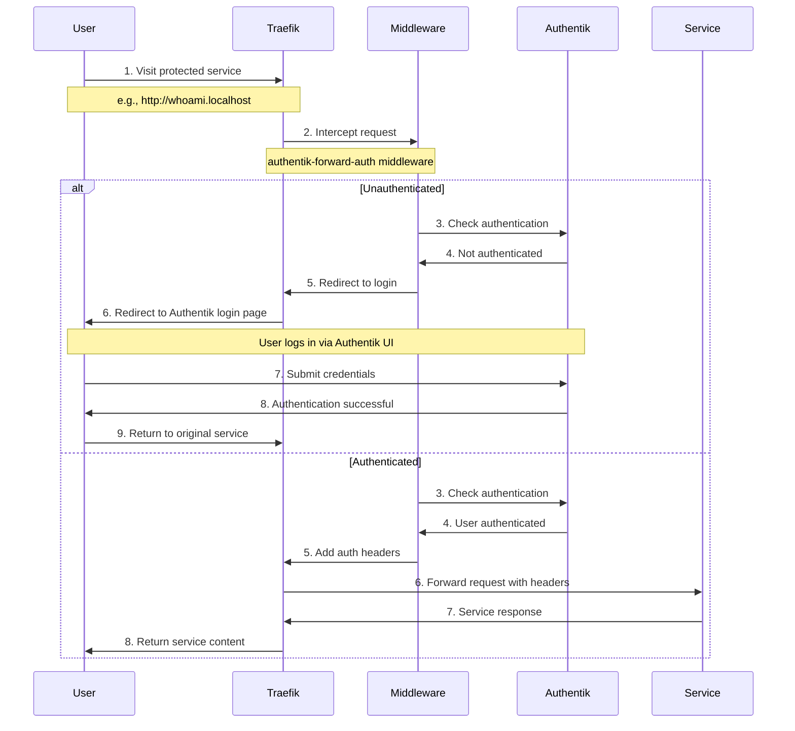

# Traefik Ingress Rules - Cluster Standards Guide

**File**: `doc/rules-ingress-traefik.md`  
**Purpose**: Explain how ingress is configured in this Kubernetes cluster using Traefik  
**Target Audience**: Developers, DevOps engineers, and anyone working with cluster ingress  
**Last Updated**: September 01, 2025  

## 📋 **Overview**

This cluster uses **Traefik** as the primary Ingress Controller with **Traefik IngressRoute CRDs** as the standard pattern. This approach provides more flexibility and features than standard Kubernetes Ingress resources.

## 🏗️ **Cluster Ingress Architecture**

### **Components**:
- **Traefik**: Ingress Controller (runs as a DaemonSet)
- **IngressRoute CRDs**: Custom Resource Definitions for advanced routing
- **Entry Points**: HTTP (`web` port 80) and HTTPS (`websecure` port 443)
- **Priority System**: Determines route matching order

### **DNS and Localhost Routing**:
This cluster uses the **localhost feature** for seamless development:

- **No Hosts File Configuration Required**: Developers don't need to modify `/etc/hosts` or `C:\Windows\System32\drivers\etc\hosts`
- **Automatic Routing**: Any hostname ending in `.localhost` automatically routes to `127.0.0.1` (localhost)
- **Traefik Handles the Rest**: Once traffic reaches localhost, Traefik routes it based on the hostname in the request

**Example Flow**:
```
1. Developer types: http://myapp.localhost
2. DNS resolves: myapp.localhost → 127.0.0.1 (localhost)
3. Request reaches: localhost:80 (Traefik)
4. Traefik matches: Host(`myapp.localhost`) rule
5. Traefik routes to: myapp-service:8080
```

**Benefits**:
- ✅ **Zero Configuration**: No hosts file editing needed
- ✅ **Instant Access**: New services immediately accessible
- ✅ **Consistent**: Same pattern for all developers
- ✅ **Clean**: No local machine pollution

### **Internal DNS Resolution for Pod-to-Pod Communication**:
While the localhost routing works perfectly for browser access, **pods within the cluster need different DNS resolution** to communicate with services using the same hostnames.

**The Challenge**:
- **Browser Context**: `authentik.localhost` → `127.0.0.1` → Traefik → Service ✅
- **Pod Context**: `authentik.localhost` → `127.0.0.1` → ❌ **Unreachable from inside pods**
- **OAuth Integration**: OpenWebUI pods need to call `authentik.localhost` for authentication discovery
- **Service Communication**: Internal APIs need consistent hostname resolution

**The Solution - CoreDNS Rewrite Rules**:
This cluster implements **internal DNS resolution** using CoreDNS rewrite rules that map `*.localhost` hostnames to internal service FQDNs:

```yaml
# CoreDNS Configuration (REMOVED - was manifests/005-internal-dns.yaml)
rewrite name authentik.localhost authentik-server.authentik.svc.cluster.local
rewrite name openwebui.localhost open-webui.ai.svc.cluster.local
```

**Dual-Context Architecture**:
```
# External/Browser Access:
Browser → authentik.localhost → 127.0.0.1 → Traefik → authentik-server.authentik

# Internal/Pod Access:
Pod → authentik.localhost → CoreDNS → 10.43.x.x (ClusterIP) → authentik-server.authentik
```

**Key Benefits**:
- ✅ **Same Hostnames**: Applications use identical URLs in all contexts
- ✅ **OAuth Integration**: Enables OpenWebUI ↔ Authentik authentication
- ✅ **Service Discovery**: Internal APIs accessible via consistent hostnames
- ✅ **Zero App Changes**: No configuration differences between internal/external
- ✅ **Automatic Resolution**: Pods automatically resolve `*.localhost` to service IPs

**Implementation Details**:
- **File**: `manifests/005-internal-dns.yaml` (REMOVED - was deployed early in cluster setup)
- **Method**: Patches existing CoreDNS ConfigMap with rewrite rules
- **Scope**: All pods cluster-wide get the internal DNS resolution
- **Verification**: `kubectl exec -it <pod> -- getent hosts authentik.localhost`

**Critical for These Use Cases**:
- 🔐 **OAuth Authentication**: OpenWebUI → Authentik integration
- 🌐 **API Communication**: Service-to-service internal calls
- 📊 **Monitoring**: Services calling other services for metrics/health
- 🔄 **Webhooks**: Internal callback URLs using consistent hostnames

**DNS Resolution Flow**:
```
Pod Request → CoreDNS → Rewrite Rule Applied → Service ClusterIP → Target Service

Example:
authentik.localhost → authentik-server.authentik.svc.cluster.local → 10.43.119.98 → Authentik Service
```

This **dual-context DNS resolution** ensures that the same hostname works seamlessly in both browser and pod contexts, enabling complex integrations like OAuth while maintaining the simplicity of the localhost development pattern.

### **Authentication in the Cluster**:
This cluster supports **optional authentication** using **Authentik** as the identity provider. Services can be configured as public (no auth) or protected (requires login). Protected services use Traefik middleware (`authentik-forward-auth`) that forwards authentication requests to Authentik before serving content. See `manifests/075-authentik-config.yaml`, `manifests/077-authentik-forward-auth-middleware.yaml`, and `manifests/078-whoami-protected-ingressroute.yaml` for implementation examples.

### **External Traffic Access**:
For external access beyond localhost, this cluster supports **Cloudflare Tunnels** and **Tailscale Funnel** to securely route external traffic to Traefik. External domains can be configured to route through Cloudflare (with WAF/DDoS protection) or directly via Tailscale Funnel, while maintaining the same Traefik ingress rules. See `doc/networking-cloudflare-setup.md`, `doc/networking-tailscale-setup.md`, and `doc/networking-readme.md` for setup details.

### **Why Traefik IngressRoute CRDs?**
- **More Features**: Path rewriting, header manipulation, middleware
- **Better Performance**: Direct integration with Traefik
- **Cluster Standard**: Consistent with existing infrastructure
- **Advanced Routing**: Complex matching rules and conditions

## 🔧 **API Version and Standards**

### **Current Traefik Version**:
This cluster is running **Traefik 3.3.6** (Rancher Desktop distribution).

### **Available API Versions**:
```bash
# Current cluster has these Traefik API resources:
ingressroutes        traefik.io/v1alpha1     true    IngressRoute
ingressroutetcps     traefik.io/v1alpha1     true    IngressRouteTCP
ingressrouteudps     traefik.io/v1alpha1     true    IngressRouteUDP
middlewares          traefik.io/v1alpha1     true    Middleware
middlewaretcps       traefik.io/v1alpha1     true    MiddlewareTCP
serverstransports    traefik.io/v1alpha1     true    ServersTransport
serverstransporttcps traefik.io/v1alpha1     true    ServersTransportTCP
tlsoptions           traefik.io/v1alpha1     true    TLSOption
tlsstores            traefik.io/v1alpha1     true    TLSStore
traefikservices      traefik.io/v1alpha1     true    TraefikService
```

### **API Version Status**:
- **`traefik.io/v1alpha1`**: ✅ **Currently Supported** - This is the working version in Traefik 3.3.6
- **`traefik.io/v1`**: ❌ **Not Available** - This version is not yet available in Traefik 3.3.6
- **`hub.traefik.io/v1alpha1`**: ✅ **Available** - For newer Traefik Hub features (APIs, Portals, etc.)

### **Required API Version for Ingress**:
```yaml
apiVersion: traefik.io/v1alpha1
kind: IngressRoute
```

**⚠️ Important**: Use `traefik.io/v1alpha1` - this is the current working version in Traefik 3.3.6. While `traefik.io/v1` may be available in future Traefik versions, it's not yet available in this cluster.

### **Standard Structure**:
```yaml
apiVersion: traefik.io/v1alpha1
kind: IngressRoute
metadata:
  name: <service-name>
  namespace: default
  labels:
    app: <application-name>
    component: <component-type>
    protection: <auth-level>
spec:
  entryPoints:
    - web  # HTTP port 80
  routes:
    - match: <routing-rule>
      kind: Rule
      services:
        - name: <service-name>
          port: <port-number>
```

## 🎯 **Priority System**

### **How Priorities Work**:
- **Lower numbers = Higher priority** (checked first)
- **Higher numbers = Lower priority** (checked last)
- **No priority specified = Default higher priority**

### **Priority Guidelines**:
```yaml
# High Priority (1-10): Critical services, authentication
priority: 1

# Medium Priority (10-50): Application services
priority: 25

# Low Priority (50+): Fallback, catch-all
priority: 100
```

### **Example - Nginx Catch-All**:
```yaml
# File: manifests/020-nginx-root-ingress.yaml
spec:
  routes:
    - match: PathPrefix(`/`)
      kind: Rule
      priority: 1  # LOWEST priority - ensures all other routes are checked first
      services:
        - name: nginx
          port: 80
```

**Purpose**: Acts as a fallback for any unmatched requests. **Priority 1** ensures it's checked last.

## 🌐 **Routing Patterns**

### **1. HostRegexp Pattern Routing** (Recommended - For Multi-Domain Support)
```yaml
# Recommended pattern for all services - enables multi-domain access
spec:
  routes:
    - match: HostRegexp(`myapp\..+`)
      kind: Rule
      services:
        - name: myapp-service
          port: 80
```

**Best For**: All services - enables unified internal/external access and future domain support
**Benefits**: 
- ✅ Works on `.localhost` (internal development)
- ✅ Works on `.urbalurba.no` (external demo)
- ✅ Works on any future domains automatically
- ✅ No need to update IngressRoute when adding new domains

### **2. Path-Based Routing**
```yaml
spec:
  routes:
    - match: PathPrefix(`/api`)
      kind: Rule
      services:
        - name: api-service
          port: 8080
```

**Best For**: API endpoints, path-specific routing

### **3. Complex Matching** (Use Sparingly)
```yaml
spec:
  routes:
    - match: Host(`service.localhost`) && PathPrefix(`/admin`)
      kind: Rule
      services:
        - name: admin-service
          port: 8080
```

**Best For**: Advanced routing needs, but can cause debugging issues

### **4. HostRegexp Pattern Routing** (Advanced - For Unified Internal/External Access)
```yaml
# File: manifests/078-whoami-protected-ingressroute.yaml
spec:
  routes:
    - match: HostRegexp(`whoami\..+`)
      kind: Rule
      services:
        - name: whoami
          port: 80
      middlewares:
        - name: authentik-forward-auth
          namespace: default
```

**Best For**: Services that need to work on both internal (.localhost) and external (.urbalurba.no) domains
**Pattern Explanation**: `whoami\..+` matches any domain starting with `whoami.`
- ✅ `whoami.localhost` (internal development)
- ✅ `whoami.urbalurba.no` (external demo via Cloudflare tunnel)
- ✅ `whoami.example.com` (any future domain)

**Benefits**:
- **Unified Routing**: Single IngressRoute handles multiple domains
- **Future-Proof**: Automatically supports new domains without configuration changes
- **Cloudflare Ready**: External access via Cloudflare tunnel without duplicating rules
- **Seamless Switching**: Easy transition between development and demo modes

## 🔐 **Authentication with Authentik**

### **Overview**
This cluster supports **optional authentication** using **Authentik** as the identity provider. Services can be configured as public (no auth) or protected (requires login). Protected services use Traefik middleware (`authentik-forward-auth`) that forwards authentication requests to Authentik before serving content.

### **Authentication Flow**


**Step-by-Step Process**:
1. **Unauthenticated Request**: User visits protected service
2. **Traefik Intercepts**: Middleware catches the request
3. **Redirect to Authentik**: User is sent to login page
4. **User Authentication**: User logs in via Authentik
5. **Return to Service**: After successful auth, user is redirected back
6. **Service Access**: Service receives authentication headers

### **Required Components**
1. **Authentik Deployment**: `manifests/075-authentik-config.yaml`
2. **CSP Middleware**: `manifests/076-authentik-csp-middleware.yaml` (for external domain support)
3. **Forward Auth Middleware**: `manifests/077-authentik-forward-auth-middleware.yaml`
4. **Protected IngressRoute**: Example below

### **CSP Middleware for External Domains**
When using external domains (like `authentik.urbalurba.no` via Cloudflare tunnel), the authentication UI experiences **mixed content errors** because:
- Page loads over HTTPS: `https://authentik.urbalurba.no`
- But API calls use HTTP: `http://authentik.urbalurba.no/api/v3/...`
- Browsers block HTTP requests from HTTPS pages

The **CSP middleware** solves this by adding the `upgrade-insecure-requests` header:

```yaml
# File: manifests/076-authentik-csp-middleware.yaml
apiVersion: traefik.io/v1alpha1
kind: Middleware
metadata:
  name: authentik-csp-upgrade
  namespace: authentik
spec:
  headers:
    customResponseHeaders:
      Content-Security-Policy: "upgrade-insecure-requests"
```

**How it works**:
- **HTTPS domains** (external): Get CSP header → Browser automatically upgrades HTTP API calls to HTTPS ✅
- **HTTP domains** (.localhost): No CSP header → Works normally with HTTP ✅

**Integration**: The CSP middleware is automatically applied to the Authentik IngressRoute:
```yaml
# File: manifests/076-authentik-ingressroute.yaml
spec:
  routes:
    - match: HostRegexp(`authentik\..+`)
      middlewares:
        - name: authentik-csp-upgrade
          namespace: authentik
      services:
        - name: authentik-server
          port: 80
```

**Benefits**:
- ✅ Enables external domain authentication (Cloudflare, Tailscale)
- ✅ Preserves localhost development workflow
- ✅ Uses browser-native mixed content resolution
- ✅ No server-side configuration changes needed

### **Example: Protected Service with HostRegexp**
```yaml
# File: manifests/078-whoami-protected-ingressroute.yaml
apiVersion: traefik.io/v1alpha1
kind: IngressRoute
metadata:
  name: whoami-protected
  namespace: default
  labels:
    app: whoami
    type: protected
    routing: unified
    protection: authentik-forward-auth
spec:
  entryPoints:
    - web
  routes:
    - match: HostRegexp(`whoami\..+`)
      kind: Rule
      services:
        - name: whoami
          port: 80
      middlewares:
        - name: authentik-forward-auth
          namespace: default
```

**Key Elements**:
- **HostRegexp Pattern**: `whoami\..+` for unified internal/external routing
- **Middleware Reference**: `authentik-forward-auth` in default namespace
- **Labels**: `type: protected` and `routing: unified` for clarity

### **Authentication Headers**
When properly configured, the following headers are passed to your service:
```yaml
# Headers available in your application
- X-Forwarded-User          # Username
- X-Forwarded-Email         # User email
- X-Forwarded-Groups        # User groups/roles
- X-Forwarded-Name          # Full name
- X-Forwarded-Preferred-Username  # Preferred username
- X-Forwarded-User-Id       # User ID
```

### **UI Configuration Prerequisites**
Before deploying protected services, complete these steps in Authentik UI:

1. **Create Application**: 
   - Name: `whoami`, Slug: `whoami`
   - Type: `Proxy`

2. **Create Proxy Provider**:
   - Name: `whoami-provider`
   - Mode: `Forward auth (single application)`
   - External Host: `https://whoami.urbalurba.no`

3. **Link Provider to Application**:
   - Edit whoami application
   - Assign whoami-provider

4. **Configure Outpost**:
   - Edit "authentik Embedded Outpost"
   - Add whoami application

### **Testing Authentication**
```bash
# Test unauthenticated access (should redirect to login)
curl -L http://whoami.localhost

# Test authenticated access (browser required)
open http://whoami.localhost

# Compare with public route (no auth required)
curl http://whoami-public.localhost
```

### **Public vs Protected Routes**
```yaml
# Public Route (No Authentication)
# File: manifests/071-whoami-public-ingressroute.yaml
spec:
  routes:
    - match: HostRegexp(`whoami-public\..+`)
      services:
        - name: whoami
          port: 80
      # No middlewares = public access

# Protected Route (With Authentication)
# File: manifests/078-whoami-protected-ingressroute.yaml
spec:
  routes:
    - match: HostRegexp(`whoami\..+`)
      services:
        - name: whoami
          port: 80
      middlewares:
        - name: authentik-forward-auth  # Authentication required
          namespace: default
```

**Pattern**: Use `whoami-public\..+` for public access and `whoami\..+` for protected access to the same service.

## 📁 **Working Examples**

### **File Organization**:
All ingress configuration files are located in the **`manifests/`** folder.

**⚠️ See [doc/rules-naming-conventions.md](rules-naming-conventions.md#manifest-files) for complete naming patterns.**

**Quick Reference**:
- **File Naming**: IngressRoute files end with `-ingressroute.yaml`
- **Examples**:
  - `038-grafana-ingressroute.yaml`
  - `039-otel-collector-ingressroute.yaml`
  - `071-whoami-public-ingressroute.yaml`
- **Numbering**: Files numbered to indicate deployment order and component grouping

### **Example 1: Nginx Catch-All**
```yaml
# File: manifests/020-nginx-root-ingress.yaml
apiVersion: traefik.io/v1alpha1
kind: IngressRoute
metadata:
  name: nginx-root-catch-all
  namespace: default
  labels:
    app: nginx
    component: catch-all-routing
spec:
  entryPoints:
    - web
  routes:
    - match: PathPrefix(`/`)
      kind: Rule
      priority: 1  # Lowest priority - fallback
      services:
        - name: nginx
          port: 80
```

**Purpose**: Fallback for unmatched requests  
**Priority**: 1 (lowest - checked last)  
**Pattern**: `PathPrefix(/)` - matches everything

### **Example 2: Whoami Public Service (Working File)**
```yaml
# File: manifests/071-whoami-public-ingressroute.yaml
# This is the ACTUAL working file with HostRegexp pattern
apiVersion: traefik.io/v1alpha1
kind: IngressRoute
metadata:
  name: whoami-public
  namespace: default
  labels:
    app: whoami
    type: public
    routing: unified
spec:
  entryPoints:
    - web
  routes:
    - match: HostRegexp(`whoami-public\..+`)
      kind: Rule
      services:
        - name: whoami
          port: 80
```

**Purpose**: Unified internal/external routing with HostRegexp  
**Priority**: None specified (defaults to higher than catch-all)  
**Pattern**: `HostRegexp(whoami-public\..+)` - matches whoami-public.localhost, whoami-public.urbalurba.no, etc.
**Status**: ✅ This is the ACTUAL working file in your cluster

## 🚫 **Common Mistakes to Avoid**

### **1. Wrong API Version**
```yaml
# ❌ WRONG - Will cause "no matches for kind" error
apiVersion: traefik.io/v1

# ✅ CORRECT - This is the working version
apiVersion: traefik.io/v1alpha1
```

### **2. Over-Complex Routing**
```yaml
# ❌ AVOID - Complex matching can cause issues
match: Host(`service.localhost`) && PathPrefix(`/api`) && Header(`Content-Type`, `application/json`)

# ✅ PREFER - Simple, reliable routing
match: Host(`api.localhost`)
```

### **3. Missing Priority for Catch-All**
```yaml
# ❌ WRONG - Will interfere with other routes
match: PathPrefix(`/`)
priority: 100  # Too high - other routes won't work

# ✅ CORRECT - Low priority for fallback
match: PathPrefix(`/`)
priority: 1  # Lowest - checked last
```

### **4. Port Mismatches**
```yaml
# ❌ WRONG - Service port doesn't match
services:
  - name: my-service
    port: 8080  # But service actually runs on port 80

# ✅ CORRECT - Verify actual service port
services:
  - name: my-service
    port: 80  # Match actual service port
```

## 🔍 **Debugging Ingress Issues**

### **Check IngressRoute Status**:
```bash
# List all IngressRoutes
kubectl get ingressroute

# Describe specific IngressRoute
kubectl describe ingressroute <name>

# Get YAML configuration
kubectl get ingressroute <name> -o yaml
```

### **Test Service Directly**:
```bash
# Port-forward to service
kubectl port-forward svc/<service-name> <local-port>:<service-port>

# Test locally
curl -i http://localhost:<local-port>/
```

### **Check Traefik Logs**:
```bash
# Get Traefik pod name
kubectl get pods -l app.kubernetes.io/name=traefik

# View logs
kubectl logs <traefik-pod-name> -f
```

### **Verify Service Health**:
```bash
# Check service endpoints
kubectl get endpoints <service-name>

# Check pod status
kubectl get pods -l app=<app-label>
```

### **Debug Internal DNS Resolution**:
```bash
# Test DNS resolution from pod
kubectl exec -it <pod-name> -- getent hosts authentik.localhost

# Verify CoreDNS configuration
kubectl get configmap coredns -n kube-system -o yaml

# Check CoreDNS logs
kubectl logs -n kube-system -l k8s-app=kube-dns -f

# Test service connectivity from pod
kubectl exec -it <pod-name> -- python -c "import socket; print(socket.gethostbyname('authentik.localhost'))"
```

## 📝 **Best Practices**

### **1. Use HostRegexp for All Services** (Recommended)
```yaml
# ✅ RECOMMENDED - For all services to enable multi-domain support
match: HostRegexp(`myapp\..+`)

# Pattern Examples:
# - myapp.localhost (internal development)
# - myapp.urbalurba.no (external demo)
# - myapp.example.com (future domains)

# ❌ AVOID - Limited to single domain
match: Host(`myapp.localhost`)
```

### **2. Set Appropriate Priorities**
```yaml
# High priority for critical services
priority: 10

# Medium priority for applications
priority: 25

# Low priority for fallbacks
priority: 100
```

### **3. Use Descriptive Names and Labels**
```yaml
metadata:
  name: myapp-api-ingress
  labels:
    app: myapp
    component: api
    protection: public
    environment: production
```

### **4. Test Before Production**
```yaml
# Test with HostRegexp routing first
match: HostRegexp(`test\..+`)

# Then add complexity if needed
match: HostRegexp(`test\..+`) && PathPrefix(`/api`)
```

## 🔄 **Migration from Standard Ingress**

### **Before (Standard Kubernetes Ingress)**:
```yaml
apiVersion: networking.k8s.io/v1
kind: Ingress
metadata:
  name: myapp-ingress
  annotations:
    traefik.ingress.kubernetes.io/router.entrypoints: "web"
spec:
  ingressClassName: traefik
  rules:
  - host: myapp.localhost
    http:
      paths:
      - path: /
        pathType: Prefix
        backend:
          service:
            name: myapp-service
            port:
              number: 80
```

### **After (Traefik IngressRoute)**:
```yaml
apiVersion: traefik.io/v1alpha1
kind: IngressRoute
metadata:
  name: myapp-ingress
spec:
  entryPoints:
    - web
  routes:
    - match: Host(`myapp.localhost`)
      kind: Rule
      services:
        - name: myapp-service
          port: 80
```

## 📚 **Additional Resources**

### **Official Documentation**:
- [Traefik IngressRoute Documentation](https://doc.traefik.io/traefik/routing/providers/kubernetes-crd/)
- [Traefik Routing Rules](https://doc.traefik.io/traefik/routing/routers/)

### **Cluster-Specific Files**:
- **Internal DNS**: `manifests/005-internal-dns.yaml` (REMOVED)
- **Nginx Catch-All**: `manifests/020-nginx-root-ingress.yaml`
- **Whoami Public**: `manifests/071-whoami-public-ingressroute.yaml`
- **Authentik CSP Middleware**: `manifests/076-authentik-csp-middleware.yaml`
- **Gravitee Examples**: `manifests/091-gravitee-ingress.yaml`

### **Related Documentation**:
- **Networking Overview**: `doc/networking-readme.md`
- **Infrastructure Guide**: `doc/infrastructure-readme.md`

## 🎯 **Summary**

### **Key Points**:
1. **Use `traefik.io/v1alpha1`** - this is the current working version in Traefik 3.3.6
2. **Deploy internal DNS early** - `manifests/005-internal-dns.yaml` (REMOVED - was used for pod-to-pod communication)
3. **Prefer `HostRegexp()` patterns** for all services to enable multi-domain support
4. **Use `HostRegexp()` for unified internal/external access** - single rule handles multiple domains
5. **Set appropriate priorities** (1 = lowest, 100+ = highest)
6. **Test services directly** before troubleshooting ingress
7. **Follow the working examples** in the manifests folder
8. **Implement authentication** using `authentik-forward-auth` middleware for protected services

### **Traefik Version Information**:
- **Current Version**: Traefik 3.3.6 (Rancher Desktop)
- **API Version**: `traefik.io/v1alpha1` is current and supported
- **Future Versions**: `traefik.io/v1` may be available in newer Traefik releases
- **Cluster Status**: Using the latest stable API version available

### **Remember**:
- **Internal DNS resolution** is required for OAuth and service-to-service communication
- **Traefik IngressRoute CRDs** are the cluster standard
- **HostRegexp patterns** are preferred for all services to enable multi-domain support
- **Dual-context DNS** enables same hostnames in browser and pod contexts
- **Unified routing** across internal and external domains
- **Priority system** determines route matching order
- **Authentication middleware** protects services when needed
- **Test incrementally** to avoid debugging complexity

This approach ensures consistent, maintainable ingress configuration across the cluster with support for both development and production environments, while enabling complex internal service communication patterns like OAuth integration.

## ⚠️ **External Domain Authentication Limitations**

### **The Problem**
While Authentik works seamlessly with `*.localhost` domains, **adding external domains (like `urbalurba.no`) requires significant manual configuration**. This is a fundamental limitation of Authentik's proxy provider architecture, not our cluster setup.

### **Why This Happens**
Authentik's proxy providers have a single "External Host" field that only accepts ONE specific URL. You cannot use patterns or wildcards. This means:
- ❌ Cannot have one provider for both `whoami.localhost` and `whoami.urbalurba.no`
- ❌ Cannot use patterns like `https://whoami.*` in the External Host field
- ❌ Each domain/service combination needs its own provider

### **Manual Steps Required Per External Domain**

When connecting a new external domain (e.g., via Cloudflare tunnel), developers must:

#### **1. Update CSRF Trusted Origins** (~10 minutes)
Edit `manifests/075-authentik-config.yaml` and add ALL external URLs that will be accessed:
```yaml
- name: AUTHENTIK_WEB__CSRF_TRUSTED_ORIGINS
  value: "http://authentik.localhost,https://authentik.urbalurba.no,https://whoami.urbalurba.no,https://openwebui.urbalurba.no"
```
Then redeploy Authentik:
```bash
kubectl delete -f manifests/075-authentik-config.yaml
kubectl apply -f manifests/075-authentik-config.yaml
```

#### **2. Create Proxy Provider in Authentik UI** (~5 minutes per service)
For EACH protected service on the external domain:
1. Login to Authentik admin: `https://authentik.urbalurba.no/if/flow/initial-setup/`
2. Navigate to **Applications** → **Providers**
3. Click **Create** → **Proxy Provider**
4. Configure:
   - **Name**: `whoami-urbalurba-provider`
   - **Authorization flow**: `default-provider-authorization-implicit-consent`
   - **Type**: Select **Forward auth (single application)**
   - **External host**: `https://whoami.urbalurba.no` (exact URL, no wildcards)
   - **Token validity**: `hours=24`

#### **3. Create Application** (~3 minutes per service)
1. Navigate to **Applications** → **Applications**
2. Click **Create**
3. Configure:
   - **Name**: `whoami-urbalurba`
   - **Slug**: `whoami-urbalurba`
   - **Provider**: Select the provider created in step 2
   - **Policy engine mode**: `any`

#### **4. Update Embedded Outpost** (~2 minutes)
1. Navigate to **Applications** → **Outposts**
2. Edit **authentik Embedded Outpost**
3. In **Applications**, add the new application from step 3
4. Click **Update**

### **Time Impact**
- **First external domain**: ~45 minutes (includes CSRF update + first few services)
- **Additional services on same domain**: ~10 minutes each
- **New external domain**: ~20 minutes + 10 minutes per protected service

### **Example Scenario**
Developer connects `company.com` via Cloudflare tunnel and wants to protect 5 services:
1. Update CSRF origins with all 5 service URLs: 10 minutes
2. Create 5 proxy providers (one per service): 25 minutes
3. Create 5 applications: 15 minutes
4. Update outpost configuration: 2 minutes
**Total**: ~52 minutes of manual configuration

### **What Works Without Manual Configuration**
✅ All `*.localhost` services (development)
✅ Public services on external domains (no authentication)
✅ Authentik admin UI on external domains (with CSP middleware)

### **What Requires Manual Configuration**
❌ Each protected service on external domains
❌ CSRF trusted origins for each new domain
❌ Separate provider/application for each domain/service combination

### **Future Solutions Being Considered**
1. **Custom Authentication Proxy**: Build domain-agnostic proxy between Traefik and Authentik
2. **Automation Scripts**: Use Authentik API to auto-configure providers when new domains detected
3. **Alternative Auth Systems**: Evaluate Authelia or OAuth2-Proxy for better multi-domain support
4. **Kubernetes Operator**: Auto-configure Authentik based on IngressRoute annotations

### **Current Workaround**
For now, developers should:
1. Use `*.localhost` for development (works automatically)
2. Only configure external domain authentication for production/demo services
3. Keep most services public during development
4. Document which services need protection before going to production

This limitation is acknowledged and being worked on, but for now represents a "one-time setup cost" per external domain that developers need to be aware of.
