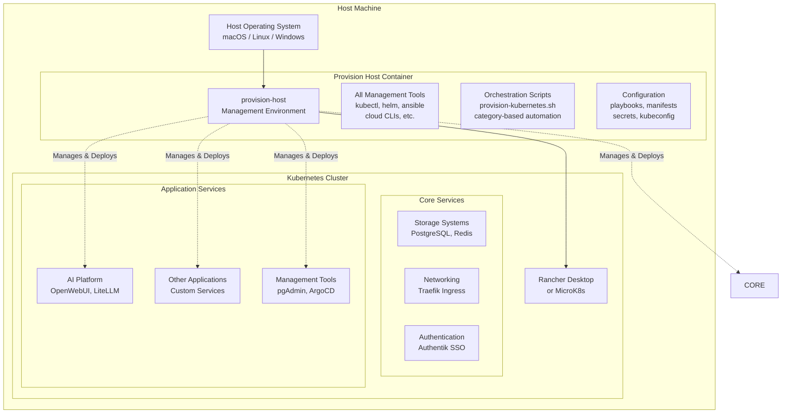
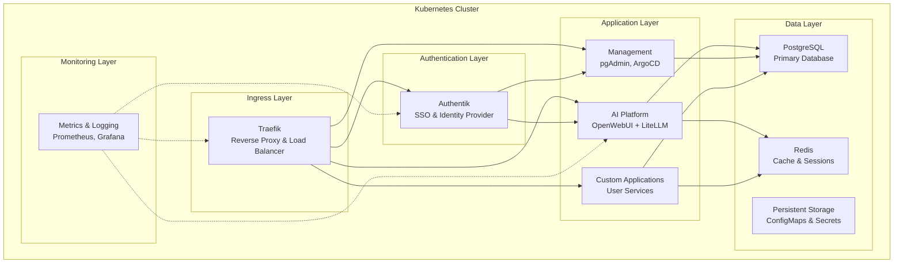
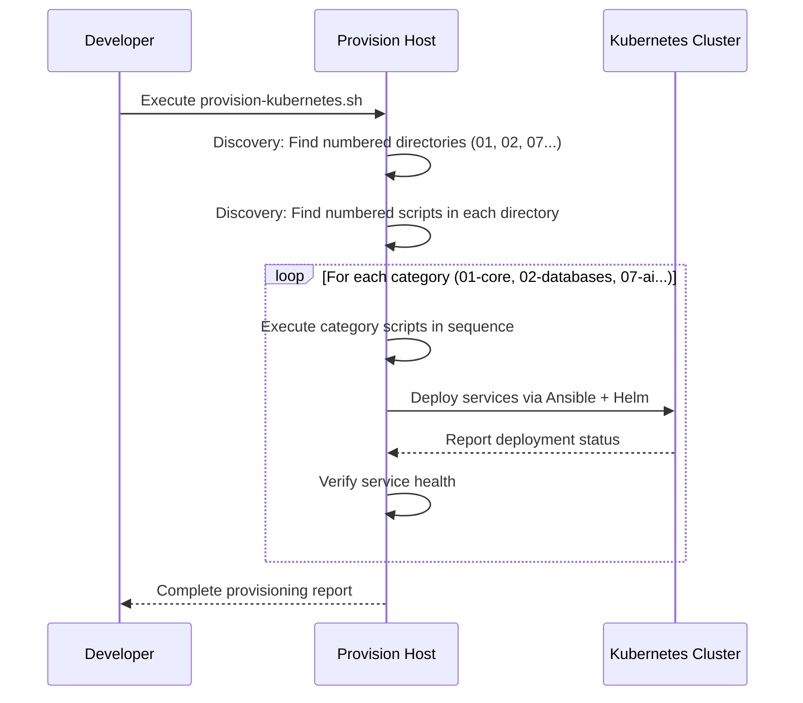
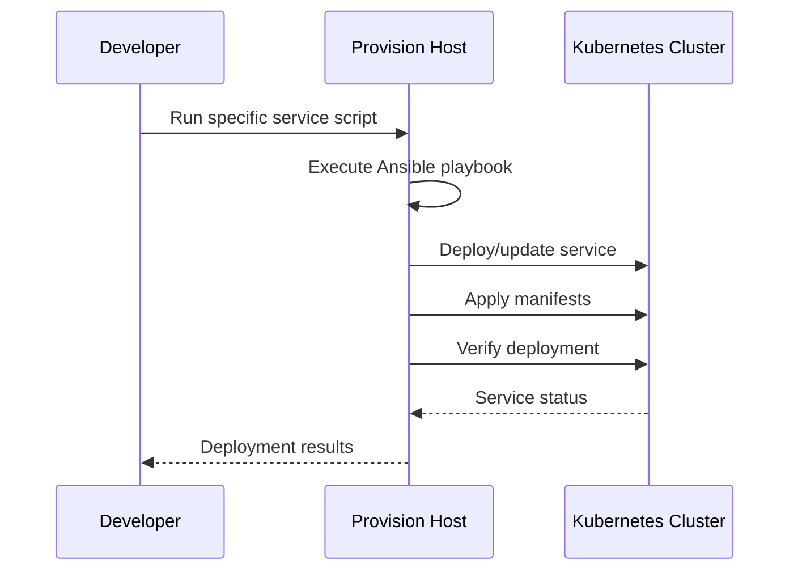

# Urbalurba Infrastructure System Architecture

**File**: `doc/system-architecture.md`
**Purpose**: High-level overview of the two-tier architecture: provision-host + cluster
**Target Audience**: Developers, architects, and anyone needing to understand the overall system design
**Last Updated**: September 20, 2024

## 🏗️ **Overview**

The Urbalurba Infrastructure follows a **two-tier architecture** that separates cluster management from cluster workloads. This design provides a clean separation of concerns, ensuring all management tooling is centralized and the cluster remains focused on running applications.



## 🎯 **Core Architecture Principles**

### **1. Separation of Management and Runtime**
- **Provision Host**: Contains ALL tools needed to manage the cluster
- **Cluster**: Runs ONLY application workloads and services
- **Clean Interface**: Management happens through standard Kubernetes APIs

### **2. Self-Contained Management Environment**
- **Containerized Tooling**: All management tools isolated in provision-host container
- **Version Consistency**: Same tool versions across all environments
- **Portable**: Works identically on any host machine

### **3. Declarative Configuration**
- **Infrastructure as Code**: All cluster state defined in manifests
- **Reproducible Deployments**: Same configuration produces identical results
- **Version Controlled**: All configuration tracked in Git

## 🏗️ **Tier 1: Provision Host (Management Layer)**

The **provision-host** is a containerized management environment that contains ALL tools and scripts needed to manage the Kubernetes cluster.

### **What's Inside the Provision Host**

```
provision-host/
├── kubernetes/                    # Orchestration scripts
│   ├── provision-kubernetes.sh    # Main orchestration engine
│   ├── 01-core-systems/          # Core infrastructure scripts
│   ├── 02-databases/             # Data service scripts
│   ├── 07-ai/                    # AI platform scripts
│   └── [nn]-[category]/          # Other service categories
├── ansible/                      # Automation engine
│   ├── playbooks/                # Service deployment logic
│   └── inventory/                # Environment configurations
└── tools/                        # Management toolchain
    ├── kubectl                   # Kubernetes CLI
    ├── helm                      # Package manager
    ├── ansible                   # Automation engine
    └── cloud CLIs               # AWS, Azure, GCP tools
```

### **Management Capabilities**

- **🚀 Cluster Provisioning**: Automated setup of entire infrastructure
- **📦 Service Deployment**: Deploy services using Ansible + Helm
- **🔧 Configuration Management**: Manage secrets, configs, manifests
- **🔍 Monitoring & Debugging**: Access logs, metrics, troubleshooting tools
- **☁️ Cloud Integration**: Deploy to AWS, Azure, GCP from same environment

### **Key Benefits**

- ✅ **Tool Consistency**: Same versions across all environments
- ✅ **Reproducible**: Identical setup process everywhere
- ✅ **Isolated**: Management tools don't interfere with cluster workloads
- ✅ **Portable**: Works on any machine with Docker
- ✅ **Auditable**: All management actions tracked and scripted

## 🎪 **Tier 2: Kubernetes Cluster (Runtime Layer)**

The **Kubernetes cluster** runs on the host machine and provides container orchestration for all application services.

### **Cluster Runtime Options**

| **Option** | **Use Case** | **Benefits** |
|------------|--------------|--------------|
| **Rancher Desktop** | Development, local testing | Easy setup, GUI management |
| **MicroK8s** | Production-like local env | Lightweight, production features |
| **Cloud K8s** | Production deployment | Managed services, high availability |

### **Service Architecture**



### **Service Categories**

| **Category** | **Number Range** | **Examples** | **Purpose** |
|--------------|------------------|--------------|-------------|
| **Core Systems** | `000-099` | Storage, networking, DNS | Foundation services |
| **Data Services** | `040-099` | PostgreSQL, Redis, MongoDB | Data persistence |
| **Authentication** | `070-079` | Authentik, OAuth providers | Identity & access |
| **AI Platform** | `200-229` | OpenWebUI, LiteLLM, Tika | AI/ML workloads |
| **Observability** | `030-039` | Prometheus, Grafana, Loki | Monitoring & logging |
| **Management** | `600-799` | pgAdmin, ArgoCD | Admin interfaces |

## 🔄 **Deployment Flow**

### **Automated Provisioning Process**



### **Manual Service Management**



## 🔌 **Interface Between Tiers**

### **Communication Protocols**

- **🔗 Kubernetes API**: Primary interface for cluster management
- **🐳 Docker API**: Container lifecycle management
- **📁 Volume Mounts**: Shared configuration and data
- **🌐 Network**: Standard TCP/IP for service access

### **Configuration Management**

```
Host Machine
├── topsecret/kubernetes/kubernetes-secrets.yml    # Central configuration
├── manifests/                                     # Service definitions
└── ansible/playbooks/                            # Deployment automation
    ↓ (mounted into provision-host)
provision-host:/mnt/urbalurbadisk/
├── topsecret/kubernetes/kubernetes-secrets.yml    # Same configuration
├── manifests/                                     # Same manifests
└── ansible/playbooks/                            # Same playbooks
```

## 💡 **Key Design Benefits**

### **1. Simplified Development Experience**
- **Single Entry Point**: Everything managed through provision-host
- **Consistent Environment**: Same tools and versions everywhere
- **Reduced Complexity**: Developers don't need to install management tools

### **2. Operational Reliability**
- **Immutable Management**: Provision-host container ensures consistent tooling
- **Isolated Concerns**: Management plane separated from application plane
- **Reproducible Deployments**: Same process works everywhere

### **3. Scalability & Portability**
- **Cloud Agnostic**: Same management approach for any Kubernetes cluster
- **Environment Consistency**: Dev, test, prod use identical processes
- **Team Collaboration**: Shared management environment and processes

## 🚀 **Getting Started**

### **Quick Setup**
1. **Clone Repository**: Get the infrastructure code
2. **Start Provision Host**: Launch the management container
3. **Run Provisioning**: Execute `provision-kubernetes.sh`
4. **Access Services**: Use ingress URLs or port-forwarding

### **Daily Development**
1. **Access Provision Host**: `docker exec -it provision-host bash`
2. **Deploy Services**: Run category scripts or specific playbooks
3. **Monitor Cluster**: Use kubectl, logs, metrics dashboards
4. **Update Configuration**: Edit manifests and re-deploy

## 📚 **Related Documentation**

- **🔧 Deployment Rules**: `doc/rules-provisioning.md` - How to create and manage services
- **🚦 Ingress Patterns**: `doc/rules-ingress-traefik.md` - Traffic routing and authentication
- **🤖 AI Platform**: `doc/package-ai-readme.md` - AI infrastructure details
- **🌐 Networking**: `doc/networking-readme.md` - Network architecture and DNS

---

**💡 Key Takeaway**: The Urbalurba Infrastructure is fundamentally about **separation of concerns** - the provision-host handles ALL management complexity, while the cluster focuses purely on running applications reliably and efficiently.