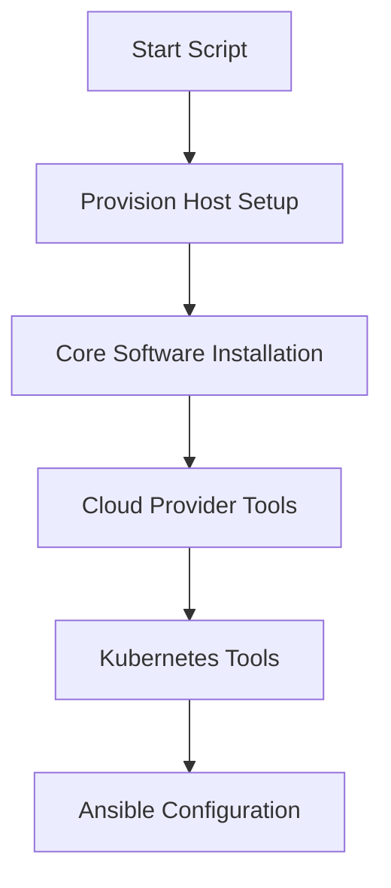
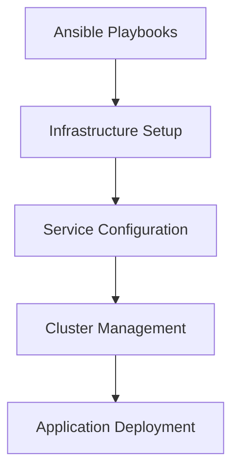
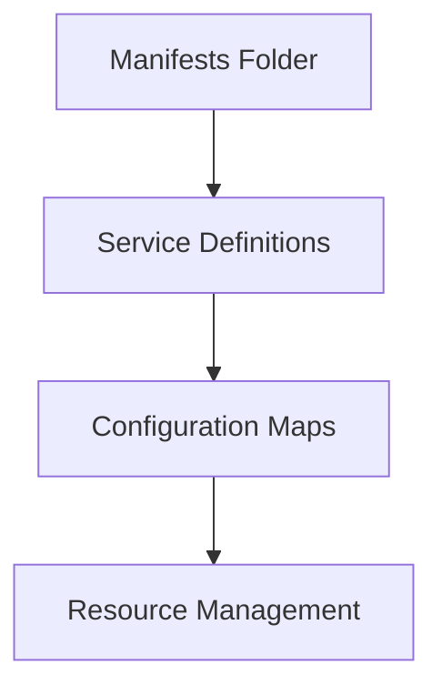

# Urbalurba Infrastructure System Architecture

## Overview

The Urbalurba Infrastructure is a comprehensive system that provides a complete development, testing, and deployment environment. It can run on a single machine (like a developer's laptop) and can be deployed to cloud providers (AWS, Azure, GCP) or on-premises environments.

## System Components

The system consists of several key components that work together:

1. **Provision Host**
   - Containerized environment containing all necessary tools
   - Manages infrastructure setup and configuration
   - Contains cloud provider tools and Kubernetes management tools

2. **Local Kubernetes Cluster**
   - Provides container orchestration
   - Runs services and applications
   - Can be Rancher Desktop or MicroK8s

3. **Ansible Playbooks**
   - Automates infrastructure setup
   - Manages configuration
   - Deploys services to the Kubernetes cluster

4. **Kubernetes Manifests**
   - Defines services and applications
   - Configures Kubernetes resources
   - Managed through version control

## System Workflow

### 1. Initial Setup

The system is initialized through a series of scripts that follow a specific order:

1. **Start Script**
   - Entry point for system initialization
   - Coordinates the setup process
   - Ensures proper execution order

2. **Provision Host Setup**
   - Creates the containerized environment
   - Installs base tools and dependencies
   - Configures networking and security

3. **Core Software Installation**
   - Installs essential tools (GitHub CLI, etc.)
   - Sets up development environment
   - Configures system settings

4. **Cloud Provider Tools**
   - Installs cloud-specific CLIs
   - Configures cloud provider access
   - Sets up authentication

5. **Kubernetes Tools**
   - Installs kubectl, Helm, and other tools
   - Configures Kubernetes access
   - Sets up cluster management tools

### 2. Infrastructure Management

Once the initial setup is complete, Ansible playbooks take over for infrastructure management:

1. **Infrastructure Setup**
   - Configures network components
   - Sets up storage solutions
   - Deploys monitoring tools

2. **Service Configuration**
   - Configures system services
   - Sets up security policies
   - Manages access control

3. **Cluster Management**
   - Manages Kubernetes resources
   - Configures cluster components
   - Sets up service mesh

4. **Application Deployment**
   - Deploys applications
   - Configures services
   - Manages updates

### 3. Kubernetes Manifests

The system uses Kubernetes manifests to define and manage services:

1. **Service Definitions**
   - Defines Kubernetes services
   - Configures deployments
   - Sets up ingress rules

2. **Configuration Maps**
   - Manages application configs
   - Stores environment variables
   - Handles secrets

3. **Resource Management**
   - Defines resource limits
   - Configures scaling rules
   - Manages storage

## Development Workflow

1. **Local Development**
   - Developers work on their local machines
   - Use provision host for management
   - Test applications locally

2. **Testing**
   - Automated testing in local environment
   - Integration testing with services
   - Performance testing

3. **Deployment**
   - Deploy to local cluster for testing
   - Push to cloud providers when ready
   - Use same manifests across environments

## Security Considerations

1. **Access Control**
   - Role-based access control
   - Secure communication channels
   - Encrypted storage

2. **Network Security**
   - Firewall rules
   - Network policies
   - VPN access

3. **Data Protection**
   - Encrypted secrets
   - Secure backups
   - Access logging

## Maintenance and Updates

1. **Regular Updates**
   - Tool version updates
   - Security patches
   - Feature enhancements

2. **Monitoring**
   - System health checks
   - Performance monitoring
   - Log management

3. **Backup and Recovery**
   - Regular backups
   - Disaster recovery
   - System restoration

## Future Enhancements

1. **Planned Improvements**
   - Additional cloud provider support
   - Enhanced monitoring
   - Improved automation

2. **Scalability**
   - Multi-cluster support
   - Load balancing
   - Resource optimization

3. **Security**
   - Enhanced encryption
   - Advanced access control
   - Compliance features 