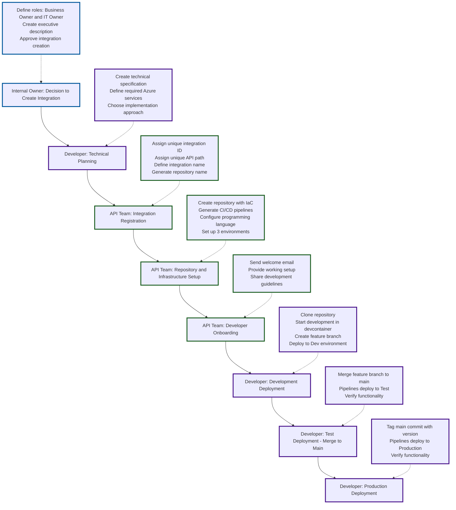

# Azure Integration Deployment Process

## Actors
- **Internal Owner**: Business decision maker
- **Developer**: Technical implementer
- **API Team**: Infrastructure and platform management

## Process Flow

### 1. Internal Owner: Decision to Create Integration
- Define roles: Business Owner and IT Owner
- Create executive description of integration purpose and scope
- Approve integration creation

### 2. Developer: Technical Planning
- Create technical specification (data requirements, performance needs)
- Define required Azure services (database, service bus, logging, storage, key vault)
- Choose implementation approach (Azure Functions: C#/TypeScript/Python, App Service, Container Apps)

### 3. API Team: Integration Registration
- Assign unique integration ID (e.g., INT0001007)
- Assign unique API path (e.g., /organizations)
- Define integration name (e.g., Local-Unions)
- Generate repository name: `<integration-id>-<integration-name>` (e.g., INT0001007-Local-Unions)

### 4. API Team: Repository and Infrastructure Setup
- Create repository with infrastructure as code
- Automatically generate CI/CD pipelines:
  - CI (Continuous Integration)
  - CD (Continuous Deployment)
  - APIM registration for API developer portal
- Configure programming language for Azure Functions
- Set up for 3 environments: Dev, Test, Production
- Prepare services requiring manual configuration (database, service bus, etc.)

### 5. API Team: Developer Onboarding
- Send welcome email to developer
- Provide working setup with "Hello World" skeleton
- Share development guidelines (branching strategy, coding standards)

### 6. Developer: Development Deployment
- Clone repository
- Start development in devcontainer (developer toolbox)
- Create feature branch according to branching rules
- Modify the test path from printing "Hello World" to "Hello My World"
- Deploy infrastructure to Dev environment
- Deploy to APIM
- Verify functionality at: `https://api-dev.redcross.no/<API-path>/helloworld`
  - Example: `https://api-dev.redcross.no/organizations/helloworld`
- Continue development iterations

### 7. Developer: Test Deployment (Merge to Main)
- Merge feature branch to main in DevOps portal
- Pipelines automatically deploy to Test environment
- Verify functionality at: `https://api-test.redcross.no/<API-path>/helloworld`

### 8. Developer: Production Deployment
- Tag main commit with semantic version (e.g., 1.0.2)
- Pipelines automatically deploy to Production
- Verify functionality at: `https://api.redcross.no/<API-path>/helloworld`

## Key Principles
- Infrastructure as Code for all deployments
- Automated CI/CD pipelines across all environments
- Manual configuration only for services requiring it
- Semantic versioning for production releases