# 1- Urbalurba Integration Platform
_From ClickOps to DevOps_

**API Endpoints**  
- Production API Base: https://api.urbalurba.no  
  Developer portal: https://developer.urbalurba.no  
- Test API Base: https://api.urbalurba.no  
  Developer portal: https://developer.urbalurba.no  
- Development API Base: https://api.urbalurba.no  
  Developer portal: https://developer.urbalurba.no  

---

## 2- ClickOps vs DevOps  

**ClickOps Characteristics**  
- Manual repetition — same clicking process for every deployment  
- "It worked yesterday" — no audit trail when things break unexpectedly  
- Knowledge silos — everything breaks when the “Azure expert” is on vacation  
- Configuration drift — dev, test, and prod environments are never identical  
- Fear of change — “Don’t touch it if it’s working” mentality  
- Costly mistakes — one wrong click in production = major incident  

**DevOps Characteristics**  
- Deploy in seconds — one command replaces hundreds of clicks  
- Full traceability — every change tracked (who, what, when, why)  
- Knowledge in code — new team members productive on day one  
- Identical environments — what works in dev will work in production  
- Confident changes — test everything before production  
- Automatic rollback — mistakes reverted in seconds, not hours  

---

## 3- Deployment Process  

1. Internal Owner: Decision to create integration  
2. Developer: Technical planning  
3. Developer: OpenAPI/Swagger spec  
4. API Team: Integration registration  
5. API Team: Repository and infrastructure setup  
6. API Team: Developer onboarding  
7. Developer: Development deployment  
8. Developer: Test deployment (merge to main)  
9. Developer: Production deployment  

### 1. Internal Owner: Decision to Create Integration
- Define roles: Business Owner and IT Owner
- Create executive description of integration purpose and scope
- Approve integration creation

### 2. Developer: Technical Planning
- Create technical specification (data requirements, performance needs)
- Define required Azure services (database, service bus, logging, storage, key vault)
- Choose implementation approach (Azure Functions: C#/TypeScript/Python, App Service, Container Apps)

### 3. API Team: Integration Registration
- Assign unique integration ID (e.g., INT0001007)
- Assign unique API path (e.g., /organizations)
- Define integration name (e.g., Local-Unions)
- Generate repository name: `<integration-id>-<integration-name>` (e.g., INT0001007-Local-Unions)

### 4. API Team: Repository and Infrastructure Setup
- Create repository with infrastructure as code
- Automatically generate CI/CD pipelines:
  - CI (Continuous Integration)
  - CD (Continuous Deployment)
  - APIM registration for API developer portal
- Configure programming language for Azure Functions
- Set up for 3 environments: Dev, Test, Production
- Prepare services requiring manual configuration (database, service bus, etc.)

### 5. API Team: Developer Onboarding
- Send welcome email to developer
- Provide working setup with "Hello World" skeleton
- Share development guidelines (branching strategy, coding standards)

### 6. Developer: Development Deployment
- Clone repository
- Start development in devcontainer (developer toolbox)
- Create feature branch according to branching rules
- Modify the test path from printing "Hello World" to "Hello My World"
- Deploy infrastructure to Dev environment
- Deploy to APIM
- Verify functionality at: `https://api-dev.urbalurba.no/<API-path>/helloworld`
  - Example: `https://api-dev.urbalurba.no/organizations/helloworld`
- Continue development iterations

### 7. Developer: Test Deployment (Merge to Main)
- Merge feature branch to main in DevOps portal
- Pipelines automatically deploy to Test environment
- Verify functionality at: `https://api-test.urbalurba.no/<API-path>/helloworld`

### 8. Developer: Production Deployment
- Tag main commit with semantic version (e.g., 1.0.2)
- Pipelines automatically deploy to Production
- Verify functionality at: `https://api.urbalurba.no/<API-path>/helloworld`

### Key Principles
- Infrastructure as Code for all deployments
- Automated CI/CD pipelines across all environments
- Manual configuration only for services requiring it
- Semantic versioning for production releases

---

## 4- What happens inside IaC Infrastructure as Code

- Fully automated setup  
- Works the same every time  
- Provisions: landing zones, systems, networking, security, APIM, owners, and more  

```mermaid
graph TD
    A[Infrastructure as Code IaC] --> B[1. Create Repository<br/>with Infrastructure as Code]
    
    B --> C[2. Auto-Generate CI/CD Pipelines]
    C --> C1[CI - Continuous Integration]
    C --> C2[CD - Continuous Deployment]
    C --> C3[APIM Registration<br/>for API Developer Portal]
    
    C1 --> D[3. Configure Programming Language<br/>for Azure Functions]
    C2 --> D
    C3 --> D
    
    D --> E[4. Set Up 3 Environments]
    E --> E1[DEV Environment]
    E --> E2[TEST Environment]
    E --> E3[PROD Environment]
    
    E1 --> F[5. Prepare Services<br/>Requiring Manual Configuration]
    E2 --> F
    E3 --> F
    
    F --> F1[Database]
    F --> F2[Service Bus]
    F --> F3[Other Services]
    
    F1 --> G[Infrastructure Deployed ✓]
    F2 --> G
    F3 --> G
```

---

## 5- Landing Zone Architecture – Production Landing Zone  

- Landing zones for Development, Test, and Production  

---

## 6- Integration Platform Overview - Landing zones Dev, Test and Prod

Overview of the dev, test and prod landing zones

```mermaid
graph TB
    CLOUD["☁️ Internet"]
    
    FIREWALL["🛡️ Azure Firewall"]
    
    classDef prodSecure stroke:#d63031,stroke-width:5px
    
    subgraph "Prod Shared Services"
        subgraph "dev-sharedservices"
            FRONTDOORDEV["🚪 Azure Front Door<br/>(Dev)"]
            APIMDEV["🔧 APIM-Dev"]
            PORTALDEV["👨‍💻 Developer Portal<br/>(Dev)"]
            SERVICEBUSDEV["🚌 Service Bus<br/>(Dev)"]
        end
        
        subgraph "test-sharedservices"
            FRONTDOORTEST["🚪 Azure Front Door<br/>(Test)"]
            APIMTEST["🔧 APIM-Test"]
            PORTALTEST["👨‍💻 Developer Portal<br/>(Test)"]
            SERVICEBUSTEST["🚌 Service Bus<br/>(Test)"]
        end
        
        subgraph "prod-sharedservices"
            FRONTDOORPROD["🚪 Azure Front Door<br/>(Prod)"]
            APIMPROD["🔧 APIM-Prod"]
            PORTALPROD["👨‍💻 Developer Portal<br/>(Prod)"]
            SERVICEBUSPROD["🚌 Service Bus<br/>(Prod)"]
            REGISTRYPROD["📦 Container Registry<br/>(Prod)"]
            CERTRENEWPROD["🔐 Certificate Renew<br/>(Prod)"]
        end
    end
    
    %% Connections
    CLOUD --> FIREWALL
    FIREWALL --> FRONTDOORDEV
    FIREWALL --> FRONTDOORTEST
    FIREWALL --> FRONTDOORPROD
    
    FRONTDOORDEV --> APIMDEV
    FRONTDOORTEST --> APIMTEST
    FRONTDOORPROD --> APIMPROD
    
    APIMDEV --> PORTALDEV
    APIMTEST --> PORTALTEST
    APIMPROD --> PORTALPROD
    
    class SERVICEBUSPROD,APIMPROD prodSecure
```

---

## 7- Deployment Portal – “The API Shop” 

- **Browse & Discover**: Search and explore available APIs  
- **Self-Register**: Sign up for API access independently  
- **Get API Keys**: Receive authentication credentials instantly  
- **Test APIs**: Try APIs directly in the portal before integration  
- **Download SDKs**: Access client libraries and code samples  

---

## 8- Developer Guidelines  

- Core Requirements  
- Development Process  
- Logging Standards  

**image from Integrations.wiki showing the Developer handbook" 
TODO: Add the most important text as speaker notes

---

## 9- Developer Toolbox  

- Works across Windows / Mac / Linux  
- **Efficiency**: Faster onboarding, reduced support overhead  
- **Version Control**: Same libraries for everyone, no version conflicts  
- **Consistency**: Standardized tools and practices across teams  
- **Accessibility**: Anyone can check out code and fix bugs  

> Tools, programming languages, and libraries are included in the **Devcontainer**.  
TODO: Add speakder notes and link
---

## 8- Our “Runtime” Menu  

- Container Apps  
- App Service  
- Serverless / Functions  

**Images showing: a) what runtimes we offer and how they relate to offerings from azure b) what runtimes are suited for what***

---

## 9- DevOps Benefits  

**For the Company**  
- Faster time-to-market: features in days, not months  
- Reduced operational costs: fewer incidents, less manual work, optimal resource usage  

**For Developers**  
- Focus on creating, not configuring: write code, not deployment guides  
- Less stress: no more weekend deployments or 2 AM emergencies  

**For IT Department**  
- From firefighting to engineering: prevent problems instead of reacting  
- Standardization without bureaucracy: governance built-in, not blocking  

 DevOps Benefits  

- Automated & Reliable  
- Documented  

---

## 10- DevOps Challenges  

**For the Company**  
- Upfront investment: time, training, tools cost money before ROI  
- Cultural resistance: “we’ve always done it this way” friction  

**For Developers**  
- Steep learning curve: Git, pipelines, IaC, testing (not just coding)  
- Less freedom: only pre-approved services/patterns, no experimenting  

**For IT Department**  
- Identity shift: from infrastructure gatekeepers to platform enablers  
- Legacy system pressure: maintaining old while building new practices  

---

**Image (described):** Illustrations contrasting ClickOps and DevOps work styles.  
