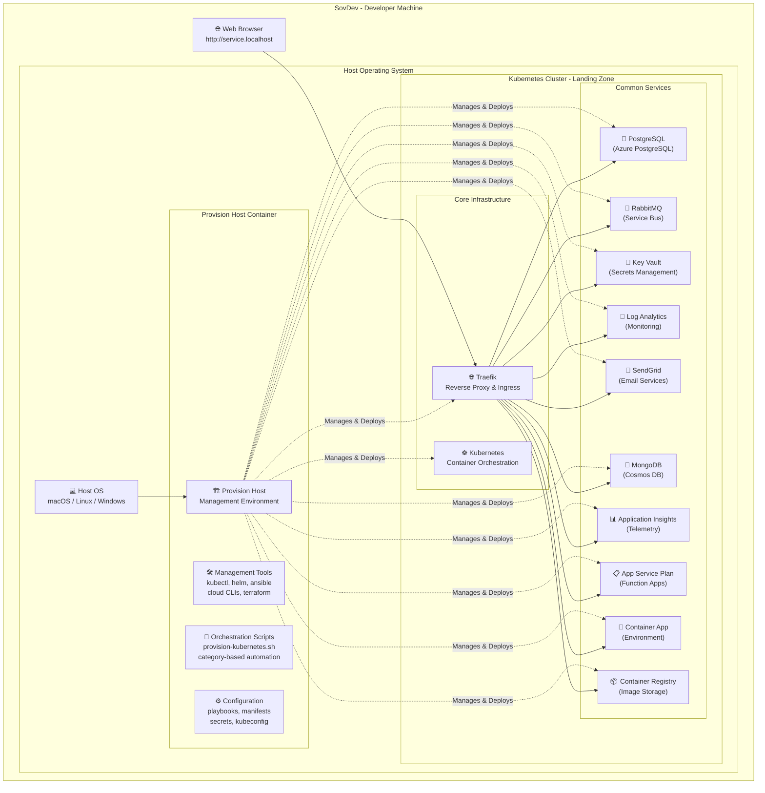
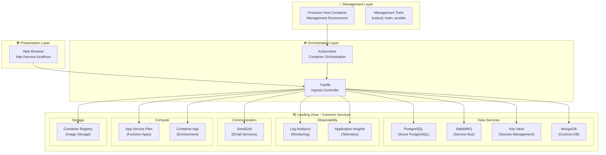

# Sovereign Developer Infrastructure - SovDev

```mermaid
graph TB
    subgraph "SovDev - Developer Machine"
        BROWSER["🌐 Web Browser<br/>http://service.localhost"]
        
        subgraph "Host Operating System"
            HOST["💻 Host OS<br/>macOS / Linux / Windows"]
            
            subgraph "Provision Host Container"
                PH["🏗️ Provision Host<br/>Management Environment"]
                TOOLS["🛠️ Management Tools<br/>kubectl, helm, ansible<br/>cloud CLIs, terraform"]
                SCRIPTS["📜 Orchestration Scripts<br/>provision-kubernetes.sh<br/>category-based automation"]
                CONFIG["⚙️ Configuration<br/>playbooks, manifests<br/>secrets, kubeconfig"]
            end
            
            subgraph "Kubernetes Cluster - Landing Zone"
                subgraph "Core Infrastructure"
                    K8S["☸️ Kubernetes<br/>Container Orchestration"]
                    TRAEFIK["🌐 Traefik<br/>Reverse Proxy & Ingress"]
                end
                
                subgraph "Common Services"
                    POSTGRES["🐘 PostgreSQL<br/>(Azure PostgreSQL)"]
                    SERVICEBUS["🚌 RabbitMQ<br/>(Service Bus)"]
                    VAULT["🔐 Key Vault<br/>(Secrets Management)"]
                    LOGS["📝 Log Analytics<br/>(Monitoring)"]
                    SENDGRID["📧 SendGrid<br/>(Email Services)"]
                    COSMOS["🌌 MongoDB<br/>(Cosmos DB)"]
                    INSIGHTS["📊 Application Insights<br/>(Telemetry)"]
                    PLAN["📋 App Service Plan<br/>(Function Apps)"]
                    CONTAINER["🐳 Container App<br/>(Environment)"]
                    REGISTRY["📦 Container Registry<br/>(Image Storage)"]
                end
            end
        end
    end
    
    %% Internal SovDev connections
    BROWSER --> TRAEFIK
    HOST --> PH
    PH -.->|"Manages & Deploys"| K8S
    PH -.->|"Manages & Deploys"| TRAEFIK
    PH -.->|"Manages & Deploys"| POSTGRES
    PH -.->|"Manages & Deploys"| SERVICEBUS
    PH -.->|"Manages & Deploys"| VAULT
    PH -.->|"Manages & Deploys"| LOGS
    PH -.->|"Manages & Deploys"| SENDGRID
    PH -.->|"Manages & Deploys"| COSMOS
    PH -.->|"Manages & Deploys"| INSIGHTS
    PH -.->|"Manages & Deploys"| PLAN
    PH -.->|"Manages & Deploys"| CONTAINER
    PH -.->|"Manages & Deploys"| REGISTRY
    
    TRAEFIK --> POSTGRES
    TRAEFIK --> SERVICEBUS
    TRAEFIK --> VAULT
    TRAEFIK --> LOGS
    TRAEFIK --> SENDGRID
    TRAEFIK --> COSMOS
    TRAEFIK --> INSIGHTS
    TRAEFIK --> PLAN
    TRAEFIK --> CONTAINER
    TRAEFIK --> REGISTRY
```

## Alternative Layered Architecture View

```mermaid
flowchart TB
    subgraph "🌐 Presentation Layer"
        BROWSER["Web Browser<br/>http://service.localhost"]
    end
    
    subgraph "🔧 Management Layer"
        PH["Provision Host Container<br/>Management Environment"]
        TOOLS["Management Tools<br/>kubectl, helm, ansible"]
    end
    
    subgraph "☸️ Orchestration Layer"
        K8S["Kubernetes<br/>Container Orchestration"]
        TRAEFIK["Traefik<br/>Ingress Controller"]
    end
    
    subgraph "🏗️ Landing Zone - Common Services"
        subgraph "Data Services"
            POSTGRES["PostgreSQL<br/>(Azure PostgreSQL)"]
            SERVICEBUS["RabbitMQ<br/>(Service Bus)"]
            VAULT["Key Vault<br/>(Secrets Management)"]
            COSMOS["MongoDB<br/>(Cosmos DB)"]
        end
        
        subgraph "Observability"
            LOGS["Log Analytics<br/>(Monitoring)"]
            INSIGHTS["Application Insights<br/>(Telemetry)"]
        end
        
        subgraph "Communication"
            SENDGRID["SendGrid<br/>(Email Services)"]
        end
        
        subgraph "Compute"
            PLAN["App Service Plan<br/>(Function Apps)"]
            CONTAINER["Container App<br/>(Environment)"]
        end
        
        subgraph "Storage"
            REGISTRY["Container Registry<br/>(Image Storage)"]
        end
    end
    
    %% SovDev internal flow
    BROWSER --> TRAEFIK
    PH --> K8S
    K8S --> TRAEFIK
    TRAEFIK --> POSTGRES
    TRAEFIK --> SERVICEBUS
    TRAEFIK --> VAULT
    TRAEFIK --> LOGS
    TRAEFIK --> SENDGRID
    TRAEFIK --> COSMOS
    TRAEFIK --> INSIGHTS
    TRAEFIK --> PLAN
    TRAEFIK --> CONTAINER
    TRAEFIK --> REGISTRY
```