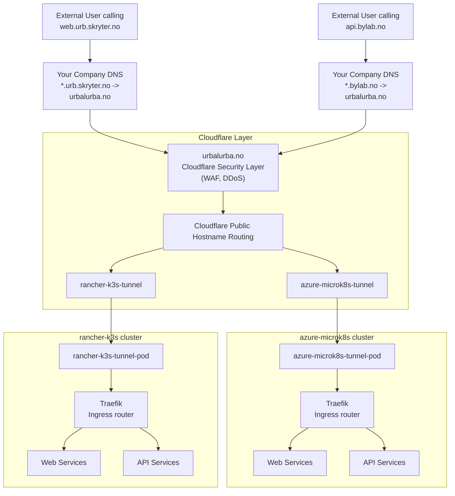

# External Cloudflare Setup

## Introduction

This document provides an overview of the networking setup that makes services reachable from the Internet, along with detailed setup instructions.

Network security is paramount; we use Cloudflare to safely and securely expose services to the internet.

For overall networking architecture and why we use Cloudflare to implement a Zero Trust architecture based on Microsoft CAF principles, see the [networking-readme.md](networking-readme.md).

## High-Level Architecture for exposing services to the Internet



Each cluster is isolated and the only way into the cluster is through the Cloudflare tunnel client that is installed in the cluster. This follows the Microsoft CAF principles of Landing Zone and Zero Trust.

There can be multiple clusters in the same Azure Landing Zone, and they will still be isolated from each other. Or the clusters can be placed in different Landing Zones.

The clusters can be in different Clouds, e.g. Azure, AWS, GCP, OCI, etc. Or on-premises.

## Components

### 1. **Your Company DNS**

- You only need to add a CNAME record to your company DNS
- A wildcard (`*.urb.mydomain.com`) CNAME record points to Cloudflare
- This ensures that all subdomains (`www.urb.mydomain.com`, `api.urb.mydomain.com`, etc.) route through Cloudflare

In this document we use the domains `urb.skryter.no` and `bylab.no` as examples. The setup is the same for any domain, however.

### 2. **Cloudflare**

- **DNS Hosting**: Manages domain resolution.
- **WAF (Web Application Firewall)**: Protects against malicious traffic.
- **DDoS Protection**: Prevents denial-of-service attacks.
- **Rate Limiting**: Ensures APIs and web services are not overloaded.
- **Cloudflare Tunnel**: Securely connects to Kubernetes clusters without exposing services directly to the internet.

In order to use all security and protections that Cloudflare offers, we need to set up a domain that is managed by Cloudflare. In this document we use the domain `urbalurba.no` for this purpose.
You must set up your own domain and transfer it to Cloudflare.

### 3. **Public Hostname Routing for Cloudflare Tunnel**

Cloudflare Tunnels use Public Hostname Routing to direct traffic to the appropriate tunnel based on the domain name:

- **Simple Configuration**: Each domain and subdomain can be routed directly to a specific tunnel
- **Integrated Security**: All Cloudflare security features (WAF, DDoS protection) are automatically applied


When you create a DNS route for your tunnel (using `cloudflared tunnel route dns`), Cloudflare automatically creates the necessary DNS records and configures the routing within its network.

### 4. **Cloudflare Tunnel**

- Routes traffic securely from Cloudflare to the Kubernetes clusters.
- Eliminates the need to expose public IPs.

A Cloudflare tunnel is created for each Kubernetes cluster and consists of two components.
The Tailcale Client that runs in the Kubernetes cluster and the tunnel it connects to in Cloudflare. Each Kubernetes Cluster has its own tunnel.

### 5. **Traefik Ingress Controller**

- Manages routing of traffic within the Kubernetes cluster.
- Blocker of requests that do not match the defined routes.

Traefik is the dispatcher for the Kubernetes cluster and is the main entry point for the incoming requests. Based on rules it will forward the request to the appropriate service.
The services can be web services or APIs.

### 6. **Kubernetes Services**

- Applications run as services inside Kubernetes.
- This can be websites, APIs, etc.

## Traffic Flow

### **Web Services (e.g., `www.urb.skryter.no`)**

1. User accesses `https://www.urb.skryter.no`.
2. Company DNS resolves `www.urb.skryter.no` to Cloudflare.
3. Cloudflare applies WAF, DDoS protection, and other security features.
4. Cloudflare Tunnel directly routes the request to the appropriate tunnel based on the hostname.
5. The tunnel client forwards the request to the Traefik Ingress Controller inside the Kubernetes cluster.
6. Traefik routes the request to the appropriate web service.

## Prerequisites

We use only "free" services from Cloudflare. This gives us a lot of features and protections. You can opt for a paid plan if you need more.

### Domain

You need to have a domain that you can use with Cloudflare. You can buy a domain from Cloudflare or use a domain you already have. This domain must be transferred to Cloudflare.

### Cloudflare Account

You need to have a Cloudflare account. You can create an account at [https://www.cloudflare.com/](https://www.cloudflare.com/)

In this document we use the domain `urbalurba.no` as the domain that is transferred to Cloudflare.

### Access to your organizations DNS

We need to add a CNAME record in your organizations DNS. This is usually done by the system administrator for the domain.
In this document we use two domains: `skryter.no` and `bylab.no`. And we will set these up to point to Cloudflare.

## Setup Instructions

Important urls:

- Cloudflare Dashboard: https://dash.cloudflare.com/
- Cloudflare Zero Trust tunnels: https://one.dash.cloudflare.com/ (log in and Go to Networks -> Tunnels )

### Step 1: Registering Your Domain with Cloudflare and Setting Up DNS

Goal: Set up the domain `urbalurba.no` in Cloudflare and host the DNS records for urbalurba.no in CloudFlare.

1. Log in to your Cloudflare account
2. Click on the "Add a Site" button on your Cloudflare dashboard
3. Enter your domain (e.g., `urbalurba.no`) and click "Continue"
4. Select the Free plan and click "Continue"
5. Cloudflare will scan your existing DNS records. Review and click "Continue"
6. You'll need to change your domain's nameservers with your registrar to the ones Cloudflare provides
7. Wait for the nameserver change to propagate (can take up to 24 hours)
8. Verify the domain is active in your Cloudflare dashboard

### Step 2: Setting Up Cloudflare Tunnel

We need to create tunnels for each host we want to expose to the internet.
In our case we will create a tunnel to the clusters named `azure-microk8s` and `rancher-k3s`.
The tunnel will be named `azure-microk8s-tunnel` and `rancher-k3s-tunnel`. The azure-microk8s is running in Azure and the rancher-k3s is running on the DevOps engineers laptop (Rancher Desktop kubernetes k3s)

#### Creating a Tunnel

We will need one tunnel for each Kubernetes cluster that we want to expose to the internet.
All needed software to create and test the tunnels is installed on the provision host.

NB! We create the tunnels using the provision-host, but they will not run there. They will run in the Kubernetes clusters.

1. Log in to the provision-host container as the ansible user:

   ```bash
   docker exec -it -u ansible provision-host bash
   ```

2. Run the following command to login to Cloudflare:

   ```bash
   cloudflared login
   ```

   You'll see output with a URL:

   ```plaintext
   Please open the following URL and log in with your Cloudflare account:
   https://dash.cloudflare.com/argotunnel?aud=&callback=...

   Leave cloudflared running to download the cert automatically.
   ```

3. Open the URL in your browser and authenticate with Cloudflare:
   - You'll be asked to log in to Cloudflare
   - Select the domain (e.g., `urbalurba.no`) and click "Authorize"
   - You'll see a success message: "Cloudflared has installed a certificate allowing your origin to create a Tunnel on this zone."

   In your terminal, you'll see something like:

   ```plaintext
   2025-03-14T12:41:24Z INF Waiting for login...
   2025-03-14T12:41:28Z INF You have successfully logged in.
   If you wish to copy your credentials to a server, they have been saved to:
   /home/ansible/.cloudflared/cert.pem
   ```

#### Preparing for Tunnel Creation

1. Create a directory to store the certificate and tunnel credentials:

   ```bash
   mkdir -p /mnt/urbalurbadisk/topsecret/cloudflare
   ```

2. Move the certificate to this directory with a name that identifies the tunnel:

   ```bash
   mv /home/ansible/.cloudflared/cert.pem /mnt/urbalurbadisk/topsecret/cloudflare/cloudflare-certificate.pem
   ```

3. Create the tunnel:

   ```bash
   TUNNEL_ORIGIN_CERT=/mnt/urbalurbadisk/topsecret/cloudflare/cloudflare-certificate.pem cloudflared tunnel create rancher-k3s-tunnel
   ```

   You'll see output like:

   ```plaintext
   Tunnel credentials written to /mnt/urbalurbadisk/topsecret/cloudflare/f68c1459-8b12-4b2b-b566-c2f68d538a19.json. cloudflared chose this file based on where your origin certificate was found. Keep this file secret. To revoke these credentials, delete the tunnel.

   Created tunnel rancher-k3s-tunnel with id f68c1459-8b12-4b2b-b566-c2f68d538a19
   ```

   Note the tunnel ID and credentials file path, as you'll need these for the next steps.

4. Rename the credentials file to follow our naming convention

   ```bash
   mv /mnt/urbalurbadisk/topsecret/cloudflare/f68c1459-8b12-4b2b-b566-c2f68d538a19.json /mnt/urbalurbadisk/topsecret/cloudflare/cloudflare-rancher-k3s-tunnel-credentials.json
   ```

5. Verify the tunnel was created successfully:

   ```bash
   TUNNEL_ORIGIN_CERT=/mnt/urbalurbadisk/topsecret/cloudflare/cloudflare-certificate.pem cloudflared tunnel list
   ```

   You should see your newly created tunnel in the list, similar to:

   ```plaintext
   ID                                   NAME                   CREATED              CONNECTIONS      
   f68c1459-8b12-4b2b-b566-c2f68d538a19 rancher-k3s-tunnel     2025-03-14T21:13:18Z   
   ```

#### Setting up DNS Routing to the Tunnel

When setting up external domain access through Cloudflare, the DNS configuration in your organization's DNS (in this case, skryter.no) should be set up as follows:

```plaintext
*.urb.skryter.no  CNAME  f68c1459-8b12-4b2b-b566-c2f68d538a19.cfargotunnel.com
```

This wildcard CNAME record directs all subdomains under urb.skryter.no (such as www.urb.skryter.no, api.urb.skryter.no, etc.) to your Cloudflare tunnel endpoint. The tunnel ID in the CNAME target (f68c1459-8b12-4b2b-b566-c2f68d538a19 in this example) should be replaced with your actual tunnel ID.
This configuration enables Cloudflare to route external traffic to your internal services through the secure tunnel without exposing your infrastructure directly to the internet. It's a critical component of the zero-trust architecture described in the networking documents.


TUNNEL_ORIGIN_CERT=/mnt/urbalurbadisk/topsecret/cloudflare/cloudflare-certificate.pem cloudflared tunnel route dns rancher-k3s-tunnel jalla.skryter.no

```plaintext
025-03-14T21:18:58Z INF Added CNAME www.urb.skryter.no.urbalurba.no which will route to this tunnel tunnelID=f68c1459-8b12-4b2b-b566-c2f68d538a19
```

Repeat for any additional subdomains you want to route to this tunnel.

### Step 3: Testing the Tunnel Locally

Before deploying the tunnel to your Kubernetes cluster, test it locally to verify that all configurations are correct.
The /mnt/urbalurbadisk/networking/test/ directory contains a test script and HTML file for this purpose:

- index.html: A simple HTML page with the text "CLOUDFLARE-TEST-PAGE" that serves as our test target
- test-tunnel.sh: A script that tests the tunnel configuration with a local web server

To run the test:

```bash
cd /mnt/urbalurbadisk/networking/test
./test-tunnel.sh rancher-k3s-tunnel
```

This script will:

- Start a local web server with a test page
- Create a temporary tunnel configuration that points to this web server
- Start the tunnel and connect to Cloudflare
- Allow you to test the connection

The output should contain:

```plaintext

TODO: fill in the output from the test

```


### Step 4: Deploying the Tunnel to the Kubernetes Cluster


#### Creating a Configuration File for the Tunnel

Now, let's create a configuration file for the tunnel client that will run in the Kubernetes cluster:

```bash
cat > /mnt/urbalurbadisk/topsecret/cloudflare/cloudflare-rancher-k3s-tunnel-config.yml << EOL
tunnel: [your-tunnel-id]
credentials-file: /mnt/urbalurbadisk/topsecret/cloudflare/cloudflare-rancher-k3s-tunnel-credentials.json

ingress:
  # Route all traffic to Traefik regardless of hostname
  - service: http://traefik-ingress:80
EOL
```

Replace the tunnel ID and credentials path with your actual values. 
This configuration routes all traffic to your Traefik ingress controller, which will then handle the routing based on its own rules.

The final step is to deploy the Cloudflare tunnel to your Kubernetes cluster. We provide scripts to automate this process:

1. For manual deployment, you can use the `net4-deploy-cloudflare-tunnel.sh` script:

   ```bash
   ./net4-deploy-cloudflare-tunnel.sh CLOUDFLARE_TEST rancher-k3s
   ```

   Where:
   - `CLOUDFLARE_TEST` is the prefix for variables in your kubernetes-secrets.yml file
   - `rancher-k3s` is the target host for the tunnel

2. The script will:
   - Create a Kubernetes secret with the tunnel credentials
   - Deploy a Cloudflare tunnel pod in your cluster
   - Set up the necessary networking for the tunnel to reach your services

3. Verify the tunnel is running:

   ```bash
   TUNNEL_ORIGIN_CERT=/mnt/urbalurbadisk/cloudflare/cloudflare-rancher-k3s-tunnel.pem cloudflared tunnel info rancher-k3s-tunnel
   ```

   This will show the status of your tunnel and its connections.

## Troubleshooting

If you encounter issues with your Cloudflare tunnel setup, here are some common troubleshooting steps:

1. Check if the tunnel is running:
   ```bash
   TUNNEL_ORIGIN_CERT=/mnt/urbalurbadisk/cloudflare/cloudflare-rancher-k3s-tunnel.pem cloudflared tunnel list
   ```

2. Verify the tunnel has active connections:
   ```bash
   TUNNEL_ORIGIN_CERT=/mnt/urbalurbadisk/cloudflare/cloudflare-rancher-k3s-tunnel.pem cloudflared tunnel info rancher-k3s-tunnel
   ```

3. Check the logs of the cloudflared pod in your Kubernetes cluster:
   ```bash
   kubectl logs -l app=cloudflared
   ```

4. Ensure the Traefik ingress router is properly configured and running:
   ```bash
   kubectl get pods -n kube-system | grep traefik
   ```

5. Test connectivity within the cluster:
   ```bash
   kubectl exec -it <cloudflared-pod-name> -- curl http://traefik-ingress:80
   ```