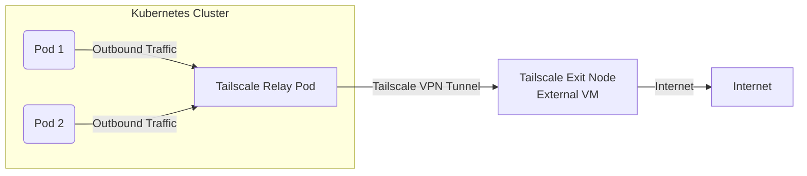

# Outbound Traffic Routing Through Tailscale in Kubernetes

## Executive Summary
To enhance security, all outbound traffic from a Kubernetes cluster running on **Rancher Desktop** (or other local environments) should be forced through **Tailscale**. This ensures that no pod has direct access to the host's local network, reducing the risk of unauthorized access or data leaks.

Since **Tailscale Funnel** is designed for inbound traffic only, we achieve outbound routing by configuring a **Tailscale Exit Node** on an external VM. The Kubernetes cluster routes all egress traffic through this exit node, isolating workloads from the local network.

### **Traffic Flow Diagram**


By implementing this solution, developers can securely run Kubernetes clusters on their machines while ensuring that applications do not bypass security policies or gain unintended access to the host network.

## Technical Description

### 1. Restrict Direct Network Access Using Kubernetes Network Policies
To prevent pods from accessing the host or the local network, create a **Kubernetes NetworkPolicy** that blocks all egress except through a designated **Tailscale Relay Pod**.

#### Example Network Policy:
```yaml
apiVersion: networking.k8s.io/v1
kind: NetworkPolicy
metadata:
  name: enforce-tailscale-egress
  namespace: default
spec:
  podSelector: {}
  policyTypes:
    - Egress
  egress:
    - to:
        - podSelector:
            matchLabels:
              app: tailscale-relay
```
This policy ensures that **only traffic going through the Tailscale relay pod is allowed**.

### 2. Deploy a Tailscale Exit Node on an External VM
A remote **Exit Node** must be deployed on a VM to route all outbound traffic through Tailscale.

#### **Steps to Configure the Exit Node:**
1. Deploy a VM (Ubuntu/Debian recommended) in a secure location.
2. Install Tailscale and authenticate it to your network.
3. Enable Exit Node mode:
   ```sh
   tailscale up --advertise-exit-node
   ```
4. Approve the Exit Node in the Tailscale admin panel.

### 3. Deploy a Tailscale Relay Pod in Kubernetes
A Kubernetes pod will serve as a **relay**, forwarding traffic to the external exit node.

#### Example Deployment:
```yaml
apiVersion: v1
kind: Pod
metadata:
  name: tailscale-relay
  labels:
    app: tailscale-relay
spec:
  securityContext:
    capabilities:
      add:
        - NET_ADMIN
        - NET_RAW
  containers:
  - name: tailscale
    image: tailscale/tailscale:latest
    securityContext:
      privileged: true
    env:
    - name: TS_AUTHKEY
      valueFrom:
        secretKeyRef:
          name: tailscale-auth
          key: TS_AUTHKEY
    args:
    - up
    - --ssh
    - --exit-node=<exit-node-ip>
```

### 4. Force Pods to Route Traffic via Tailscale
To ensure all traffic exits via Tailscale, modify pod routing tables.

#### Example Init Container:
```sh
ip route add default via $(kubectl get pod tailscale-relay -o jsonpath='{.status.podIP}')
```
This ensures that all outbound connections use the **Tailscale relay pod** as the gateway.

### 5. Enforce Security Policies
To further secure the cluster:
- **Prevent workloads from running as root**.
- **Disable NET_RAW** for all pods except the Tailscale relay pod.
- **Restrict host network access**.

#### Example Pod Security Policy:
```yaml
apiVersion: policy/v1beta1
kind: PodSecurityPolicy
metadata:
  name: restricted
spec:
  privileged: false
  hostNetwork: false
  hostIPC: false
  hostPID: false
  runAsUser:
    rule: MustRunAsNonRoot
  allowedCapabilities:
    - NET_BIND_SERVICE
  volumes:
    - configMap
    - secret
    - emptyDir
```

## Conclusion
By implementing this approach:
✅ All outbound traffic is forced through a remote Tailscale Exit Node.
✅ The cluster is isolated from the host network.
✅ Pods cannot directly reach the host or other local devices.

This ensures a **secure, zero-trust networking model** for Kubernetes clusters running on developer machines or other local environments.

