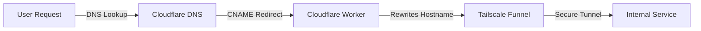

# Tailscale Funnel Implementation Guide

## Overview

This guide documents the complete process for implementing Tailscale Funnel to securely expose Kubernetes services to the internet. It covers both the authorization process and practical implementation with testing procedures.

## Architecture

The solution uses Tailscale Funnel as part of a broader architecture involving:

1. **External DNS (`skryter.no` and `bylab.no`)**
   - Both domains have `CNAME` records pointing to `urbalurba.no`
   
2. **Cloudflare Worker on `urbalurba.no`**
   - Redirects requests based on hostname to Tailscale Funnel endpoints
   
3. **Tailscale Funnel (`dog-pence.ts.net`)**
   - Handles HTTPS termination and forwards traffic to internal services
   
4. **Internal Services**
   - Services running in the Kubernetes cluster



## Prerequisites

- Tailscale installed and connected to your tailnet
- Admin access to your Tailscale network
- A local service you want to expose (e.g., web server on port 8000)

## Step-by-Step Setup Process

### Phase 1: Tailscale Funnel Authorization

1. **Verify Tailscale Connectivity**
   ```bash
   tailscale status
   ```
   Confirm your device is connected with a hostname (e.g., `provision-host.dog-pence.ts.net`).

2. **Check Initial Funnel Status**
   ```bash
   sudo tailscale funnel status
   ```
   You'll likely see "No serve config" if Funnel isn't configured.

3. **Enable Tailscale Funnel Feature**
   ```bash
   sudo tailscale funnel on
   ```
   This generates an authorization URL:
   ```
   Funnel is not enabled on your tailnet.
   To enable, visit:
   https://login.tailscale.com/f/funnel?node=XXXXXXXX
   ```

4. **Tailnet-Level Authorization**
   - Visit the provided URL and sign in to your Tailscale account
   - Click "Enable Funnel" to authorize this capability for your entire tailnet
   - This modifies your tailnet policy file to include the Funnel feature

5. **Node-Level Authorization**
   Run the command again to authorize your specific node:
   ```bash
   sudo tailscale funnel on
   ```
   You may see:
   ```
   Funnel is enabled, but the list of allowed nodes in the tailnet policy file does not include the one you are using.
   To give access to this node you can edit the tailnet policy file, or visit:
   https://login.tailscale.com/f/funnel?node=XXXXXXXX
   ```
   - Click this second authorization URL
   - Authorize this specific node to use Funnel
   - This updates your tailnet policy to include this node

### Phase 2: Exposing Services with Tailscale Funnel

#### Method 1: Direct Funnel Configuration

After completing both authorization steps, configure Funnel to expose your service:

```bash
sudo tailscale funnel 8000
```

Output should be similar to:
```
Available on the internet:
https://provision-host.dog-pence.ts.net/
|-- proxy http://127.0.0.1:8000
Press Ctrl+C to exit.
```

Your service is now accessible at `https://provision-host.dog-pence.ts.net/`.

#### Method 2: Using the Testing Script

For testing and validation, use the provided script:

1. Make the script executable:
   ```bash
   chmod +x test-tailscale-tunnel.sh
   ```

2. Run the script:
   ```bash
   ./test-tailscale-tunnel.sh [port]
   ```

The script will:
- Start a test web server on port 8000
- Configure Tailscale Funnel to expose this server
- Show the Funnel URL where the service is accessible
- Monitor for requests and log activity
- Clean up resources when you press Ctrl+C

### Verifying and Managing Funnel

- **Check current configuration**:
  ```bash
  sudo tailscale funnel status
  ```

- **Turn off Funnel**:
  ```bash
  sudo tailscale funnel off
  ```

- **Reset configuration**:
  ```bash
  sudo tailscale funnel reset
  ```

## Key Points About Tailscale Funnel

1. **Hostname Assignment**:
   - Funnel automatically uses your node's Tailscale hostname (e.g., `provision-host.dog-pence.ts.net`)
   - You cannot specify custom domains directly in Tailscale Funnel

2. **Command Syntax**:
   - The correct syntax is `tailscale funnel [port]` or `tailscale funnel [service_url]`
   - Only localhost/127.0.0.1 proxies are supported

3. **Two-Level Authorization**:
   - Tailnet-level: Enables the feature for your entire network
   - Node-level: Authorizes specific devices to expose services

4. **Security Considerations**:
   - All traffic is encrypted end-to-end
   - Services are exposed directly to the internet, so ensure they have proper security measures
   - Consider using the Cloudflare WAF for additional protection

## Integration with Cloudflare

To use custom domains with Tailscale Funnel, configure Cloudflare as outlined in the architecture document:

1. Create CNAME records in Cloudflare for your domains pointing to `urbalurba.no`
2. Set up a Cloudflare Worker on `urbalurba.no` that redirects traffic to your Tailscale Funnel endpoint
3. Update DNS settings for any new domains as needed

Example Cloudflare Worker:
```javascript
addEventListener("fetch", event => {
    event.respondWith(handleRequest(event.request));
});

async function handleRequest(request) {
    let url = new URL(request.url);
    
    if (url.hostname.endsWith("skryter.no")) {
        url.hostname = "provision-host.dog-pence.ts.net";
    } else if (url.hostname.endsWith("bylab.no")) {
        url.hostname = "provision-host.dog-pence.ts.net";
    }
    return fetch(url, request);
}
```

## Testing Tools

The repository includes a testing script (`test-tailscale-tunnel.sh`) that automates the process of:
- Starting a local web server
- Configuring Tailscale Funnel
- Verifying the setup
- Cleaning up resources

This script simplifies testing and validation of the Tailscale Funnel configuration.

## Troubleshooting

1. **Funnel Configuration Issues**:
   - Ensure both tailnet and node-level authorizations are complete
   - Verify your node is listed in the tailnet policy file under `nodeAttrs`

2. **Connection Problems**:
   - Check Tailscale connectivity with `tailscale status`
   - Verify the service is running locally before exposing it

3. **Authorization Errors**:
   - If you encounter "handler does not exist" errors, ensure you've properly authorized both the tailnet and node

4. **Port Already in Use**:
   - If port 8000 is already in use, identify and terminate the process:
     ```bash
     sudo lsof -i :8000
     sudo kill -9 $(sudo lsof -t -i:8000)
     ```

## Next Steps

1. Configure the Cloudflare Worker for hostname redirection
2. Set up CNAME records for external domains pointing to `urbalurba.no`
3. Consider implementing ExternalDNS in Kubernetes for automated DNS management
4. Deploy Traefik in Kubernetes for advanced routing capabilities

By following this guide, you've successfully implemented Tailscale Funnel to securely expose your services to the internet, which can now be integrated with Cloudflare for additional security and custom domain support.