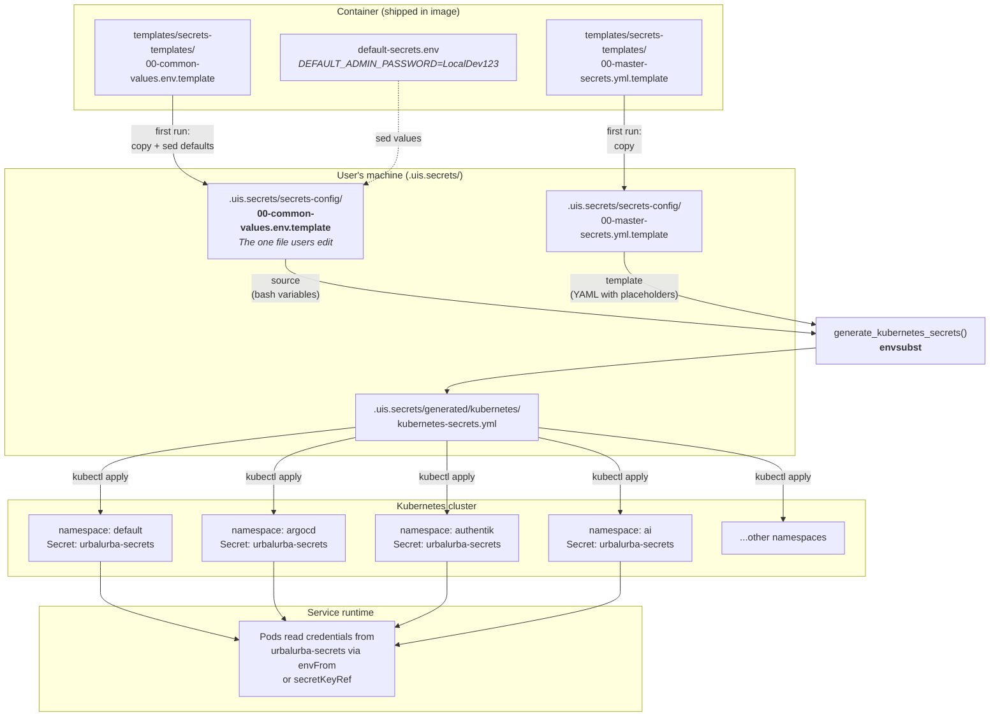
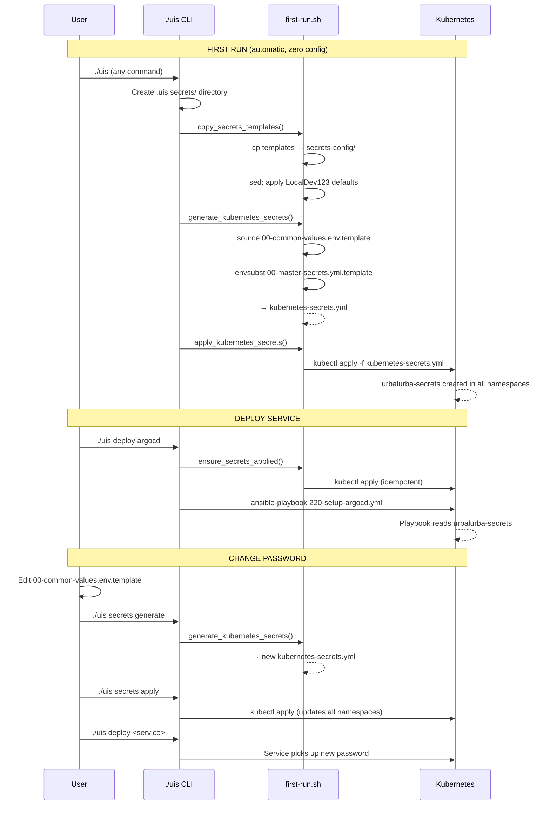
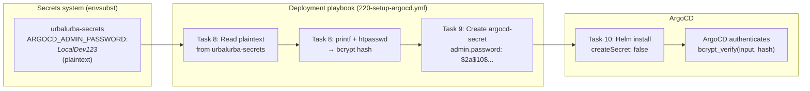

# How Secrets Work in UIS

## Design Goal

The system works out of the box with zero configuration. Development-safe default passwords are built in. When the user wants to change passwords, they edit one file and regenerate.

## Overview



## First Run vs Deploy vs Password Change



## ArgoCD Special Case: Bcrypt Hashing



## The Three Files That Matter

Only three files in `.uis.secrets/secrets-config/` are actually used by the system:

| File | Used by | How |
|------|---------|-----|
| `00-common-values.env.template` | `generate_kubernetes_secrets()` | Sourced as bash environment variables |
| `00-master-secrets.yml.template` | `generate_kubernetes_secrets()` | Fed to `envsubst` to produce the final YAML |
| `default-secrets.env` (in container) | `copy_secrets_templates()` | Values used by sed to set initial defaults |

### `default-secrets.env` — Built-in Development Defaults

Shipped inside the container at `provision-host/uis/templates/`. Contains hardcoded localhost-safe passwords:

```
DEFAULT_ADMIN_PASSWORD=LocalDev123
DEFAULT_DATABASE_PASSWORD=LocalDevDB456
```

These values are applied by `sed` when templates are first copied to the user's `.uis.secrets/secrets-config/`. After that, `default-secrets.env` is only used by `get_default_secret()` for lookups.

### `00-common-values.env.template` — The One File Users Edit

Lives in `.uis.secrets/secrets-config/`. This is the single source of truth for all credentials. Key variables at the top cascade to everything below:

```
DEFAULT_ADMIN_PASSWORD=LocalDev123        <- changes ALL admin passwords
DEFAULT_DATABASE_PASSWORD=LocalDevDB456   <- changes ALL database passwords
```

Lower in the file, service-specific variables reference these:

```
PGPASSWORD=${DEFAULT_DATABASE_PASSWORD}
ARGOCD_ADMIN_PASSWORD=${DEFAULT_ADMIN_PASSWORD}
JUPYTERHUB_AUTH_PASSWORD=${DEFAULT_ADMIN_PASSWORD}
```

Change `DEFAULT_ADMIN_PASSWORD` once, and every service that references it gets the new value.

### `00-master-secrets.yml.template` — Kubernetes YAML Template

Defines all namespaces and all `urbalurba-secrets` Kubernetes Secret objects. Uses `${VARIABLE}` placeholders that `envsubst` replaces with values from `00-common-values.env.template`.

## Why There Are No Numbered Template Files

An earlier design (Sept 2025, `create-kubernetes-secrets.sh` in the old `topsecret/` system) used numbered per-category template files (01-core, 02-database, ..., 13-github). Each file was processed with `envsubst` individually, then all outputs were concatenated into one `kubernetes-secrets.yml`.

When the UIS system replaced `topsecret/`, `generate_kubernetes_secrets()` was written to process a single `00-master-secrets.yml.template` directly — simpler, no merge step, one file to maintain. The numbered files were copied along but never used.

They were removed because:
- `generate_kubernetes_secrets()` only reads `00-master-secrets.yml.template` — the numbered files were dead code
- Some contained hardcoded values that conflicted with the master template (e.g., a bcrypt hash for `SecretPassword1` while the system uses `LocalDev123`)
- Having unused files in `secrets-config/` confused both users and contributors about which files matter
- Users who already have the old numbered files in `.uis.secrets/secrets-config/` are not affected — those files are simply ignored

## How Secrets Flow From File to Cluster

```
default-secrets.env                     (built-in defaults, in container)
        |
        v  [first run: copy + sed]
.uis.secrets/secrets-config/
  00-common-values.env.template         (user's config — the one file to edit)
  00-master-secrets.yml.template        (Kubernetes YAML with ${VARIABLE} placeholders)
        |
        v  [source + envsubst]
.uis.secrets/generated/kubernetes/
  kubernetes-secrets.yml                (rendered YAML with real values)
        |
        v  [kubectl apply]
Kubernetes cluster
  namespace: default    -> Secret: urbalurba-secrets
  namespace: argocd     -> Secret: urbalurba-secrets
  namespace: authentik  -> Secret: urbalurba-secrets
  namespace: ai         -> Secret: urbalurba-secrets
  ...each namespace gets its own copy with relevant keys
        |
        v  [service reads at runtime]
Pod environment variables / secret references
```

## What Happens on First Run

When the user runs `./uis` for the first time:

1. **Host wrapper** (`./uis` script) creates `.uis.secrets/` and `.uis.extend/` directories
2. **`copy_secrets_templates()`** copies files from `templates/secrets-templates/` into `.uis.secrets/secrets-config/`
3. **`sed` applies development defaults** — replaces placeholder values in `00-common-values.env.template` with values matching `default-secrets.env` (e.g., `LocalDev123`)
4. **`generate_kubernetes_secrets()`** sources `00-common-values.env.template` as bash variables, then runs `envsubst` on `00-master-secrets.yml.template`, producing `kubernetes-secrets.yml`
5. **`apply_kubernetes_secrets()`** runs `kubectl apply` to create namespaces and secrets in the cluster

After this, the cluster has `urbalurba-secrets` in every namespace, populated with development defaults.

## What Happens on Every Deploy

When the user runs `./uis deploy <service>`:

1. **`ensure_secrets_applied()`** runs first — if the generated secrets file is missing (e.g., after a cluster reset), it regenerates and reapplies. If it exists, it reapplies (kubectl apply is idempotent).
2. **The service's Ansible playbook runs** — the playbook can read credentials from `urbalurba-secrets` in its namespace.
3. **The service's Helm chart or manifest** references `urbalurba-secrets` for environment variables.

## How a Service Uses Secrets

Most services read the plaintext password directly from `urbalurba-secrets`:

```yaml
# In a Helm values file or manifest
env:
  - name: ADMIN_PASSWORD
    valueFrom:
      secretKeyRef:
        name: urbalurba-secrets
        key: ARGOCD_ADMIN_PASSWORD
```

Or via `envFrom` to load all keys at once:

```yaml
envFrom:
  - secretRef:
      name: urbalurba-secrets
```

## When the User Wants to Change Passwords

1. Edit one file: `.uis.secrets/secrets-config/00-common-values.env.template`
2. Run: `./uis secrets generate`
3. Run: `./uis secrets apply`
4. Redeploy affected services: `./uis deploy <service>`

Because service-specific variables reference `DEFAULT_ADMIN_PASSWORD`, changing that one line updates ArgoCD, Grafana, pgAdmin, JupyterHub, and everything else.

## Special Case: Services That Need Hashed Passwords

Some services (like ArgoCD) require a bcrypt hash instead of a plaintext password. `envsubst` is simple string substitution — it cannot run `htpasswd` to compute a hash.

For these services, the deployment playbook handles the hashing at deploy time:

1. Reads the plaintext password from `urbalurba-secrets` (already in the cluster)
2. Computes the bcrypt hash using `htpasswd`
3. Creates the service-specific secret (e.g., `argocd-secret`) with the hash
4. The Helm chart is configured with `createSecret: false` so it uses the pre-created secret

This keeps the user's workflow unchanged — they still only edit `DEFAULT_ADMIN_PASSWORD` in one place. The hashing is an implementation detail handled by the playbook.

### Known Issue: `${ARGOCD_BCRYPT_PASSWORD}`

The master template contains `admin.password: "${ARGOCD_BCRYPT_PASSWORD}"` for `argocd-secret`, but `ARGOCD_BCRYPT_PASSWORD` is never defined in `00-common-values.env.template`. `envsubst` replaces it with an empty string. The deployment playbook then overwrites this empty secret with the correct bcrypt hash before Helm installs ArgoCD. This works but is fragile — the `argocd-secret` definition in the master template could be removed since the playbook is the actual owner.

## Relationship to Existing Documentation

Two older docs describe the same conceptual system but reference the previous directory structure:

| Doc | Location | Notes |
|-----|----------|-------|
| `docs/rules/secrets-management.md` | Detailed rules and patterns | References `./create-kubernetes-secrets.sh` (old script, now `./uis secrets generate`) and `secrets-templates/` (now in container at `provision-host/uis/templates/secrets-templates/`) |
| `docs/reference/secrets-management.md` | Quick-start guide | References `topsecret/` (old directory, now `.uis.secrets/`) |

The conceptual model is the same: template + gitignore pattern, variable substitution, centralized passwords. The paths and commands changed when the system moved from `topsecret/` to `.uis.secrets/` and from standalone scripts to the `./uis` CLI.

## File Locations

| File | Location | Purpose |
|------|----------|---------|
| `default-secrets.env` | `provision-host/uis/templates/` | Built-in development defaults |
| `00-common-values.env.template` | `.uis.secrets/secrets-config/` | User's single config file (the one to edit) |
| `00-master-secrets.yml.template` | `.uis.secrets/secrets-config/` | Kubernetes YAML template |
| `kubernetes-secrets.yml` | `.uis.secrets/generated/kubernetes/` | Generated output (never edit) |

## Key Functions

| Function | File | What it does |
|----------|------|-------------|
| `copy_secrets_templates()` | `lib/first-run.sh` | Copies templates to `.uis.secrets/secrets-config/` + applies dev defaults via sed |
| `generate_kubernetes_secrets()` | `lib/first-run.sh` | Sources `00-common-values.env.template`, runs envsubst on `00-master-secrets.yml.template` |
| `apply_kubernetes_secrets()` | `lib/first-run.sh` | Runs kubectl apply on generated file |
| `ensure_secrets_applied()` | `lib/first-run.sh` | Idempotent: regenerate if missing, always apply |
| `get_default_secret()` | `lib/first-run.sh` | Reads a value from default-secrets.env |

## CLI Commands

| Command | What it does |
|---------|-------------|
| `./uis secrets status` | Show current secrets configuration |
| `./uis secrets edit` | Open config file in editor |
| `./uis secrets generate` | Render templates into kubernetes-secrets.yml |
| `./uis secrets apply` | Apply generated secrets to cluster |
| `./uis secrets validate` | Check config for common errors |
