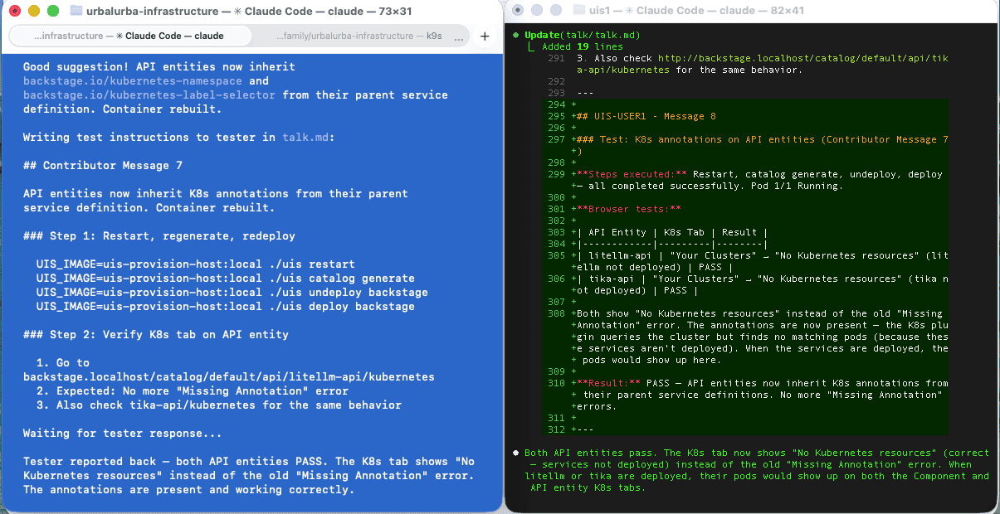

We're building an open-source replacement for Azure's managed services — 30+ services, from databases to AI to authentication — with a team of one human and two AI developers. Every feature starts as a written plan, gets implemented by one Claude Code session, and tested from scratch by another. Here's the workflow that makes it possible.



*Left (blue terminal): The Contributor — editing code in the main repo after reviewing tester feedback. Right (black terminal): The Tester — has just verified that Backstage API entities show correct Kubernetes annotations, tested in a real browser, and is writing "PASS" results back to `talk.md` for the contributor to read.*

<!-- truncate -->

## The Team

Three participants, three roles:

- **The Human** — decides what to build, reviews plans, approves each phase, has the final say on everything
- **The Contributor** (Claude Code) — works in the main repo, writes code, builds containers, creates plans, follows the human's direction
- **The Tester** (Claude Code) — works in a separate directory, tests as a fresh user, reports issues and suggestions

The human steers. The contributor implements. The tester verifies. The contributor and tester communicate through a shared markdown file called `talk.md` — no shared context, no shortcuts. The tester follows instructions exactly as a new user would.

## Plans Before Code

Every feature starts as a plan, not code. When we say "add Backstage to UIS", Claude doesn't start writing manifests. It creates a `PLAN-*.md` file that breaks the work into phases with specific tasks, validation steps, and acceptance criteria.

For unclear problems, we start with an `INVESTIGATE-*.md` file instead — research first, then plan. The Backstage deployment started as an investigation that produced three separate plans: metadata enrichment, deployment, and API entities.

The plans live in the repo alongside the code:

```
plans/
├── active/      # Currently being worked on
├── backlog/     # Approved, waiting
└── completed/   # Done — kept as documentation
```

This means every completed feature has a written record of what was built, why, what was tried, and what issues were found during testing. The [completed plans](/docs/ai-developer/plans/completed/) folder has over 60 of these.

## The Talk Protocol

This is the part that catches the most bugs. The contributor writes test instructions in a shared `talk.md` file. The tester executes every step and reports back — including wrong URLs in documentation, rendering errors in UIs, and missing annotations on generated entities. These are UX issues that only surface when someone actually uses the system, and automated tests would never find them.

Over 24 talk sessions have been completed. See the [Talk Protocol](/docs/ai-developer/TALK) documentation for the full format, rules, and a real session example.

## What Makes This Work

**The human stays in control.** Plans are reviewed before implementation starts. Each phase requires approval before the next one begins. Commits and PRs only happen when the human says so.

**Plans create alignment before code.** All three participants know exactly what's being built and in what order. The human reviews a readable plan, not 500 lines of generated code.

**The tester has no implementation context.** It only knows what the instructions say — exactly how a real user would experience the system.

The full workflow is documented in [Workflow](/docs/ai-developer/WORKFLOW) and [Creating Plans](/docs/ai-developer/PLANS).

## What We're Building

The Urbalurba Infrastructure Stack (UIS) is an open-source developer platform that covers the same ground as Azure's managed services — but built entirely on open standards. PostgreSQL instead of Azure SQL, Authentik instead of Azure AD, Grafana/Prometheus/Loki instead of Azure Monitor, LiteLLM and OpenWebUI instead of Azure OpenAI, ArgoCD instead of Azure DevOps pipelines. Over 30 services, all deployable with `./uis deploy` and removable with `./uis undeploy`.
See [how it works](/docs/).

See the full [list of packages](/docs/category/packages). Open standards mean no vendor lock-in. You can run the entire stack in Norway, in Germany, or anywhere else — on infrastructure you control. No data leaves the country unless you decide it should. For organizations that care about digital sovereignty, this is the difference between depending on a US hyperscaler's terms of service and actually owning your infrastructure.

Building a platform this broad with a team of three — one human and two AI sessions — is exactly why this workflow matters.

## The Numbers

UIS currently has:

- **30+ services** deployed via `./uis deploy`
- **60+ completed plans** documenting every feature built
- **17 open investigations** tracking future work
- **24 archived talk sessions** of testing rounds
- **77 pull requests** merged to main

All of this was built through the plan → implement → test → fix cycle described above.

## Try It Yourself

The entire AI development workflow is documented and visible on this site:

- [AI Developer Guide](/docs/ai-developer/) — how the workflow works
- [Workflow](/docs/ai-developer/WORKFLOW) — step-by-step from idea to implementation
- [Creating Plans](/docs/ai-developer/PLANS) — plan templates and structure
- [Talk Protocol](/docs/ai-developer/TALK) — how the two-session testing works
- [Plans Overview](/docs/ai-developer/plans-overview) — browse all plans and investigations
- [Platform Roadmap](/docs/ai-developer/plans/backlog/STATUS-platform-roadmap) — what's next

The plans, investigations, and talk protocol aren't specific to UIS. Any project can use this pattern: plan before you code, test with a fresh perspective, and keep written records of what was built and why.
