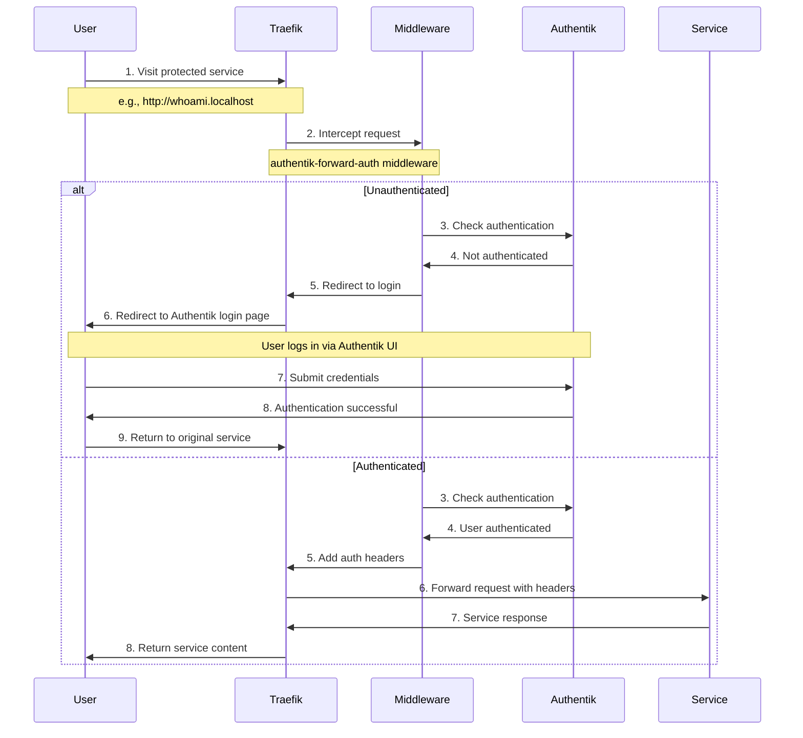

# Traefik Ingress Rules

Standards for configuring ingress and networking using Traefik IngressRoute CRDs in the UIS Kubernetes cluster.

## Cluster Ingress Architecture

### Components

- **Traefik**: Ingress controller (runs as a DaemonSet, provided by Rancher Desktop)
- **IngressRoute CRDs**: Custom Resource Definitions for advanced routing
- **Entry Points**: HTTP (`web` port 80) and HTTPS (`websecure` port 443)
- **Priority System**: Lower numbers = higher priority (checked first)

### Why Traefik IngressRoute CRDs?

UIS uses Traefik IngressRoute CRDs instead of standard Kubernetes Ingress resources because they provide path rewriting, header manipulation, middleware chains, and direct integration with Traefik.

## Localhost Routing

Any hostname ending in `.localhost` automatically resolves to `127.0.0.1` — no `/etc/hosts` editing needed:

```
Browser → http://grafana.localhost
       → DNS resolves to 127.0.0.1
       → Traefik matches Host(`grafana.localhost`)
       → Routes to grafana-service:3000
```

### Internal DNS for Pod-to-Pod Communication

Pods inside the cluster cannot reach services via `127.0.0.1`. UIS uses CoreDNS rewrite rules to map `*.localhost` hostnames to internal service FQDNs:

```yaml
# CoreDNS rewrite rules
rewrite name authentik.localhost authentik-server.authentik.svc.cluster.local
rewrite name openwebui.localhost open-webui.ai.svc.cluster.local
```

This dual-context DNS means the same hostname works in both browser and pod contexts:

```
# Browser access:
Browser → authentik.localhost → 127.0.0.1 → Traefik → authentik-server

# Pod access:
Pod → authentik.localhost → CoreDNS → ClusterIP → authentik-server
```

This is required for OAuth flows (e.g., OpenWebUI calling Authentik for authentication discovery).

## API Version

UIS runs **Traefik 3.3.6** (Rancher Desktop distribution). The current API version is:

```yaml
apiVersion: traefik.io/v1alpha1
kind: IngressRoute
```

`traefik.io/v1` is not yet available in Traefik 3.3.6. Always use `traefik.io/v1alpha1`.

## Standard IngressRoute Structure

```yaml
apiVersion: traefik.io/v1alpha1
kind: IngressRoute
metadata:
  name: <service-name>
  namespace: default
  labels:
    app: <application-name>
    component: <component-type>
    protection: <auth-level>
spec:
  entryPoints:
    - web
  routes:
    - match: <routing-rule>
      kind: Rule
      services:
        - name: <service-name>
          port: <port-number>
```

## Routing Patterns

### HostRegexp (Recommended)

Use `HostRegexp` for all services — it enables multi-domain access without updating IngressRoutes when adding new domains:

```yaml
spec:
  routes:
    - match: HostRegexp(`myapp\..+`)
      kind: Rule
      services:
        - name: myapp-service
          port: 80
```

This matches `myapp.localhost`, `myapp.urbalurba.no`, `myapp.example.com`, etc.

### Path-Based Routing

```yaml
spec:
  routes:
    - match: PathPrefix(`/api`)
      kind: Rule
      services:
        - name: api-service
          port: 8080
```

### Complex Matching (Use Sparingly)

```yaml
spec:
  routes:
    - match: Host(`service.localhost`) && PathPrefix(`/admin`)
      kind: Rule
      services:
        - name: admin-service
          port: 8080
```

## Priority System

Lower numbers = higher priority (checked first). Use this to prevent catch-all routes from intercepting more specific routes:

```yaml
# Critical services, authentication
priority: 10

# Application services
priority: 25

# Catch-all / fallback (checked last)
priority: 1
```

The nginx catch-all route uses `priority: 1` with `PathPrefix(/)` so all other routes are checked first.

## Authentication with Authentik

### Overview

UIS supports optional authentication using Authentik. Services can be public (no auth) or protected (requires login). Protected services use the `authentik-forward-auth` Traefik middleware.

### Authentication Flow



### Required Components

1. **Authentik Deployment**: `manifests/075-authentik-config.yaml`
2. **CSP Middleware**: `manifests/076-authentik-csp-middleware.yaml` (for external domains)
3. **Forward Auth Middleware**: `manifests/077-authentik-forward-auth-middleware.yaml`
4. **Protected IngressRoute**: per-service, e.g., `manifests/078-whoami-protected-ingressroute.yaml`

### Authentication Headers

When a request passes through the forward auth middleware, these headers are available in your service:

```
X-Forwarded-User                # Username
X-Forwarded-Email               # User email
X-Forwarded-Groups              # User groups/roles
X-Forwarded-Name                # Full name
X-Forwarded-Preferred-Username  # Preferred username
X-Forwarded-User-Id             # User ID
```

### Public vs Protected Routes

```yaml
# Public Route — no middleware, anyone can access
spec:
  routes:
    - match: HostRegexp(`whoami-public\..+`)
      services:
        - name: whoami
          port: 80

# Protected Route — requires Authentik login
spec:
  routes:
    - match: HostRegexp(`whoami\..+`)
      services:
        - name: whoami
          port: 80
      middlewares:
        - name: authentik-forward-auth
          namespace: default
```

### CSP Middleware for External Domains

When using external HTTPS domains (e.g., via Cloudflare tunnel), Authentik's UI makes HTTP API calls that browsers block as mixed content. The CSP middleware adds `upgrade-insecure-requests` to fix this:

```yaml
# manifests/076-authentik-csp-middleware.yaml
apiVersion: traefik.io/v1alpha1
kind: Middleware
metadata:
  name: authentik-csp-upgrade
  namespace: authentik
spec:
  headers:
    customResponseHeaders:
      Content-Security-Policy: "upgrade-insecure-requests"
```

This is applied to the Authentik IngressRoute. On HTTPS domains the browser upgrades API calls to HTTPS; on HTTP (localhost) it has no effect.

### UI Configuration for Protected Services

Before deploying protected services, configure in the Authentik admin UI:

1. **Create Proxy Provider**: Forward auth (single application), set External Host to the service URL
2. **Create Application**: Link to the provider, set slug
3. **Update Embedded Outpost**: Add the new application

## External Domain Authentication Limitations

While `*.localhost` authentication works automatically, adding external domains (like `urbalurba.no`) requires manual configuration per service. This is a fundamental limitation of Authentik's proxy provider architecture — the External Host field only accepts one specific URL, no wildcards.

### What requires manual setup per external domain

- CSRF trusted origins in `manifests/075-authentik-config.yaml`
- Separate proxy provider per protected service
- Separate application per protected service
- Outpost update to include new applications

### What works without manual configuration

- All `*.localhost` services (development)
- Public services on external domains
- Authentik admin UI on external domains (with CSP middleware)

### Time estimate

First external domain with 5 protected services takes roughly 45–60 minutes. Additional services on the same domain take about 10 minutes each.

## Common Mistakes

### Wrong API version

```yaml
# WRONG — "no matches for kind" error
apiVersion: traefik.io/v1

# CORRECT
apiVersion: traefik.io/v1alpha1
```

### Missing priority on catch-all

```yaml
# WRONG — intercepts all routes
match: PathPrefix(`/`)
priority: 100

# CORRECT — lowest priority, checked last
match: PathPrefix(`/`)
priority: 1
```

### Port mismatch

Always verify the actual service port with `kubectl get svc <name>` before setting the IngressRoute port.

## Debugging

```bash
# List all IngressRoutes
kubectl get ingressroute

# Describe a specific route
kubectl describe ingressroute <name>

# Port-forward to test service directly (bypassing Traefik)
kubectl port-forward svc/<service-name> <local-port>:<service-port>

# Check Traefik logs
kubectl logs -l app.kubernetes.io/name=traefik -f

# Test internal DNS resolution from a pod
kubectl exec -it <pod-name> -- getent hosts authentik.localhost
```

## File Organization

IngressRoute files live in `manifests/` and end with `-ingressroute.yaml`. See [Naming Conventions](./naming-conventions.md) for the full numbering scheme.

Key files:

| File | Purpose |
|------|---------|
| `020-nginx-root-ingress.yaml` | Catch-all fallback (priority 1) |
| `071-whoami-public-ingressroute.yaml` | Public service example |
| `076-authentik-csp-middleware.yaml` | CSP header for external HTTPS |
| `077-authentik-forward-auth-middleware.yaml` | Forward auth middleware |
| `078-whoami-protected-ingressroute.yaml` | Protected service example |

## Related Documentation

- **[Traefik IngressRoute Documentation](https://doc.traefik.io/traefik/routing/providers/kubernetes-crd/)** — Official Traefik CRD docs
- **[Provisioning Rules](./provisioning.md)** — Ansible playbook patterns
- **[Naming Conventions](./naming-conventions.md)** — File and resource naming
- **[Secrets Management](./secrets-management.md)** — Credential handling
