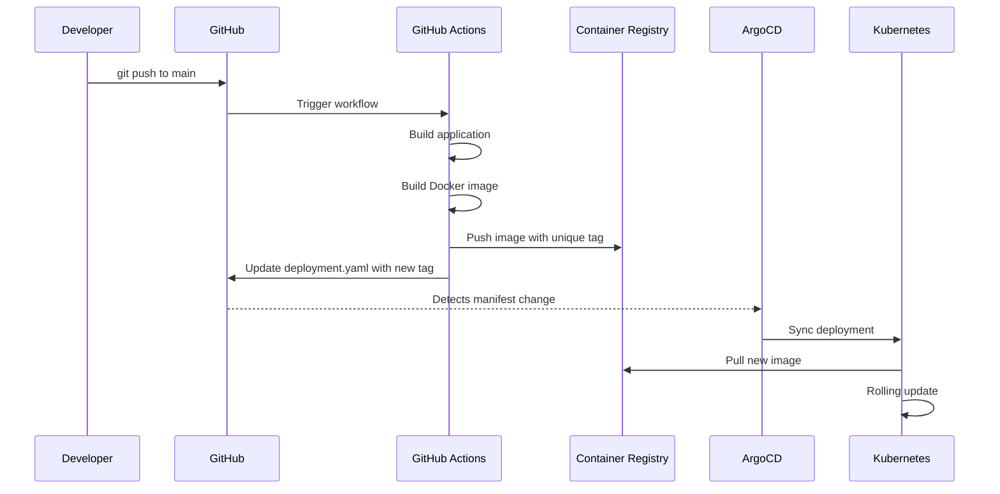

# CI/CD Pipeline

Every dev template includes a GitHub Actions workflow that automatically builds, packages, and deploys your application when you push to the main branch. ArgoCD watches your repository and syncs changes to the Kubernetes cluster.

## How it works



## Step by step

### 1. Developer pushes code

You push a commit to the `main` branch. The GitHub Actions workflow triggers automatically.

Changes to the `manifests/` directory are ignored to prevent infinite loops — the workflow itself updates manifests.

### 2. GitHub Actions builds the image

The workflow:
1. Checks out your code
2. Runs language-specific build steps (e.g., `npm ci && npm run build`)
3. Builds a Docker image from your `Dockerfile`
4. Tags it with a unique identifier: `{commit-sha}-{timestamp}` (e.g., `a1b2c3d-20260304120530`)
5. Pushes the image to GitHub Container Registry (ghcr.io)

The unique tag ensures ArgoCD detects every new build. Using only `latest` would make changes invisible to ArgoCD.

### 3. Workflow updates the manifest

After pushing the image, the workflow updates `manifests/deployment.yaml` with the new image tag:

```yaml
# Before (in deployment.yaml)
image: ghcr.io/owner/repo:abc1234-20260303100000

# After (updated by workflow)
image: ghcr.io/owner/repo:def5678-20260304120530
```

This commit is pushed back to the repository with a `[ci-skip]` message to prevent re-triggering the workflow.

### 4. ArgoCD syncs to the cluster

ArgoCD watches your repository. When it detects the updated `deployment.yaml`, it syncs the change to the Kubernetes cluster:

1. Pulls the new container image from GHCR
2. Performs a rolling update — new pods start before old ones terminate
3. Routes traffic to the new pods via the platform-managed IngressRoute

### 5. Application is live

Your updated application is accessible at `http://<app-name>.localhost`. The platform creates the IngressRoute automatically when you register the app — you don't need ingress manifests in your repo.

## What the workflow needs

The workflow requires these GitHub repository permissions (set automatically for public repos):

| Permission | Purpose |
|------------|---------|
| `contents: write` | Push updated deployment.yaml back to the repo |
| `packages: write` | Push container images to GitHub Container Registry |

## Workflow variations

Most templates use the same workflow pattern. The main differences are language-specific build steps:

| Template | Build step |
|----------|-----------|
| TypeScript | `npm ci && npm run build` |
| Python | `pip install -r requirements.txt` |
| Go | Builds inside the Docker multi-stage build |
| Java | Builds inside the Docker multi-stage build |
| C# | `dotnet restore && dotnet publish` |
| React | `npm ci && npm run build` |

## Preventing infinite loops

Two mechanisms prevent the workflow from triggering itself:

1. **Path filter**: The workflow ignores changes to `manifests/` in its trigger
2. **Author check**: Before updating manifests, the workflow checks if the current commit was made by GitHub Actions — if so, it skips the update
