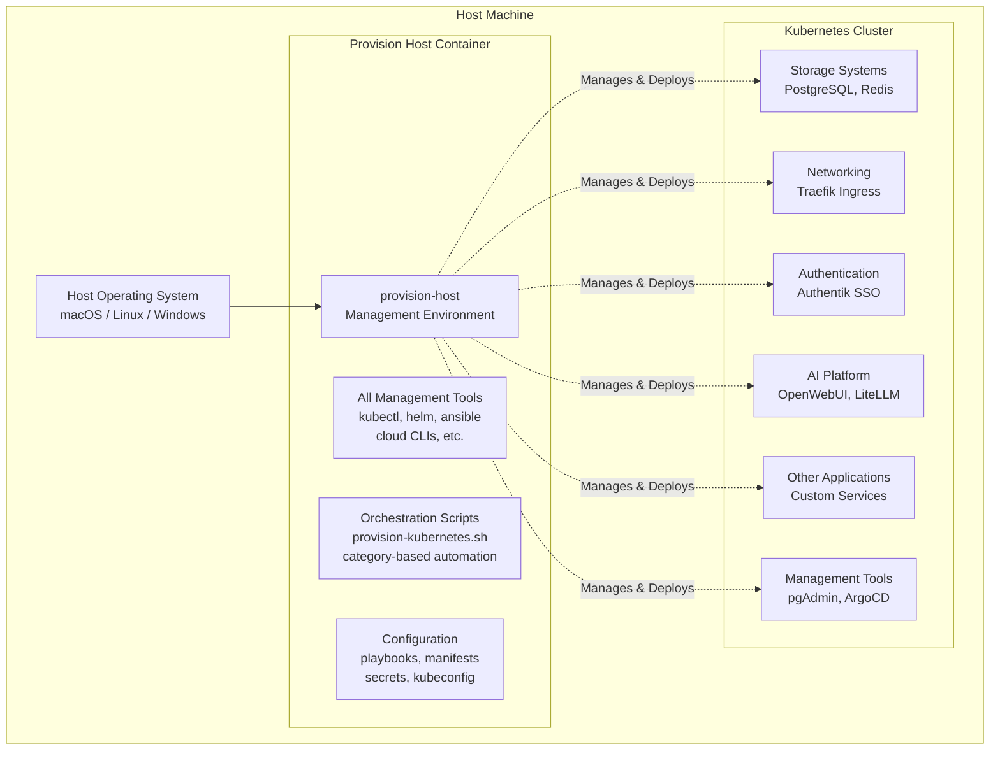
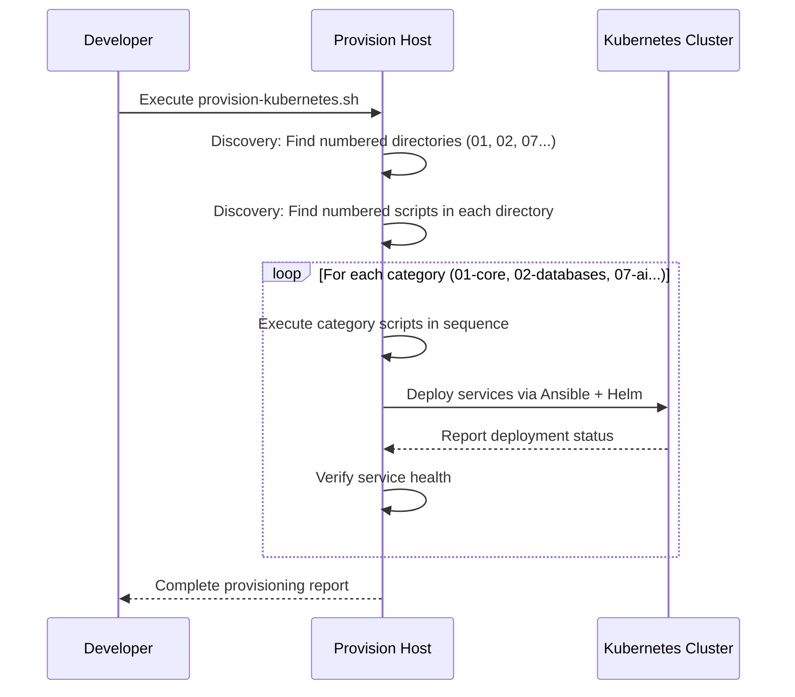
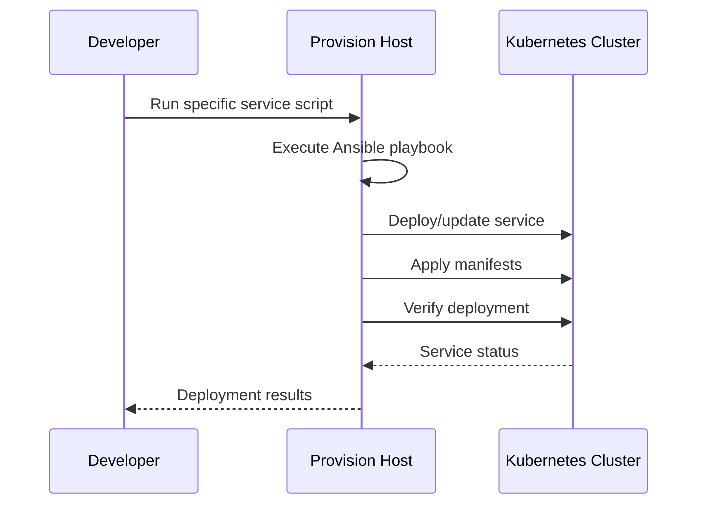
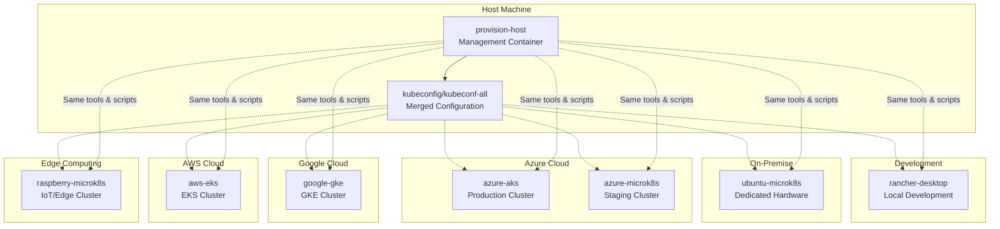

# Urbalurba Infrastructure System Architecture

**File**: `docs/overview-system-architecture.md`
**Purpose**: High-level overview of the two-tier architecture: provision-host + cluster
**Target Audience**: Developers, architects, and anyone needing to understand the overall system design
**Last Updated**: September 20, 2024

## 🏗️ **Overview**

The Urbalurba Infrastructure follows a **two-tier architecture** that separates cluster management from cluster workloads. This design provides a clean separation of concerns, ensuring all management tooling is centralized and the cluster remains focused on running applications.



## 🎯 **Core Architecture Principles**

### **1. Separation of Management and Runtime**
- **Provision Host**: Contains ALL tools needed to manage the cluster
- **Cluster**: Runs ONLY application workloads and services
- **Clean Interface**: Management happens through standard Kubernetes APIs

### **2. Self-Contained Management Environment**
- **Containerized Tooling**: All management tools isolated in provision-host container
- **Version Consistency**: Same tool versions across all environments
- **Portable**: Works identically on any host machine

### **3. Declarative Configuration**
- **Infrastructure as Code**: All cluster state defined in manifests
- **Reproducible Deployments**: Same configuration produces identical results
- **Version Controlled**: All configuration tracked in Git

## 🏗️ **Tier 1: Provision Host (Management Layer)**

The **provision-host** is a containerized management environment that contains ALL tools and scripts needed to manage the Kubernetes cluster.

### **What's Inside the Provision Host**

```
/mnt/urbalurbadisk/               # Mounted working directory
├── provision-host/               # Container setup scripts
│   ├── provision-host-00-coresw.sh      # Core software installation
│   ├── provision-host-01-cloudproviders.sh  # Cloud provider CLIs
│   ├── provision-host-02-kubetools.sh   # Kubernetes tooling
│   ├── provision-host-03-net.sh         # Network configuration
│   ├── provision-host-04-helmrepo.sh    # Helm repository setup
│   └── kubernetes/               # Orchestration scripts
│       ├── provision-kubernetes.sh      # Main orchestration engine
│       ├── 01-core/                    # Core infrastructure scripts
│       ├── 02-databases/               # Data service scripts
│       ├── 07-ai/                      # AI platform scripts
│       └── [nn]-[category]/            # Other service categories
├── ansible/                      # Automation engine
│   ├── playbooks/                # Service deployment logic
│   └── inventory/                # Environment configurations
├── manifests/                    # Kubernetes manifests
├── troubleshooting/              # Debug scripts and tools
├── kubeconfig/                   # Kubernetes configuration files
│   ├── kubeconf-all              # Merged kubeconfig for all clusters
│   └── rancher-desktop-kubeconf  # Rancher Desktop specific config
├── .uis.secrets/                 # Secrets management
│   ├── generated/kubernetes/     # Generated Kubernetes secrets
│   ├── config/                   # User configuration (your values)
│   └── scripts/                  # Secret generation scripts
├── scripts/                      # Additional utility scripts
├── networking/                   # Network configurations
├── hosts/                        # Host-specific configurations
└── cloud-init/                   # Cloud-init templates
```

**Pre-installed Tools** (via setup scripts):
- **kubectl, helm** - Kubernetes management
- **ansible** - Infrastructure automation
- **az, aws, gcloud** - Cloud provider CLIs
- **tailscale** - VPN tunnel for traffic in to the cluster
- **cloudlare** - VPN tunnel for traffic in to the cluster
- **jq, yq** - JSON/YAML processing
- **git, curl, wget** - Development utilities

### **Management Capabilities**

- **🚀 Cluster Provisioning**: Automated setup of entire infrastructure
- **📦 Service Deployment**: Deploy services using Ansible + Helm
- **🔧 Configuration Management**: Manage secrets, configs, manifests
- **🔍 Monitoring & Debugging**: Access logs, metrics, troubleshooting tools
- **☁️ Cloud Integration**: Deploy to AWS, Azure, GCP from same environment

### **Key Benefits**

- ✅ **Tool Consistency**: Same versions across all environments
- ✅ **Reproducible**: Identical setup process everywhere
- ✅ **Isolated**: Management tools don't interfere with cluster workloads
- ✅ **Portable**: Works on any machine with Rancher Desktop
- ✅ **Auditable**: All management actions tracked and scripted

## 🎪 **Tier 2: Kubernetes Cluster (Runtime Layer)**

The **provision-host** runs on the host machine and manages the Kubernetes cluster which provides container orchestration for all application services.

### **Cluster Runtime Options**

| **Option** | **Use Case** | **Benefits** |
|------------|--------------|--------------|
| **Rancher Desktop** | Development, local testing | Easy setup, GUI management |
| **MicroK8s** | Production-like local env | Lightweight, production features |
| **Cloud K8s** | Production deployment | Managed services, high availability |


## 🔄 **Deployment Flow**

Two ways to start the services in the cluster.

### **Automated Provisioning Process**

This is run when the cluster is built. 
For detailed description see [provision-host-kubernetes.md](../provision-host/kubernetes.md)


### **Manual Service Management**

This is when you log in to the `provision-host`container and start a service. See the section Starting services in the [overview-getting-started.md](./overview.md) for an example on how to start a service.




### **Multi-Cluster Management**

The provision-host can manage multiple Kubernetes clusters simultaneously using merged kubeconfig files:



**Key Benefits:**
- **🎯 Single Management Point**: One provision-host manages all clusters
- **🔧 Consistent Tooling**: Same kubectl, helm, ansible across all environments
- **📋 Unified Configuration**: Merged kubeconfig enables cluster switching with `kubectl config use-context`
- **🚀 Identical Deployments**: Same manifests and playbooks work everywhere

---

**💡 Key Takeaway**: The Urbalurba Infrastructure is fundamentally about **separation of concerns** - the provision-host handles ALL management complexity, while the cluster focuses purely on running applications reliably and efficiently.