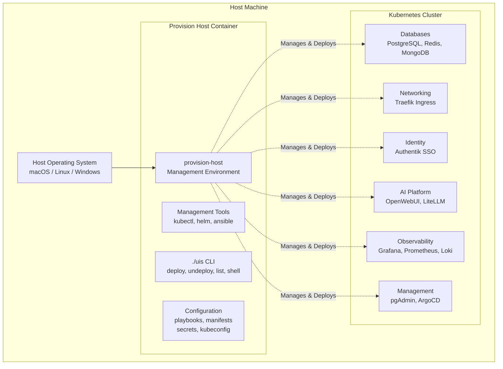
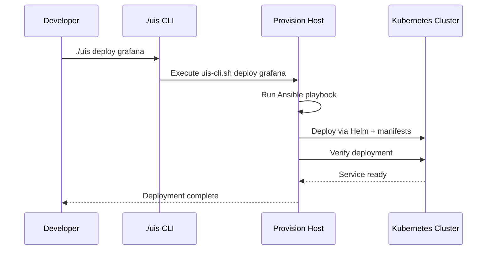
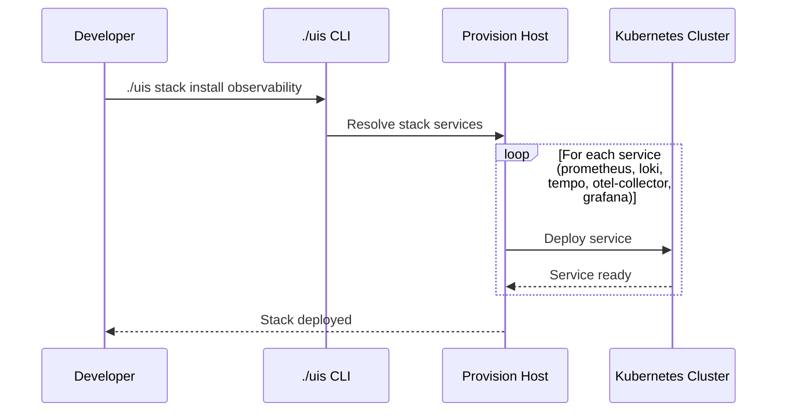
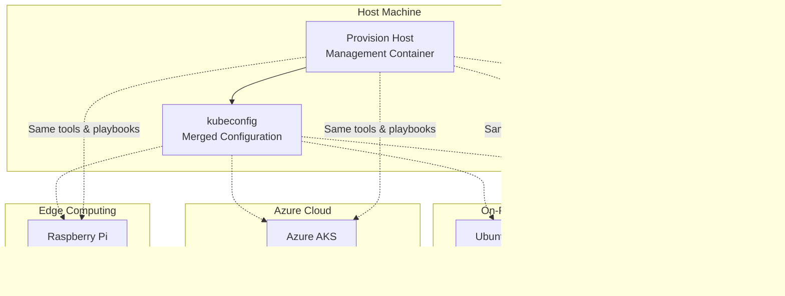

# System Architecture

UIS follows a **two-tier architecture** that separates cluster management from cluster workloads. A containerized management environment (the provision host) deploys and manages services on any Kubernetes cluster.


```mermaid
graph TB
    subgraph "Host Machine"
        HOST[Host Operating System<br/>macOS / Linux / Windows]

        subgraph "Provision Host Container"
            PH[provision-host<br/>Management Environment]
            TOOLS[Management Tools<br/>kubectl, helm, ansible]
            CLI[./uis CLI<br/>deploy, undeploy, list, shell]
            CONFIG[Configuration<br/>playbooks, manifests<br/>secrets, kubeconfig]
        end

        subgraph "Kubernetes Cluster"
            STORAGE[Databases<br/>PostgreSQL, Redis, MongoDB]
            NETWORK[Networking<br/>Traefik Ingress]
            AUTH[Identity<br/>Authentik SSO]
            AI[AI Platform<br/>OpenWebUI, LiteLLM]
            OBS[Observability<br/>Grafana, Prometheus, Loki]
            MGMT[Management<br/>pgAdmin, ArgoCD]
        end
    end

    HOST --> PH
    PH -.->|"Manages & Deploys"| STORAGE
    PH -.->|"Manages & Deploys"| NETWORK
    PH -.->|"Manages & Deploys"| AUTH
    PH -.->|"Manages & Deploys"| AI
    PH -.->|"Manages & Deploys"| OBS
    PH -.->|"Manages & Deploys"| MGMT
```

## Core Principles

### Separation of Management and Runtime
- **Provision Host** contains ALL tools needed to manage the cluster
- **Cluster** runs ONLY application workloads and services
- Management happens through standard Kubernetes APIs

### Self-Contained Management Environment
- All management tools isolated in the provision host container
- Same tool versions across all environments
- Works identically on any host machine

### Declarative Configuration
- All cluster state defined in manifests and playbooks
- Same configuration produces identical results everywhere
- All configuration tracked in Git

## Tier 1: Provision Host (Management Layer)

The provision host is a container image that includes everything needed to deploy and manage services. You interact with it through the `./uis` CLI on your host machine.

### What's Inside

The container image contains:
- **Ansible playbooks** — Service deployment logic for all 26+ services
- **Helm charts** — Templated Kubernetes deployments
- **Kubernetes manifests** — Declarative service definitions
- **UIS CLI** — The `uis-cli.sh` command dispatcher

### Pre-installed Tools
- **kubectl, helm** — Kubernetes management
- **ansible** — Infrastructure automation
- **k9s** — Terminal-based Kubernetes dashboard
- **jq, yq** — JSON/YAML processing
- **git, curl, wget** — Development utilities

### Your Local Configuration

Two directories on your host machine are mounted into the container:

- **`.uis.extend/`** — Enabled services, cluster settings, tool preferences
- **`.uis.secrets/`** — Passwords, API keys, certificates (gitignored)

These are the only files you manage locally. Everything else is baked into the container image.

## Tier 2: Kubernetes Cluster (Runtime Layer)

The cluster provides container orchestration for all application services. UIS supports multiple runtime options:

| Option | Use Case |
|--------|----------|
| **Rancher Desktop** | Local development (default) |
| **Azure AKS** | Production cloud |
| **Ubuntu Server** | Self-hosted production |
| **Raspberry Pi** | Edge computing, home lab |

## Deployment Flow

### Using the CLI


```mermaid
sequenceDiagram
    participant Dev as Developer
    participant CLI as ./uis CLI
    participant PH as Provision Host
    participant K8s as Kubernetes Cluster

    Dev->>CLI: ./uis deploy grafana
    CLI->>PH: Execute uis-cli.sh deploy grafana
    PH->>PH: Run Ansible playbook
    PH->>K8s: Deploy via Helm + manifests
    PH->>K8s: Verify deployment
    K8s-->>PH: Service ready
    PH-->>Dev: Deployment complete
```

### Stack Deployment

Deploy a full package of related services:


```mermaid
sequenceDiagram
    participant Dev as Developer
    participant CLI as ./uis CLI
    participant PH as Provision Host
    participant K8s as Kubernetes Cluster

    Dev->>CLI: ./uis stack install observability
    CLI->>PH: Resolve stack services
    loop For each service (prometheus, loki, tempo, otel-collector, grafana)
        PH->>K8s: Deploy service
        K8s-->>PH: Service ready
    end
    PH-->>Dev: Stack deployed
```

## Multi-Cluster Management

The same provision host can manage multiple Kubernetes clusters by switching kubeconfig contexts:


```mermaid
graph TB
    subgraph "Host Machine"
        PH[Provision Host<br/>Management Container]
        CONFIG[kubeconfig<br/>Merged Configuration]
    end

    subgraph "Development"
        RD[Rancher Desktop<br/>Local Development]
    end

    subgraph "On-Premise"
        UMICROK8S[Ubuntu Server<br/>Self-hosted]
    end

    subgraph "Azure Cloud"
        AKS[Azure AKS<br/>Production]
    end

    subgraph "Edge Computing"
        RMICROK8S[Raspberry Pi<br/>Edge Cluster]
    end

    PH --> CONFIG
    CONFIG -.-> RD
    CONFIG -.-> UMICROK8S
    CONFIG -.-> AKS
    CONFIG -.-> RMICROK8S

    PH -.->|"Same tools & playbooks"| RD
    PH -.->|"Same tools & playbooks"| UMICROK8S
    PH -.->|"Same tools & playbooks"| AKS
    PH -.->|"Same tools & playbooks"| RMICROK8S
```

Switch between clusters with:

```bash
./uis shell
kubectl config use-context rancher-desktop
kubectl config use-context azure-aks
```

The same `./uis deploy` commands work identically on any cluster — only the Kubernetes endpoint changes.

## Learn More

- **[How Deployment Works](../advanced/how-deployment-works.md)** — Deep dive into the deploy flow, dependency resolution, health checks, and stacks
