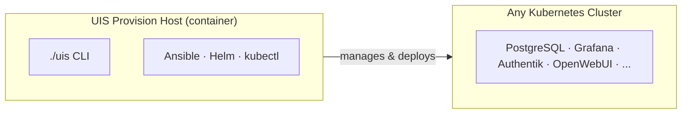

# Urbalurba Infrastructure Stack

**Your cloud services, on your laptop.**

## What is UIS?

UIS gives you the same services you use from cloud providers — databases, monitoring, AI, authentication — running on your own machine. No cloud account needed. Same configuration works on your laptop and in production.

## How it Works

A management container (the **Provision Host**) uses standard tools — Ansible, Helm, kubectl — to deploy services onto any Kubernetes cluster. You interact with it through the `./uis` CLI.



> The same provision host targets your laptop, a cloud cluster, or a Raspberry Pi — only the Kubernetes endpoint changes.

## Cloud Services Comparison

UIS replaces cloud-managed services with open-source equivalents you control:

| What you need | Cloud service you know | UIS gives you |
|---|---|---|
| **Monitoring & Observability** | Azure Monitor, CloudWatch | Prometheus, Grafana, Loki, Tempo |
| **Relational Database** | Azure Database for PostgreSQL | PostgreSQL, MySQL |
| **AI & LLM Services** | Azure OpenAI, AWS Bedrock | OpenWebUI, LiteLLM, Ollama |
| **Identity & SSO** | Azure AD, AWS IAM | Authentik |
| **Data Science & Analytics** | Azure Databricks | Spark, JupyterHub, Unity Catalog |
| **GitOps & Deployment** | Azure DevOps, GitHub Actions | ArgoCD |
| **Message Queues** | Azure Service Bus, SQS | RabbitMQ |
| **API Gateway** | Azure API Management | Gravitee |

[See the full services comparison →](./getting-started/services.md)

## Runs Anywhere

| Platform | Architecture | Use Case |
|----------|--------------|----------|
| **Laptop** (Rancher Desktop) | ARM64 / x86_64 | Local development |
| **Azure AKS** | x86_64 | Production cloud |
| **Ubuntu Server** | ARM64 / x86_64 | Self-hosted production |
| **Raspberry Pi** | ARM64 | Edge computing, home lab |

:::tip One codebase. Any platform. Same result.
Once your Kubernetes cluster is running, everything else is identical regardless of where it runs. Same manifests, same Ansible playbooks, same services, same URLs.
:::

## Quick Start

### Prerequisites

- macOS, Linux, or Windows with WSL2
- 16GB RAM minimum (32GB recommended)
- 50GB free disk space
- [Rancher Desktop](https://rancherdesktop.io/) installed

### Installation

Download the `uis` script and start — the container image is pulled automatically:

**macOS / Linux:**

```bash
# Download the UIS CLI
curl -fsSL https://raw.githubusercontent.com/terchris/urbalurba-infrastructure/main/uis -o uis
chmod +x uis

# Start the UIS provision host (pulls the container image automatically)
./uis start

# Deploy a single service
./uis deploy postgresql

# Or install a full package
./uis stack install observability
```

**Windows (PowerShell):**

```powershell
# Download the UIS CLI
Invoke-WebRequest -Uri "https://raw.githubusercontent.com/terchris/urbalurba-infrastructure/main/uis.ps1" -OutFile "uis.ps1"

# Start the UIS provision host (pulls the container image automatically)
.\uis.ps1 start

# Deploy a single service
.\uis.ps1 deploy postgresql

# Or install a full package
.\uis.ps1 stack install observability
```

### Access Your Services

After deployment, access services at:

| Service | URL |
|---------|-----|
| Grafana | [http://grafana.localhost](http://grafana.localhost) |
| Prometheus | [http://prometheus.localhost](http://prometheus.localhost) |
| Authentik | [http://authentik.localhost](http://authentik.localhost) |
| OpenWebUI | [http://openwebui.localhost](http://openwebui.localhost) |
| pgAdmin | [http://pgadmin.localhost](http://pgadmin.localhost) |
| ArgoCD | [http://argocd.localhost](http://argocd.localhost) |

## Documentation

- **[Getting Started](./getting-started/overview.md)** — First steps and quick start guide
- **[Hosts & Platforms](./hosts/index.md)** — Supported platforms and setup guides
- **[Packages](./packages/ai/index.md)** — Service documentation by category
- **[Networking](./networking/index.md)** — External access via Tailscale and Cloudflare
- **[Rules & Standards](./rules/index.md)** — Development conventions and patterns
- **[Troubleshooting](./reference/troubleshooting.md)** — Common issues and solutions

## Your Working Directory

After running `./uis start`, your directory looks like this:

```
my-project/
├── uis                   # UIS CLI (the only file you download)
├── .uis.extend/          # Service configuration overrides (yours to edit)
├── .uis.secrets/         # Passwords, API keys, certificates (gitignored)
└── .gitignore            # Auto-created, excludes .uis.secrets/
```

- **`.uis.extend/`** — Customize which services are enabled, cluster settings, and tool preferences. Edit these files to tailor UIS to your environment.
- **`.uis.secrets/`** — All credentials and sensitive config. Generated with safe defaults on first run. Never committed to git.

Everything else lives inside the container image — manifests, playbooks, and tools are all baked in.

## Contributing

Contributions are welcome! Please read the [development workflow](./rules/development-workflow.md) and [git workflow](./rules/git-workflow.md) guides before submitting changes.

## License

This project is maintained by the Urbalurba development team.
