# Authentication Package

The Authentication package is a comprehensive self-hosted identity and access management (IAM) platform that enables organizations to implement enterprise-grade authentication, authorization, and single sign-on (SSO) capabilities. This implementation is based on the [Authentik](https://goauthentik.io/) project, enhanced with our **Auth10 dynamic authentication system** that provides automated multi-domain service protection through configuration-driven templates.

## Table of Contents

1. [Getting Started](#getting-started)
2. [Auth10 Dynamic Authentication System](#auth10-dynamic-authentication-system)
3. [Technical Implementation](#technical-implementation)
4. [System Architecture](#system-architecture)
5. [Use Cases](#use-cases)
6. [Authentik Stack Setup](#authentik-stack-setup)
7. [Developer Workflow](#developer-workflow)
8. [Security and Compliance](#security-and-compliance)
9. [Monitoring and Management](#monitoring-and-management)
10. [Troubleshooting](#troubleshooting)
11. [Related Documentation](#related-documentation)
12. [Future Enhancements](#future-enhancements)

## Getting Started

### Prerequisites

Before installing the Authentication package, you must configure your services in the `kubernetes-secrets.yml` file:

1. **Configure Protected Services**: Edit `topsecret/kubernetes/kubernetes-secrets.yml` and add your services to the `protected_services` section
2. **Set Domain Configuration**: Ensure your `domains` section includes the domains you want to use (localhost, tailscale, cloudflare)

For detailed configuration instructions, see: **[Auth10 Developer Guide - Configuration](package-auth-authentik-auth10-developer-guide.md#configuration)**

### Installation

Once your configuration is ready, run the following command on your host computer:

```bash
./scripts/packages/auth.sh
```

The script will install the Authentication package and start the Authentik frontend. You can then access the Authentik admin interface at [http://authentik.localhost/if/admin/](http://authentik.localhost/if/admin/).

The install takes a while to complete as it sets up the database, creates the initial admin user, and configures all authentication flows. The system is designed to be production-ready from the first deployment.

### Default Credentials

After installation, you can access the system with these default credentials:
- **Admin URL**: [http://authentik.localhost/if/admin/](http://authentik.localhost/if/admin/)
- **Username**: `admin@urbalurba.local`
- **Password**: `SecretPassword1`

**Important**: Change these default credentials immediately after first login for security purposes.

### Installation Progress and Troubleshooting

For detailed installation monitoring, testing procedures, and troubleshooting, see: **[Auth10 Developer Guide](package-auth-authentik-auth10-developer-guide.md)**

## Auth10 Dynamic Authentication System

**Auth10** is our advanced template-driven authentication system that automatically generates multi-domain authentication configurations. It represents a major evolution from manual blueprint creation to fully automated, configuration-driven authentication.

### Key Benefits

- **🎯 Configuration-Driven**: Define services once in `kubernetes-secrets.yml`, get multi-domain authentication automatically
- **🌐 Multi-Domain Support**: Automatic provider creation for localhost, Tailscale, and Cloudflare domains
- **🔄 Dynamic Generation**: Templates rendered during deployment, always current and consistent
- **🛡️ External Domain Solution**: Solves the manual provider configuration problem for external domains
- **📝 Zero Manual Setup**: No manual provider configuration in Authentik UI required
- **🚀 Enterprise-Grade**: Production-ready security, compliance features, and scalability
- **⚡ Rapid Deployment**: Add new services by updating configuration only

### How Auth10 Works

1. **Configuration**: Define domains and protected services in `kubernetes-secrets.yml`
2. **Template Rendering**: Ansible renders Jinja2 templates during deployment
3. **Blueprint Generation**: Dynamic blueprints created with multi-domain providers
4. **Outpost Linking**: All providers automatically linked to embedded outpost
5. **Multi-Domain Auth**: External domains work automatically without manual setup

For practical usage examples and step-by-step instructions, see: **[`docs/package-auth-authentik-auth10-developer-guide.md`](package-auth-authentik-auth10-developer-guide.md)**

### Supported Authentication Types

- **`proxy`**: Forward authentication (most services)
- **`oauth2`**: Direct OAuth2/OIDC integration (Grafana, etc.)
- **`basic`**: HTTP Basic Authentication (simple services)

For complete Auth10 documentation, see: **[`docs/package-auth-authentik-auth10.md`](package-auth-authentik-auth10.md)**

## Technical Implementation

Our implementation includes significant enhancements over standard Authentik, including shared database/Redis integration, advanced Traefik routing, enhanced security features, and enterprise-grade monitoring capabilities.

For detailed technical implementation information, see: **[Technical Implementation Guide](package-auth-authentik-technical-implementation.md)**

## System Architecture


## Use Cases

### 1. Forward Authentication for Applications


### 2. OAuth2 Provider for Applications


### 3. Enterprise SSO Integration


The platform supports flexible authentication configuration per application:
- Internal applications can use forward authentication for seamless protection
- Modern web applications can integrate via OAuth2 for enhanced user experience
- Enterprise applications can use SAML for traditional SSO integration
- All configurations are managed through a centralized admin interface

## Deployment Architecture

The authentication system is deployed using an Ansible playbook that creates a complete Kubernetes-based infrastructure including:

- **Shared Services**: PostgreSQL database and Redis cache shared across applications
- **Authentik Components**: Server, worker, and embedded outpost for authentication
- **Traefik Integration**: Forward authentication middleware and ingress routing
- **Security Features**: TLS encryption, audit logging, and session management

For detailed deployment information, component specifications, and configuration details, see: **[Technical Implementation Guide](package-auth-authentik-technical-implementation.md)**

## Authentik Working Mechanism

### How Authentik Works After Cluster Reset

#### **Post-Reset Initialization Process**

After a cluster reset, Authentik goes through a specific initialization sequence:

1. **Helm Deployment**
   - Authentik server and worker pods start
   - Database connections established
   - Basic configuration loaded

2. **Blueprint Processing**
   - Blueprint discovery task enqueued
   - Applications and providers created automatically
   - Outpost configuration stored in database

3. **Outpost Initialization**
   - **Configuration**: Outpost settings are correct by default
   - **Runtime State**: But outpost process is not fully activated
   - **Status**: Configuration exists but not being applied

4. **Activation Trigger**
   - **Admin Interface Access**: Logging into `http://authentik.localhost`
   - **Application Viewing**: Viewing any application in the admin interface
   - **Result**: Outpost process "wakes up" and applies configuration

#### **Why Admin Interface Access Triggers Activation**

The Authentik admin interface access serves as a **configuration activation trigger**:

- **Database Connection**: Establishes full database connectivity
- **Configuration Loading**: Forces outpost to read its configuration
- **Process Initialization**: Completes outpost process initialization
- **Runtime Activation**: Applies configuration to running process

#### **Outpost Configuration States**

```yaml
# State 1: After Cluster Reset (Inactive)
Configuration: ✅ Correct (authentik_host_browser: "")
Runtime: ❌ Not applied (generates 0.0.0.0:9000 URLs)

# State 2: After Admin Interface Access (Active)
Configuration: ✅ Correct (authentik_host_browser: "")
Runtime: ✅ Applied (generates correct URLs)

# State 3: After Manual Configuration (Active)
Configuration: ✅ Custom settings
Runtime: ✅ Applied (generates custom URLs)
```

#### **Dynamic Host Detection Mechanism**

When `authentik_host_browser` is empty (the default):

1. **Outpost detects incoming domain** from the request
2. **Generates redirect URLs** using the same domain
3. **Automatically adapts** to both `.localhost` and `.urbalurba.no`
4. **No manual configuration** needed for multi-domain support

#### **Configuration Persistence**

- **Outpost settings** are stored in the database
- **Survive pod restarts** and cluster resets
- **Blueprint recreates** applications and providers
- **But outpost configuration** needs activation trigger

#### **Best Practices for Cluster Resets**

1. **Deploy all manifests first**
2. **Wait for blueprint processing** (check logs for completion)
3. **Access admin interface** to trigger outpost activation
4. **Test authentication flow** to verify everything works
5. **No manual configuration changes** needed

#### **Troubleshooting Flow**

```mermaid
graph TD
    A[Cluster Reset] --> B[Deploy Manifests]
    B --> C[Wait for Blueprint]
    C --> D[Access Admin Interface]
    D --> E{Outpost Working?}
    E -->|Yes| F[✅ Success]
    E -->|No| G[Pod Restart]
    G --> H{Outpost Working?}
    H -->|Yes| I[✅ Success]
    H -->|No| J[Manual Configuration]
    J --> K[✅ Success]
```



## Developer Resources

For developers working with the authentication system:

- **Quick Start Guide**: See [Auth10 Developer Guide](package-auth-authentik-auth10-developer-guide.md) for step-by-step instructions
- **Configuration Examples**: Practical examples for all service types and use cases
- **Integration Code**: Ready-to-use code examples for popular frameworks
- **Testing Workflows**: Multi-environment testing strategies and automation
- **Troubleshooting**: Debug commands and common issue resolution

## Enterprise Features

The authentication system provides enterprise-grade security, compliance, and management capabilities including:

- **Security**: Multi-factor authentication, brute force protection, secure session management
- **Compliance**: GDPR, SOC 2, HIPAA readiness with configurable policies
- **Monitoring**: Health checks, audit logging, performance metrics
- **Management**: Automated backups, disaster recovery, structured logging

For detailed security specifications, compliance features, monitoring procedures, and troubleshooting guides, see: **[Technical Implementation Guide](package-auth-authentik-technical-implementation.md)**

## Related Documentation

| Task | Documentation |
|------|---------------|
| **Get Started** | [Auth10 Developer Guide](package-auth-authentik-auth10-developer-guide.md) |
| **Configure Services** | [Auth10 System Guide](package-auth-authentik-auth10.md) |
| **Technical Details** | [Technical Implementation Guide](package-auth-authentik-technical-implementation.md) |
| **Blueprint Syntax** | [Blueprint Syntax Reference](package-auth-authentik-blueprints-syntax.md) |
| **Test Users** | [Test Users Guide](package-auth-authentik-testusers.md) |

## Summary

The Authentication package provides enterprise-grade identity and access management with the Auth10 system enabling configuration-driven, multi-domain authentication. It offers production-ready deployment automation, comprehensive security features, and seamless integration for both developers and system administrators.

The platform enables rapid development of authenticated applications while maintaining security best practices and providing a clear path to production deployment across localhost, Tailscale, and Cloudflare domains.