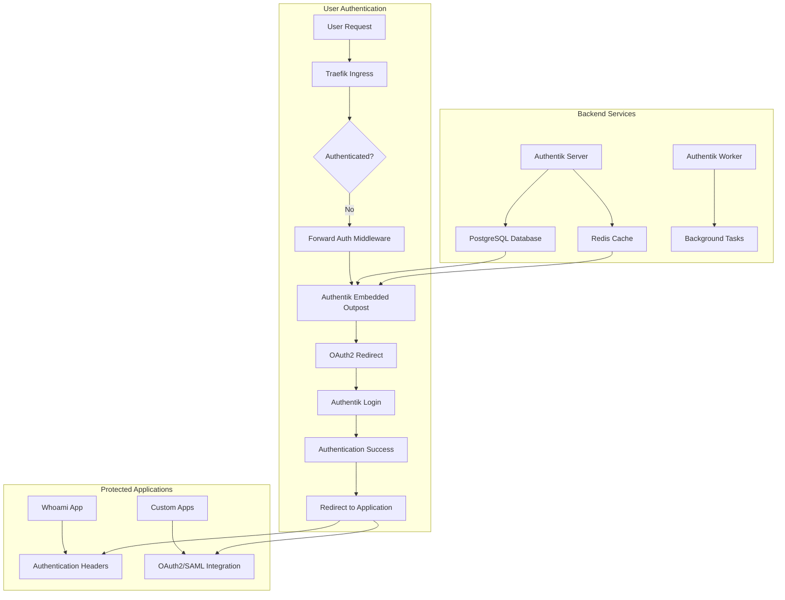

# Authentik Technical Implementation

## Overview

This document details the technical implementation of the Authentik authentication system in the Urbalurba infrastructure. While our implementation is based on the open-source [Authentik](https://goauthentik.io/) project, we've made several significant modifications to enhance its capabilities and better suit enterprise needs in a Kubernetes environment.

## Implementation Differences from Standard Authentik

### 1. Database Integration
- **Original**: Includes PostgreSQL as part of the Helm chart deployment
- **Our Implementation**: Uses shared PostgreSQL instance across multiple services
  - Single PostgreSQL instance serving multiple applications
  - Dedicated `authentik` database with proper user permissions
  - Shared backup and recovery procedures
  - Centralized database monitoring and management

### 2. Session Management
- **Original**: Includes Redis as part of the Helm chart deployment
- **Our Implementation**: Uses shared Redis instance across multiple services
  - Single Redis instance serving multiple applications
  - Shared session management and caching layer
  - Centralized Redis monitoring and management
  - Enhanced security through shared authentication

### 3. Ingress and Routing
- **Original**: Basic Traefik integration
- **Our Implementation**: Advanced Traefik integration with forward authentication
  - Forward authentication middleware for protecting applications
  - Proper ingress class configuration
  - SSL/TLS termination support
  - Catch-all routing for undefined hostnames

### 4. Forward Authentication
- **Original**: Basic forward authentication capabilities
- **Our Implementation**: Enhanced forward authentication with embedded outpost
  - Kubernetes-native deployment
  - Automatic service discovery
  - Enhanced security and isolation
  - Better integration with Traefik

### 5. Storage Architecture
- **Original**: Uses embedded storage solutions
- **Our Implementation**: Kubernetes-native persistent storage
  - Better data persistence
  - Improved backup capabilities
  - Enhanced scalability
  - Better resource management

### 6. Deployment Architecture
- **Original**: Designed for simpler deployments
- **Our Implementation**: Kubernetes-native deployment
  - Better scalability
  - Enhanced reliability
  - Improved resource management
  - Better integration with enterprise infrastructure

### 7. Security Enhancements
- **Original**: Basic security features
- **Our Implementation**: Enhanced security features
  - Centralized secret management
  - Advanced access control
  - Better audit capabilities
  - Enhanced monitoring and alerting

### 8. Monitoring and Management
- **Original**: Basic monitoring capabilities
- **Our Implementation**: Enhanced monitoring and management
  - Comprehensive health checks
  - Detailed logging and audit trails
  - Better resource monitoring
  - Enhanced troubleshooting capabilities

## Core Features

### Identity Management
- User and group management with hierarchical organization
- Role-based access control (RBAC)
- Multi-factor authentication (MFA) support
- User provisioning and deprovisioning workflows
- Password policies and complexity requirements

### Authentication Flows
- OAuth2 provider for modern web applications
- SAML provider for enterprise SSO integration
- OpenID Connect support
- Custom authentication flows and policies
- Social login integration capabilities

### Forward Authentication
- Protect any application with authentication
- Seamless integration with Traefik ingress
- Automatic redirect to login for unauthenticated users
- Session management and persistence
- Support for multiple protected applications

### Application Integration
- OAuth2 client applications
- SAML service providers
- API authentication and authorization
- Custom application integration
- Webhook and notification support

### Security & Compliance
- Audit logging and compliance reporting
- Data encryption at rest and in transit
- GDPR and privacy compliance features
- Security event monitoring
- Backup and disaster recovery

## Enterprise Features

### Multi-tenant Support
- Organization-based user management
- Department and team structures
- Granular permission management
- Custom branding per organization

### Advanced Policies
- Conditional access policies
- Risk-based authentication
- Geographic access restrictions
- Time-based access controls

### Integration Capabilities
- LDAP/Active Directory integration
- HR system synchronization
- Custom API integrations
- Webhook notifications

## Design Philosophy

The platform is designed to operate entirely offline while maintaining enterprise-grade security and scalability features. It provides organizations with a secure, cost-effective way to implement comprehensive identity and access management while maintaining control over user access and security policies.

## System Architecture



## Authentik Stack Setup

The Authentication stack is set up using an Ansible playbook (`070-setup-authentik.yml`) that deploys a complete authentication infrastructure on Kubernetes. The stack consists of several key components:

### Core Components

1. **Shared PostgreSQL Database**
   - Shared database instance serving multiple applications
   - Dedicated `authentik` database within the shared PostgreSQL instance
   - Stores user accounts, groups, policies, and audit logs
   - Ensures data persistence across pod restarts
   - [PostgreSQL Official Website](https://www.postgresql.org/)
   - [PostgreSQL Helm Chart](https://artifacthub.io/packages/helm/bitnami/postgresql)

2. **Shared Redis Cache**
   - Shared Redis instance serving multiple applications
   - Session management and caching layer for Authentik
   - Stores user sessions and temporary data
   - Provides distributed session management
   - [Redis Official Website](https://redis.io/)
   - [Redis Helm Chart](https://artifacthub.io/packages/helm/bitnami/redis)

3. **Traefik Ingress Controller**
   - Kubernetes ingress controller for routing external traffic
   - Handles SSL/TLS termination and routing
   - Integrates with forward authentication middleware
   - [Traefik Official Website](https://traefik.io/)
   - [Traefik Helm Chart](https://artifacthub.io/packages/helm/traefik/traefik)

4. **Forward Authentication Middleware**
   - Traefik middleware for protecting applications
   - Redirects unauthenticated users to Authentik login
   - Manages authentication headers and session validation
   - [Traefik Middleware Documentation](https://doc.traefik.io/traefik/middlewares/overview/)

5. **Authentik Server**
   - Core authentication server
   - Handles user authentication and authorization
   - Manages OAuth2 and SAML flows
   - Provides admin interface and API
   - [Authentik Official Website](https://goauthentik.io/)
   - [Authentik Documentation](https://goauthentik.io/docs/)
   - [Authentik Helm Chart](https://artifacthub.io/packages/helm/authentik/authentik)

6. **Authentik Worker**
   - Background task processor
   - Handles user provisioning and deprovisioning
   - Manages scheduled tasks and workflows
   - Processes webhook notifications
   - [Authentik Worker Documentation](https://goauthentik.io/docs/installation/architecture)

7. **Embedded Outpost**
   - Lightweight authentication proxy
   - Integrates with Traefik for forward authentication
   - Manages session validation and user context
   - Provides seamless authentication experience
   - [Authentik Outpost Documentation](https://goauthentik.io/docs/installation/outposts)

### Authentik Custom Configuration

The default Authentik Helm chart has been customized to better integrate with our authentication stack:

#### Enabled Components
- PostgreSQL database integration with proper permissions
- Redis session management with authentication
- Traefik ingress integration
- Forward authentication middleware
- Embedded outpost for seamless integration

#### Disabled Components
- Built-in PostgreSQL database (using shared PostgreSQL instance)
- Built-in Redis cache (using shared Redis instance)
- Basic ingress (using Traefik integration)

#### Resource Configuration
- **Authentik Server**: 512Mi request, 1Gi limit
- **Authentik Worker**: 256Mi request, 512Mi limit
- **Shared PostgreSQL**: Resources managed separately
- **Shared Redis**: Resources managed separately

#### Key Integrations
1. **PostgreSQL Database**
   - Connected via `AUTHENTIK_POSTGRESQL__HOST: postgresql.default.svc.cluster.local`
   - Database name: `authentik`
   - User credentials from Kubernetes secrets
   - SSL mode: `require`

2. **Redis Cache**
   - Connected via `AUTHENTIK_REDIS__HOST: redis-master.default.svc.cluster.local`
   - Port: `6379`
   - Password authentication from Kubernetes secrets
   - Database: `0`

3. **Traefik Integration**
   - Ingress class: `traefik`
   - Forward authentication middleware
   - SSL redirect configuration
   - Host-based routing

4. **Forward Authentication**
   - Middleware: `default-authentik-forward-auth@kubernetescrd`
   - Embedded outpost integration
   - Session management and validation
   - Automatic redirect to login

#### Technical Notes
- **Session Management**:
  - Sessions are stored in Redis for distributed access
  - Session timeout configurable per application
  - Automatic session cleanup and expiration
  - Support for multiple concurrent sessions per user
- **Database Migrations**:
  - Automatic database schema updates
  - Version compatibility checking
  - Rollback capabilities for failed migrations
  - Backup before major schema changes
- **Security Configuration**:
  - TLS encryption for all connections
  - Password hashing with modern algorithms
  - Rate limiting for authentication attempts
  - Audit logging for security events

### Configuration and Requirements

The setup requires:
- A Kubernetes cluster with Traefik ingress controller
- Shared PostgreSQL instance with `authentik` database created
- Shared Redis instance for session management
- Helm package manager
- Required secrets stored in Kubernetes:
  - `AUTHENTIK_SECRET_KEY`: Authentik encryption key
  - `AUTHENTIK_POSTGRESQL__PASSWORD`: Database user password
  - `AUTHENTIK_REDIS__PASSWORD`: Redis authentication password

### Deployment Process

1. Creates an `authentik` namespace in Kubernetes
2. Verifies required secrets exist
3. Connects to shared PostgreSQL instance and creates `authentik` database with proper permissions
4. Connects to shared Redis instance for session management
5. Deploys Authentik components in sequence:
   - Database migrations and setup
   - Authentik server and worker pods
   - Forward authentication middleware
   - Ingress configuration
6. Configures whoami test application for verification

Each component is deployed with appropriate timeouts and readiness checks to ensure proper initialization.

### Use Cases and Applications

#### 1. Protecting Internal Applications

The forward authentication system allows you to protect any internal application without modifying the application code:

```yaml
# Example: Protecting a custom application
apiVersion: networking.k8s.io/v1
kind: Ingress
metadata:
  name: my-app
  annotations:
    traefik.ingress.kubernetes.io/router.middlewares: "default-authentik-forward-auth@kubernetescrd"
spec:
  rules:
  - host: myapp.localhost
    http:
      paths:
      - path: /
        pathType: Prefix
        backend:
          service:
            name: my-app-service
            port:
              number: 80
```

#### 2. OAuth2 Integration for Modern Apps

Modern web applications can integrate directly with Authentik as an OAuth2 provider:

```javascript
// Example: OAuth2 client configuration
const oauthConfig = {
  clientId: 'your-app-client-id',
  redirectUri: 'http://localhost:3000/callback',
  authorizationEndpoint: 'http://authentik.localhost/application/o/authorize/',
  tokenEndpoint: 'http://authentik.localhost/application/o/token/',
  scope: 'openid profile email'
};
```

#### 3. SAML Integration for Enterprise Apps

Traditional enterprise applications can use SAML for SSO integration:

```xml
<!-- Example: SAML Service Provider configuration -->
<md:EntityDescriptor entityID="http://myapp.localhost">
  <md:SPSSODescriptor protocolSupportEnumeration="urn:oasis:names:tc:SAML:2.0:protocol">
    <md:AssertionConsumerService
      Binding="urn:oasis:names:tc:SAML:2.0:bindings:HTTP-POST"
      Location="http://myapp.localhost/saml/acs"/>
  </md:SPSSODescriptor>
</md:EntityDescriptor>
```

## Security and Compliance

### Authentication Security

- **Multi-Factor Authentication (MFA)**: Support for TOTP, SMS, and hardware tokens
- **Password Policies**: Configurable complexity requirements and expiration
- **Brute Force Protection**: Rate limiting and account lockout policies
- **Session Security**: Secure session management with configurable timeouts

### Data Protection

- **Encryption**: All sensitive data encrypted at rest and in transit
- **Audit Logging**: Comprehensive logging of all authentication events
- **Data Retention**: Configurable data retention policies
- **Backup and Recovery**: Automated backup procedures with encryption

### Compliance Features

- **GDPR Compliance**: Data portability and deletion capabilities
- **SOC 2 Support**: Security controls and monitoring
- **HIPAA Ready**: Healthcare compliance features
- **Custom Compliance**: Configurable policies for industry-specific requirements

## Monitoring and Management

### Health Monitoring

- **Pod Health Checks**: Kubernetes-native health monitoring
- **Database Connectivity**: Continuous database connection monitoring
- **Redis Health**: Cache service health monitoring
- **Traefik Integration**: Ingress controller health status

### Logging and Analytics

- **Structured Logging**: JSON-formatted logs for easy parsing
- **Audit Trails**: Complete authentication event logging
- **Performance Metrics**: Response time and throughput monitoring
- **Error Tracking**: Comprehensive error logging and alerting

### Backup and Recovery

- **Automated Backups**: Scheduled database and configuration backups
- **Point-in-Time Recovery**: Database restore capabilities
- **Configuration Backup**: Helm values and custom configurations
- **Disaster Recovery**: Multi-region backup and restore procedures

## Troubleshooting

### Common Issues

1. **Authentication Failures**
   - Check database connectivity
   - Verify Redis connection
   - Check user credentials and permissions
   - Review authentication logs

2. **Forward Authentication Issues**
   - Verify Traefik middleware configuration
   - Check outpost connectivity
   - Review ingress annotations
   - Test middleware functionality

3. **Database Connection Problems**
   - Check PostgreSQL pod status
   - Verify network connectivity
   - Review database logs
   - Check secret configuration

### Debug Commands

```bash
# Check pod status
kubectl get pods -n authentik

# View logs
kubectl logs -n authentik deployment/authentik-server
kubectl logs -n authentik deployment/authentik-worker

# Check services
kubectl get svc -n authentik

# Verify ingress configuration
kubectl get ingress -n authentik
kubectl get middleware -n default

# Test connectivity
kubectl run test-curl --image=curlimages/curl --rm -i --restart=Never --command -- curl -I http://authentik.localhost/if/admin/
```

### Reset and Recovery

```bash
# Remove specific app authentication (if using developer workflow)
./scripts/auth/remove-app-auth.sh myapp

# Complete Authentik reset (careful!)
kubectl delete namespace authentik
rm -rf ~/authentik-blueprints/*
# Then redeploy using setup script

# Database reset (if needed)
kubectl exec -it deployment/postgresql -n default -- psql -U authentik -c "DROP DATABASE authentik;"
kubectl exec -it deployment/postgresql -n default -- psql -U authentik -c "CREATE DATABASE authentik;"
```

## Future Enhancements

### Planned Features

#### Auth10 Enhancements
- **Advanced Service Types**: Support for SAML and custom authentication protocols
- **Conditional Domain Assignment**: Dynamic domain selection based on service requirements
- **Template Customization**: User-configurable template modifications
- **Auth10 GUI**: Web interface for Auth10 configuration management

#### Platform Features
- **Advanced Policy Engine**: Conditional access policies and risk-based authentication
- **API Gateway Integration**: Enhanced API protection and rate limiting
- **Multi-Region Support**: Geographic distribution and failover
- **Enhanced Monitoring**: Prometheus metrics and Grafana dashboards
- **Mobile App Support**: Native mobile authentication SDKs

### Integration Roadmap

- **LDAP/Active Directory**: Enhanced directory integration with Auth10 automation
- **HR System Sync**: Automated user provisioning with Auth10 service assignment
- **SIEM Integration**: Security information and event management
- **Multi-Cloud Auth10**: Extended Auth10 support for AWS, Azure, GCP domains
- **Compliance Reporting**: Automated compliance documentation
- **Custom Workflows**: User-defined authentication flows

### Developer Workflow Enhancements

- **Auth10 Configuration GUI**: Visual interface for managing protected services
- **Testing Automation**: Automated testing of authentication flows across all domains
- **Performance Monitoring**: Application-specific authentication metrics with Auth10 context
- **Advanced User Scenarios**: Complex testing scenarios and role simulation
- **Integration Templates**: Pre-built Auth10 configurations for popular frameworks
- **Multi-Domain Testing**: Automated testing across localhost, Tailscale, and Cloudflare domains

## Related Documentation

- **[Main Authentication Guide](./authentik.md)** - Overview and getting started
- **[Auth10 System Guide](./auth10.md)** - Configuration-driven authentication
- **[Developer Guide](./developer-guide.md)** - Practical implementation
- **[Blueprint Syntax](./blueprints-syntax.md)** - Blueprint reference
- **[Test Users Guide](./test-users.md)** - User management

---

*This document focuses on the technical implementation details. For practical usage and configuration, see the related documentation above.*