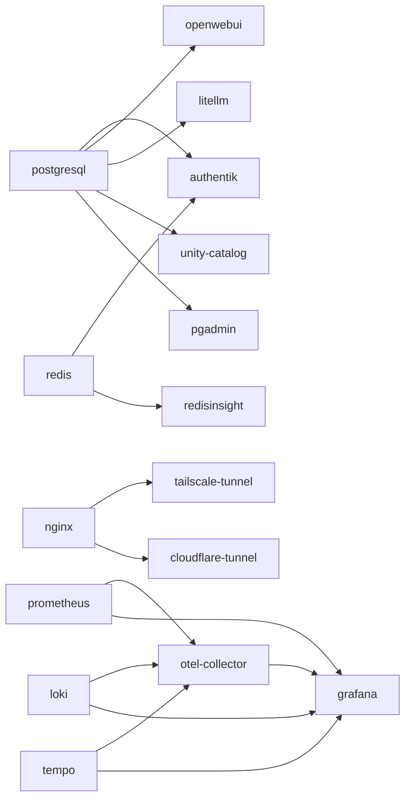

# Service Dependencies

This page shows which services depend on other services. Deploy dependencies before the services that need them.

## Dependency Graph



## Dependency Table

### Services with dependencies

| Service | Category | Depends on | Deploy command |
|---------|----------|-----------|----------------|
| authentik | Identity | postgresql, redis | `./uis deploy authentik` |
| grafana | Observability | prometheus, loki, tempo, otel-collector | `./uis deploy grafana` |
| otel-collector | Observability | prometheus, loki, tempo | `./uis deploy otel-collector` |
| openwebui | AI | postgresql | `./uis deploy openwebui` |
| litellm | AI | postgresql | `./uis deploy litellm` |
| unity-catalog | Analytics | postgresql | `./uis deploy unity-catalog` |
| pgadmin | Management | postgresql | `./uis deploy pgadmin` |
| redisinsight | Management | redis | `./uis deploy redisinsight` |
| cloudflare-tunnel | Networking | nginx | `./uis deploy cloudflare-tunnel` |
| tailscale-tunnel | Networking | nginx | `./uis deploy tailscale-tunnel` |

### Services with no dependencies

These can be deployed in any order:

| Service | Category | Deploy command |
|---------|----------|----------------|
| postgresql | Databases | `./uis deploy postgresql` |
| redis | Databases | `./uis deploy redis` |
| mysql | Databases | `./uis deploy mysql` |
| mongodb | Databases | `./uis deploy mongodb` |
| qdrant | Databases | `./uis deploy qdrant` |
| elasticsearch | Databases | `./uis deploy elasticsearch` |
| prometheus | Observability | `./uis deploy prometheus` |
| loki | Observability | `./uis deploy loki` |
| tempo | Observability | `./uis deploy tempo` |
| nginx | Management | `./uis deploy nginx` |
| whoami | Management | `./uis deploy whoami` |
| argocd | Management | `./uis deploy argocd` |
| spark | Analytics | `./uis deploy spark` |
| jupyterhub | Analytics | `./uis deploy jupyterhub` |
| rabbitmq | Integration | `./uis deploy rabbitmq` |
| gravitee | Integration | `./uis deploy gravitee` |

## Most-Depended-On Services

| Service | Required by |
|---------|------------|
| **postgresql** | authentik, openwebui, litellm, unity-catalog, pgadmin |
| **redis** | authentik, redisinsight |
| **nginx** | tailscale-tunnel, cloudflare-tunnel |
| **prometheus** | otel-collector, grafana |
| **loki** | otel-collector, grafana |
| **tempo** | otel-collector, grafana |

## Recommended Deploy Order

For a full deployment, this order respects all dependencies:

```bash
# 1. Databases (no dependencies)
./uis deploy postgresql
./uis deploy redis

# 2. Observability foundation
./uis deploy prometheus
./uis deploy loki
./uis deploy tempo
./uis deploy otel-collector
./uis deploy grafana

# 3. Identity
./uis deploy authentik

# 4. Core services
./uis deploy nginx
./uis deploy whoami

# 5. AI stack
./uis deploy litellm
./uis deploy openwebui

# 6. Management tools
./uis deploy pgadmin
./uis deploy redisinsight
./uis deploy argocd

# 7. Analytics
./uis deploy spark
./uis deploy jupyterhub
./uis deploy unity-catalog

# 8. Remaining
./uis deploy elasticsearch
./uis deploy mongodb
./uis deploy mysql
./uis deploy qdrant
./uis deploy rabbitmq
./uis deploy gravitee
```

Or use stacks to deploy groups:

```bash
./uis stack install observability
./uis stack install ai-local
./uis stack install analytics
```
