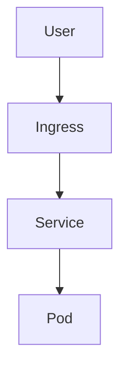

# Documentation Guide

This guide explains how documentation works in Urbalurba Infrastructure and how to contribute to it.

## Documentation Architecture

Documentation is built with [Docusaurus](https://docusaurus.io/) and deployed to GitHub Pages:

| Environment | URL | Use Case |
|-------------|-----|----------|
| **Local Development** | `http://localhost:3000` | Live editing with hot reload |
| **Production** | `https://uis.sovereignsky.no` | Public documentation |

### How It Works

```
┌─────────────────────────────────────────────────────────────────────┐
│                     website/docs/ folder                            │
│                    (Markdown source files)                          │
└─────────────────────────────────────────────────────────────────────┘
                                │
                                ▼
┌─────────────────────────────────────────────────────────────────────┐
│                   docusaurus.config.ts                              │
│                  (Site configuration)                               │
└─────────────────────────────────────────────────────────────────────┘
                                │
        ┌───────────────────────┴───────────────────────┐
        ▼                                               ▼
┌───────────────┐                              ┌───────────────┐
│   npm start   │                              │ GitHub Action │
│  (local dev)  │                              │ (on push)     │
└───────────────┘                              └───────────────┘
        │                                               │
        ▼                                               ▼
┌───────────────┐                              ┌───────────────┐
│ localhost:3000│                              │ GitHub Pages  │
└───────────────┘                              └───────────────┘
```

## Writing Documentation

### Local Development Workflow

1. **Install dependencies**:
   ```bash
   cd website
   npm install
   ```

2. **Start the local server**:
   ```bash
   npm start
   ```

3. **Open browser** at `http://localhost:3000`

4. **Edit markdown files** in `website/docs/` - changes appear instantly with hot reload

5. **Build and test**:
   ```bash
   npm run build
   ```

6. **Commit and push** when ready - GitHub Pages updates automatically

### Directory Structure

Documentation is organized into logical sections:

```
website/docs/
├── index.md                    # Homepage
├── getting-started/            # Quick start guides
├── hosts/                      # Platform documentation
│   └── cloud-init/            # Cloud-init subsection
├── packages/                   # Service packages
│   ├── ai/                    # AI & ML services
│   ├── authentication/        # Authentik
│   ├── databases/             # PostgreSQL, MySQL, etc.
│   └── ...                    # Other categories
├── networking/                 # Network configuration
├── provision-host/             # Provision host docs
├── rules/                      # Standards and conventions
└── reference/                  # Reference materials
```

### Adding a New Document

1. **Create the markdown file** in the appropriate directory:
   ```bash
   touch website/docs/packages/databases/newdb.md
   ```

2. **Add frontmatter** (optional but recommended):
   ```markdown
   ---
   sidebar_position: 5
   title: NewDB Setup
   ---
   ```

3. **Write content** using the template below

4. **Preview locally** with `npm start`

5. **Commit and push** to deploy

### Document Template

```markdown
---
sidebar_position: 1
---

# Service Name

Brief description of what this service does and why it's included.

## Overview

- **Purpose**: What problem does it solve?
- **Port**: Internal port number
- **Namespace**: Kubernetes namespace (usually `default`)

## Quick Start

```bash
# How to access or test the service
kubectl port-forward svc/service-name 8080:80
```

## Configuration

Explain key configuration options.

## Troubleshooting

Common issues and solutions.

## Related Documentation

- [Related Service](../category/related)
```

## Markdown Features

Docusaurus supports rich formatting with MDX:

### Admonitions (Callout Boxes)

```markdown
:::note Optional Title
This is a note callout.
:::

:::warning
This is a warning without a custom title.
:::

:::tip Pro Tip
Helpful tips go here.
:::

:::danger Critical
Important warnings about destructive operations.
:::

:::info
Informational callout.
:::
```

### Code Blocks with Syntax Highlighting

````markdown
```yaml
apiVersion: v1
kind: ConfigMap
metadata:
  name: example
```

```bash
kubectl apply -f manifest.yaml
```

```python
def hello():
    print("Hello, World!")
```
````

### Tabs

```jsx
import Tabs from '@theme/Tabs';
import TabItem from '@theme/TabItem';

<Tabs>
  <TabItem value="rancher" label="Rancher Desktop" default>
    Instructions for Rancher Desktop users.
  </TabItem>
  <TabItem value="aks" label="Azure AKS">
    Instructions for Azure AKS users.
  </TabItem>
  <TabItem value="microk8s" label="MicroK8s">
    Instructions for MicroK8s users.
  </TabItem>
</Tabs>
```

### Tables

```markdown
| Column 1 | Column 2 | Column 3 |
|----------|----------|----------|
| Value 1  | Value 2  | Value 3  |
```

### Links

```markdown
[Link to another doc](../packages/ai/litellm)
[External link](https://example.com)
```

### Mermaid Diagrams

````markdown

````

## Technical Details

### GitHub Pages Deployment

The `.github/workflows/docs.yml` workflow:

- Triggers on push to `main` when `website/` changes
- Installs Node.js and npm dependencies
- Runs `npm run build`
- Deploys to GitHub Pages

### Configuration Files

| File | Purpose |
|------|---------|
| `website/docusaurus.config.ts` | Site configuration, theme, plugins |
| `website/sidebars.ts` | Sidebar navigation structure |
| `website/package.json` | Dependencies and scripts |
| `website/docs/**/_category_.json` | Section labels and ordering |
| `.github/workflows/docs.yml` | GitHub Pages deployment |

## Best Practices

### Content Guidelines

1. **Be concise** - Get to the point quickly
2. **Use examples** - Show, don't just tell
3. **Include troubleshooting** - Anticipate common problems
4. **Link related docs** - Help users navigate
5. **Keep current** - Update when code changes

### Structure Guidelines

1. **Start with overview** - What is this? Why use it?
2. **Quick start first** - Let users try it immediately
3. **Details after** - Deep dive for those who need it
4. **Troubleshooting last** - Problem solving at the end

### Technical Writing Tips

- Use active voice: "Run the command" not "The command should be run"
- Use present tense: "This creates" not "This will create"
- Be specific: "Port 5432" not "the default port"
- Use consistent terminology throughout

## Troubleshooting

### Local Preview Not Working

```bash
# Check if dependencies are installed
cd website
npm install

# Clear cache and restart
npm run clear
npm start
```

### Build Errors

```bash
# Run build to see detailed errors
npm run build

# Common fixes:
# - Check for broken internal links
# - Verify frontmatter syntax
# - Check for unclosed code blocks
```

### GitHub Pages Not Updating

1. Check GitHub Actions tab for failed workflows
2. Verify changes are in `website/` directory
3. Ensure push is to `main` branch
4. Check the workflow file for correct paths

### Navigation Not Showing New Page

1. Check `_category_.json` in the directory
2. Verify `sidebars.ts` includes the new section
3. Ensure file has valid frontmatter
